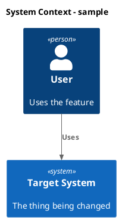

# Kanban Task Workflow

Use this skill to turn markdown task files into the active work queue for the repository. The task files are the coordination surface: read them before acting, select one task at a time, update the selected task's properties when its status changes, update only the selected task file unless the user explicitly asks for broader edits, and keep code changes aligned with the task's current status.

## Board Model

The default task root is `docs/kanban/`. Each task is a markdown file under that root. Status is represented by the task file's `status` property, never by its containing folder. `order` is an integer priority and sort key: lower numbers are selected first within the same status.

Keep task files directly under `docs/kanban/` unless the repository has a documented non-status organization such as epics or teams. Such folders may organize files, but must not define task state. Preserve existing non-status folders and infer their purpose from local documentation before acting.

Supported statuses and ownership:

- `Backlog`: user-managed. Ideas or tasks not ready for processing. Do not modify, plan, or implement unless the user explicitly names one or asks to pull from Backlog.
- `Started`: handoff to the agent for planning. When selecting one, set `status: Planning` before researching or planning.
- `Planning`: agent-managed. Requires codebase research and an implementation plan before user review.
- `Ready`: user-managed review state. Do not implement unless the user explicitly requests it. User acceptance changes it to `ToDo`.
- `ToDo`: handoff to the agent for implementation. Set it to `InProgress` before editing code.
- `InProgress`: agent-managed. Work is underway; update its notes and checklist as work advances.
- `Completed`: agent-managed. Finished and verified. Do not reopen unless the user asks or current verification proves it incomplete.

Use these exact values and capitalization. Do not represent workflow state with a folder, a separate shared board, or a `blocked` status. Record blockers in task notes while leaving the task in its current status unless the repository defines a separate status for blocked work.

## Task Files

Each task lives in its own markdown file so separate agents can work concurrently without rewriting a shared board file. Keep filenames stable unless renaming is necessary for clarity. Use a short, filesystem-safe filename that matches the task title when creating a task.

Each task file must contain an H1 title, `status`, `order`, a useful goal when it is `Ready` or later, a checklist, and notes. Keep properties in the bullet-property style used by the existing board:

```markdown
# Task title

- status: Backlog
- order: 100
- goal: Implement the scoped change, verified by focused tests, while preserving existing public behavior outside the task boundary.
- updated: 2026-07-17
- steps:
    - [ ] Research current behavior
    - [ ] Implement scoped change
    - [ ] Run focused tests

Longer task description, user comments, research notes, plan, verification notes, blocker details, or completion summary.
```

Supported fields:

- `status`: required; one of the statuses in Board Model. It is the sole source of truth for workflow state.
- `order`: required positive integer. Lower values take priority. Create and renumber with wide gaps—normally `100`, `200`, `300`—so a task can be inserted between two others without renumbering the whole board (for example, use `150` between `100` and `200`).
- `goal`: compact, auditable completion contract: desired end state, verification evidence, important boundaries, and what to report if blocked.
- `reason`: short blocker or decision note when useful.
- `updated`: ISO date, when useful for longer tasks.
- `steps`: checklist of concrete work items.

Do not invent due dates, labels, estimates, or review/acceptance properties. Add or update only fields that help selection, planning, implementation, verification, or future continuation.

## Validation Script

Run `uv run .agents/skills/kanban-task-workflow/scripts/validate_tasks.py` after changing task files, and before handing off a kanban workflow change. Pass an alternative task root as its optional argument when needed. Run `uv run .agents/skills/kanban-task-workflow/scripts/test_validate_tasks.py` after changing the validator; it creates isolated temporary task files and exercises every validation rule.

The standalone script validates every task file recursively under the task root (excluding `readme.md`). It reports concise, file-specific remediation errors for a missing H1 task title or missing/invalid required properties: `status` and positive-integer `order`; `goal` is also required for `Ready`, `ToDo`, `InProgress`, and `Completed` tasks. Keep this script concise and update it whenever this skill changes its task-file schema or validation rules.

## Task Selection

When the user says to proceed, continue, work the board, pick the next task, or similar:

1. Read `AGENTS.md` or the user-provided repository instructions when available.
2. Read task files under the task root, excluding non-task markdown such as `README.md` when local documentation identifies it as such. Do not create status folders.
3. Parse each task's `status` and `order`. Treat a missing or invalid property as a recordkeeping issue: do not select it automatically; report it and ask the user or repair it only when the intended value is unambiguous.
   Run the validation script first when task-file integrity is uncertain or after a bulk task update.
4. Select exactly one task, sorted by ascending `order` within each eligible status:
   - First choose the lowest-order `ToDo` task.
   - Otherwise choose the lowest-order `Started` task and set `status: Planning` before planning.
   - Do not choose `InProgress`, `Planning`, `Ready`, `Backlog`, or `Completed` without explicit user direction.
5. Break equal `order` values by deterministic relative file path, and note the duplicate order so it can be resolved later.
6. If no actionable task exists, report the status counts, any invalid records, and the smallest next decision needed from the user.

When the user asks to reprioritize work, change only the relevant tasks' `order` values. Prefer inserting a value in an existing gap; renumber the smallest affected set only when no suitable integer remains. Preserve wide gaps after renumbering.

## Workflow By Status

### Started

Tasks in `Started` are ready for planning. When selecting one, set `status: Planning` before editing other task content or researching implementation. Do not leave a picked-up planning task in `Started`.

### Planning

Research before planning. Inspect relevant code, tests, contracts, docs, and recent task notes. Use `rg`/`rg --files` first for local search. Browse the internet only when the task depends on current external facts or the user asks for external research. Keep the plan reliable, edge-case aware, and strictly scoped. Tests should be focused, fast, and verify the goal without assuming unrelated behavior.

If the current task title or filename is vague, stale, or misleading, rename it during planning so its `#` heading and filename reflect the real scope. Keep the new name concise and specific; do not rename a clear task merely for cosmetic consistency.

Every implementation plan must include a concise C4 change diagram suite in PlantUML:

- Required: System Context, Container, Component, and Code views.
- Use PlantUML C4 macros such as `C4Context`, `C4Container`, and `C4Component` where possible.
- Use a simple Mermaid class diagram for the Code view.
- Use Mermaid sequence or activity diagrams when the task changes a runtime flow, adds a feature, or alters an existing flow.
- Label meaningful new, changed, removed, and unchanged elements.
- Keep diagrams task-scoped; write "No change" for required views with no impact.

Example:



Then update the selected task with a concise implementation plan:

```markdown
- status: Planning
- order: 100
- goal: Produce a researched implementation plan, verified against the relevant code and tests, with blockers and user review needs called out explicitly.
- updated: 2026-07-17
- steps:
    - [ ] Implement step...
    - [ ] Verify behavior...

Original task:
~~~
Create...
~~~

Research:
- Finding...

Plan:
- Step...

C4 Change Diagrams:
- System Context:
- Container:
- Component:
- Code:
- Flowchart/Sequence:

Verification:
- Test or check...
```

When planning is complete, set `status: Ready`. The user reviews `Ready` tasks; if the plan is not acceptable, they may add comments and set the task back to `Planning`. When it returns to `Planning`, read the new comments, revise the plan, and set it to `Ready` again.

### Ready

Do not implement `Ready` tasks. It is a user-managed review state. The user signals acceptance by setting `status: ToDo`. If the user explicitly asks to revise a Ready task, treat it as Planning, update the plan, and set the status according to their instruction.

### ToDo

Tasks in `ToDo` are accepted for implementation. Before editing code, confirm that the task has enough plan detail to implement. Its `ToDo` status is the acceptance signal; do not require a separate review property.

If plan detail is missing or inconsistent, set `status: Planning` and add a short note explaining what needs more research. If ready, set `status: InProgress` and implement the scoped plan.

### InProgress

Implement the task end to end. Keep edits narrow and aligned with repository conventions. Update contracts, DTOs, tests, docs, or examples only when the task requires those surfaces to stay consistent.

Follow KISS, YAGNI, and SOLID. Avoid unnecessary refactors, add abstractions only when they provide clear value, and preserve behavior outside the task scope. If blocked, update the task with what was tried and the decision or input needed; keep it `InProgress` unless the repository defines a separate approved status.

After implementation:

1. Run the most focused verification available.
2. If it passes, update checklist state, add a short completion note with the checks run, and set `status: Completed`.
3. If it fails or a blocker remains, keep `status: InProgress` with a concrete reason and next action.

### Completed

Completed tasks should include enough notes to explain what changed and how it was verified. Do not edit them except to add missing verification context, correct an obvious recordkeeping mistake, or respond to a user request.

## Editing and Migration

When modifying task files:

- Preserve unrelated text, ordering, spelling, and formatting.
- Change `status` instead of moving a file to signal a status transition.
- Preserve `order` unless the user asks to reprioritize or a new task needs placement.
- Keep `Backlog` and `Ready` user-managed unless explicitly requested.
- Add short continuity notes: research findings, plan, verification, blockers, and completion summary.
- Avoid cosmetic rewrites and do not duplicate a task in another folder or shared board.

If legacy status folders such as `01_Backlog` through `07_Completed` exist and the user asks to migrate them:

1. Move each task file to the task root (or a documented non-status grouping folder).
2. Set `status` from the legacy folder mapping: `01_Backlog` → `Backlog`, `02_Started` → `Started`, `03_Planning` → `Planning`, `04_Ready` → `Ready`, `05_ToDo` → `ToDo`, `06_InProgress` → `InProgress`, `07_Completed` → `Completed`.
3. Add `order` when missing, assigning `100`, `200`, `300`, and so on within each status in deterministic filename order.
4. Preserve all other task content and remove empty legacy status folders only when the user asks for cleanup.

If legacy `docs/kanban.md` or `docs/kanban-done.md` files exist and the user asks to migrate them, convert each card into a task file, preserve its text, map any legacy status to `status`, and assign a wide-gap `order` value. If legacy boards exist without a migration request, read them only as context; do not duplicate state in a shared board and task files.

## Verification Defaults

Choose verification by the surface touched:

- Unity/editor changes: prefer Unity EditMode tests, Unity console logs, and targeted Unity editor C# checks.
- Local service changes: prefer focused `dotnet test` runs for `CopilotService.Tests`.
- Contract changes: keep OpenAPI/AsyncAPI examples and shared DTO behavior aligned.
- UI E2E changes: use Unity tests that wait for UI Toolkit layout and async updates rather than assuming same-frame completion.

If verification cannot run, state why and record residual risk in the task note.

For task-file-only changes, run the validation script as the focused verification.

## Response Format

When you finish a kanban workflow turn, report:

- Selected task and starting status.
- What changed in code and task file state.
- Verification run and result.
- Current task status, order, and next action.

Keep the final response concise. The task file should carry detailed continuity notes; the chat response should summarize the outcome.
