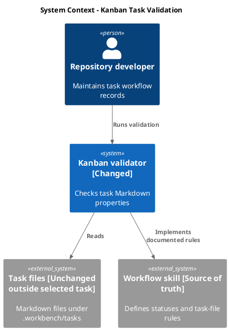
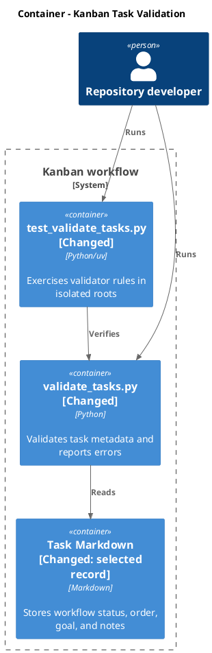
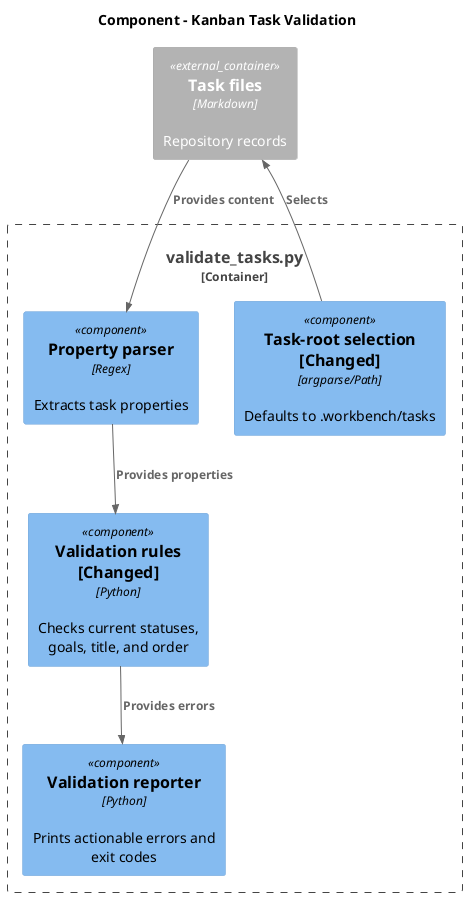
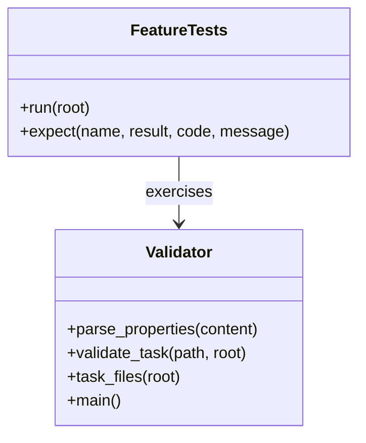

# Align kanban task validation with the current workflow

- status: Completed
- order: 2900
- goal: Make the kanban validator enforce the four statuses and `.workbench/tasks` default described by the workflow skill, with focused tests and clear reporting of legacy task records that remain outside this scoped change.
- updated: 2026-08-10
- steps:
    - [x] Research the current workflow instructions, validator, tests, and task records
    - [x] Align validator statuses, goal rules, and default task root with the skill
    - [x] Update validator feature tests for the current contract
    - [x] Run focused validator tests and validate the selected task file

## Original task

~~~
.agents\\skills\\kanban-task-workflow\\SKILL.md has beed changed and now inscludes statuses:
Backlog, Planning, InProgress, and Completed. Veryfy and update .agents\\skills\\kanban-task-workflow\\scripts\\validate_tasks.py if neccessary.
~~~

## Research

- The workflow skill defines exactly `Backlog`, `Planning`, `InProgress`, and `Completed`.
- The validator currently accepts `Started`, `Ready`, and `ToDo`, requires goals for those legacy active states, and defaults to `docs/kanban`.
- The repository task root is `.workbench/tasks`; it contains 42 Markdown task files, including two legacy `Ready` records and one existing Backlog record without a goal. Those unrelated records should be reported by validation, not silently migrated by this task.
- The validator feature test still encodes the seven-status contract and does not exercise the repository default root.

## Plan

1. Set the validator status constant to the four skill-defined statuses, require goals for every valid status as required by the task-file contract, and use `.workbench/tasks` as the default root.
2. Update isolated feature tests to cover all four statuses, the new goal rule, rejection of legacy statuses, and the default root behavior.
3. Normalize this task file, run the validator's feature test, run the validator against `.workbench/tasks`, and record any unrelated legacy-record errors.

## C4 Change Diagrams

### System Context

### Container

### Component

### Code

## Verification

- `uv run .agents/skills/kanban-task-workflow/scripts/test_validate_tasks.py` — passed all feature checks.
- `uv run .agents/skills/kanban-task-workflow/scripts/validate_tasks.py .workbench/tasks` (expected to report the two unrelated legacy `Ready` records and one existing Backlog record without a goal until separately migrated)

## Completion

- Updated `validate_tasks.py` to accept only `Backlog`, `Planning`, `InProgress`, and `Completed`, require a goal for each valid status, and default to `.workbench/tasks`.
- Updated `test_validate_tasks.py` for the four-state contract, default-root behavior, legacy status rejection, and goal enforcement.
- The selected task validates successfully; full-board validation remains nonzero only for the three unrelated legacy records listed above.
