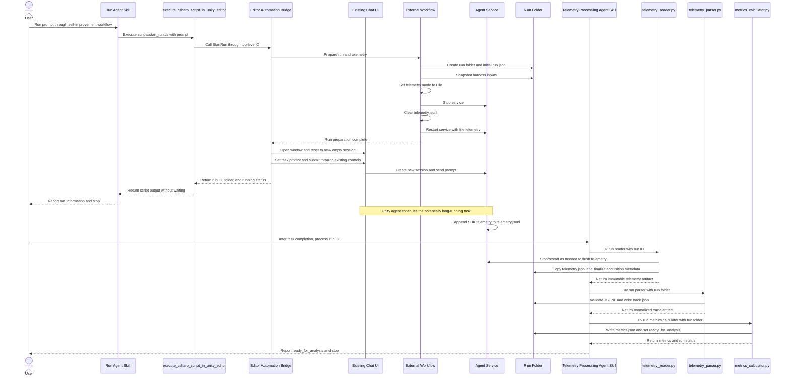
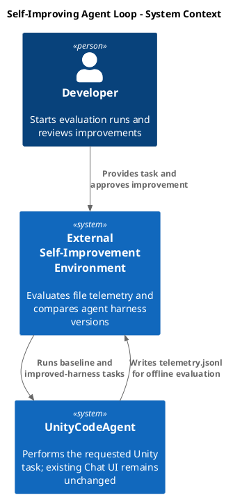
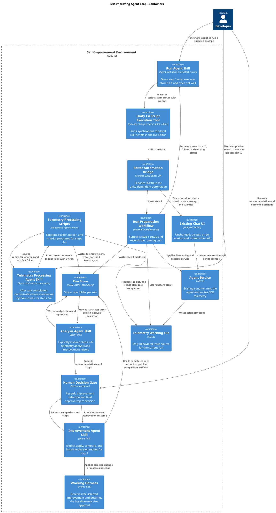
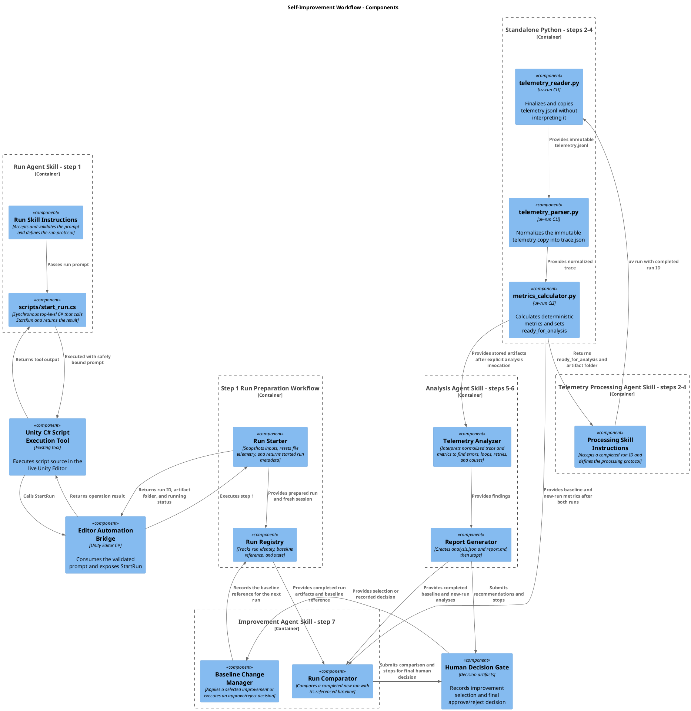
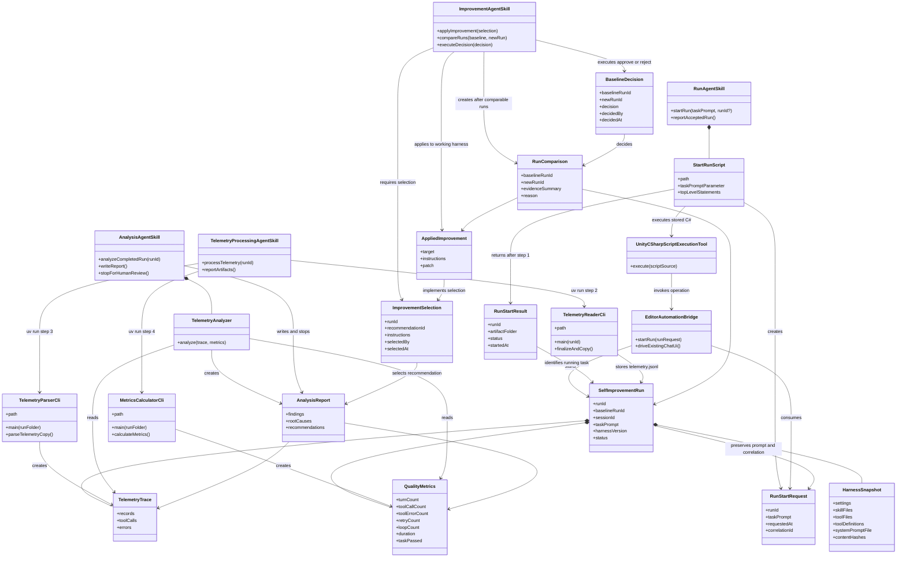

# Design a self-improving agent evaluation loop

- status: Planning
- order: 200
- goal: Define a high-level design for an external self-improvement workflow that repeatedly runs the agent through Chat UI, evaluates only file telemetry, proposes harness improvements, and updates the baseline only after human approval or restores it after rejection, with minimal isolated changes to agent code and no implementation in this task.
- updated: 2026-07-22
- steps:
    - [x] Define the improvement loop.
    - [x] Define the main system components and responsibilities.
    - [x] Define the per-run artifacts and comparison outcome.
    - [x] Describe the design with concise C4 and flow diagrams.

## Idea

Start with a representative task prompt, for example:

> Create a playable Snake game in Unity.

Run the agent and capture its file telemetry. After the task finishes, calculate quality metrics and analyze the telemetry trace for recurring problems. Produce a report that recommends improvements to the agent harness, such as changes to skills, system instructions, tool descriptions, tool behavior, or task prompts.

Apply the selected improvement directly to the working harness while preserving the current baseline for rollback. Run the same task again and compare it with the baseline. A human then either approves the result and makes that run the new baseline, or rejects it and restores the previous baseline. Every run and decision remains stored as evidence.

This task defines that workflow only. Implementation will be split into separate tasks.

## High-level improvement loop

```mermaid
flowchart LR
    subgraph P1[Run Agent Skill]
        A[1. Prepare and start task]
    end
    A --> W[Unity agent runs task]
    subgraph P2[Telemetry Processing Agent Skill]
        B[2. Read telemetry file] --> C[3. Parse trace.json]
        C --> D[4. Calculate metrics.json]
    end
    W -->|Task has completed, explicitly invoke skill| B
    subgraph P3[Analysis Agent Skill]
        E[5. Analyze telemetry] --> F[6. Create improvement report]
    end
    subgraph P4[Separate Improvement Agent Skill]
        I[7a. Apply selected improvement to working harness]
        L[7b. Compare new run with baseline]
    end

    D -->|Explicitly invoke Analysis Agent Skill| E
    F --> K{Run has a baseline reference?}
    K -->|No| H[Human selects an improvement]
    K -->|Yes| L
    H -->|Explicitly invoke Improvement Agent Skill| I
    I --> J[Working harness updated]
    J -->|Agent instruction invokes Run Agent Skill| A
    L --> M{Human decision}
    M -->|Approve| N[Update baseline to new run]
    M -->|Reject| O[Restore previous baseline]
```



## Execution ownership and gates

| Phase | Steps | Owner | Start condition | Output and stop condition |
| --- | --- | --- | --- | --- |
| Prepare and start | 1 | Run Agent Skill plus `scripts/start_run.cs` | The agent is explicitly instructed to run a prompt | Executes the stored C# script through `execute_csharp_script_in_unity_editor`; snapshots the harness, configures and clears file telemetry, starts the task through the existing Chat UI, returns the run ID/folder and `running` status, then stops without waiting |
| Telemetry processing | 2–4 | Telemetry Processing Agent Skill plus three standalone Python scripts | After the Unity task completes, the skill is explicitly invoked with the run ID | Runs the reader, parser, and metrics calculator sequentially with `uv run`; finalizes and copies `telemetry.jsonl`, creates `trace.json` and `metrics.json`, marks the run `ready_for_analysis`, and returns the artifact location |
| Analysis and report | 5–6 | Analysis Agent Skill | Agent is explicitly asked to analyze a run whose programmatic artifacts are complete | Produces `analysis.json` and `report.md`, marks the run `analysis_complete`, then stops without changing the harness |
| Improvement selection | Gate between 6 and 7 | Human | Baseline analysis report is available | Selects an improvement and explicitly invokes the Improvement Agent Skill; the selection is stored in `improvement.json` |
| Improvement application and comparison | 7 | Separate Improvement Agent Skill | Human invokes the skill with a selected improvement, or later with completed baseline/new-run artifacts | Preserves rollback information, applies the selected change directly to the working harness, and records `changes.patch`; after the new run completes steps 1–6, writes `comparison.json` and stops for a human decision |
| Baseline decision | Final gate | Human | `comparison.json` is available | Stores `approve` or `reject` in `decision.json`; a separate Improvement Agent Skill invocation updates the baseline on approval or restores the previous baseline on rejection |

The four Agent Skills are separate workflows. The Run Agent Skill owns only step 1 and never waits for or monitors task completion. The Telemetry Processing Agent Skill owns only the explicit transition through steps 2–4 and may be invoked only after the operator observes that the Unity task has finished. The Analysis Agent Skill cannot edit the harness or invoke step 7. The Improvement Agent Skill may change the working harness only after explicit human selection and may update or restore the baseline only from `decision.json`.

The durable run-state sequence is `preparing` → `running` → `processing` → `ready_for_analysis` → `analysis_complete`. A failure records `<stage>_failed` plus a structured error in `run.json`. There is intentionally no automatic `task_completed` transition because the Run Agent Skill exits immediately; invoking telemetry processing after the Unity task finishes is an explicit operator action.

## Architectural boundary

The self-improvement workflow is a separate companion system, not part of the agent runtime. The Run Agent Skill executes its stored C# script through `execute_csharp_script_in_unity_editor` for step 1. After the Unity task completes, a separate Telemetry Processing Agent Skill runs three standalone Python scripts with `uv run` for steps 2–4. Two further Agent Skills own steps 5–7, with explicit human selection and baseline-decision points.

Changes inside UnityCodeAgent should be minimal and isolated to a narrow Editor automation bridge that can perform step 1:

- invoke the external workflow to prepare a run;
- open the existing Chat window;
- reset the existing Chat UI client to a new session;
- place the task prompt in the existing composer and submit it through the normal UI path.

The Chat UI, Agent Service, session orchestration, tools, skills, and normal chat behavior remain unchanged and must not depend on the improvement engine. The bridge lives in a separate Editor-only file/folder and uses the same programmatic UI interaction approach as existing Chat UI E2E tests. It exposes only a callable `StartRun` operation and adds no UI. Steps 2–4 run outside Unity through standalone Python scripts. The programmatic workflow and all four skills communicate through run artifacts; they do not require new evaluation endpoints or service-event subscriptions.

For this version, `.unityCodeAgent/service/logs/telemetry.jsonl` is the **only trace and evaluation source**. Service events, Chat UI transcript events, SSE capture, and `events.jsonl` are explicitly out of scope. If a required metric cannot be derived from telemetry, record it as unavailable rather than reading another event source.

## Main stages

Step 1 and steps 2–4 are two separate, explicitly invoked workflows:

- The **Run Agent Skill** accepts the task prompt and an optional prepared run ID, loads `scripts/start_run.cs` from its own skill folder, supplies the inputs safely, and runs it through `execute_csharp_script_in_unity_editor`. It returns the run ID/folder and initial status, then stops without waiting.
- After the Unity task completes, the **Telemetry Processing Agent Skill** is invoked with the run ID. It calls three standalone Python scripts from its own `scripts/` subfolder in order with `uv run`: the Telemetry Reader for step 2, Telemetry Parser for step 3, and Metrics Calculator for step 4. Each script has one responsibility and communicates only through explicit run artifacts.

Neither skill interprets telemetry itself. There is no automatic transition from step 1 to step 2.

The implementation language follows the runtime boundary: operations that require live Unity Editor APIs use skill-owned C# scripts executed through `execute_csharp_script_in_unity_editor`; operations that do not require Unity use standalone Python scripts in the owning skill's `scripts/` subfolder, executed with `uv run`. Telemetry reading, parsing, and metric calculation are outside-Unity operations and therefore must not be implemented as C# Editor scripts.

### Script storage and execution contract

Each execution skill owns its scripts in its own `scripts/` subfolder. The Run Agent Skill owns the Unity-dependent C# script; the Telemetry Processing Agent Skill owns three standalone Python scripts:

```text
.agents/skills/self-improvement-run/
  SKILL.md
  scripts/
    start_run.cs
.agents/skills/self-improvement-telemetry-processing/
  SKILL.md
  scripts/
    telemetry_reader.py
    telemetry_parser.py
    metrics_calculator.py
```

The Run Agent Skill reads `start_run.cs`, binds the prompt using a safely escaped input contract, and passes the resulting source to `execute_csharp_script_in_unity_editor`. The C# script uses synchronous top-level statements only, is safe to rerun, returns a concise machine-readable result, and calls the narrow compiled Editor automation bridge. It does not define classes or methods, start background tasks, or contain direct telemetry/JSON file-processing logic.

The Telemetry Processing Agent Skill invokes the Python scripts as separate commands:

```text
uv run .agents/skills/self-improvement-telemetry-processing/scripts/telemetry_reader.py --run-id <run-id>
uv run .agents/skills/self-improvement-telemetry-processing/scripts/telemetry_parser.py --run-folder <run-folder>
uv run .agents/skills/self-improvement-telemetry-processing/scripts/metrics_calculator.py --run-folder <run-folder>
```

Each Python script is a self-contained single file with a CLI `main`, uses standard-library code where practical, and declares any third-party dependencies through PEP 723 inline metadata. No `pyproject.toml`, requirements file, shared Python package, or monolithic processing script is introduced. A script starts only when the prior artifact exists and passes validation; any nonzero exit stops the sequence and records the failed stage without running later scripts.

### 1. Start and run the task

The run is initiated by explicitly invoking the Run Agent Skill with a task prompt, for example, “Run a self-improvement baseline with the prompt: Create a playable Snake game.” The skill loads its stored top-level C# script, substitutes or passes the prompt using a safely escaped parameter contract, and calls `execute_csharp_script_in_unity_editor`. The script calls the isolated Editor automation bridge. It does not add a Chat UI control or use a headless conversation. The bridge asks the external improvement workflow to create a fresh run folder, opens the unchanged UnityCodeAgent Chat window, resets it to a new session, inserts the supplied task prompt, and submits it through the normal UI path.

Before the prompt is sent, the run starter must:

1. Ensure no prompt is currently running.
2. Create a unique run ID/folder for an initial run, or validate the prepared run ID/folder created for an applied improvement.
3. Snapshot the current harness inputs into that folder:
   - active skills selected through UnityCodeAgent settings, including their files and enabled/disabled selection;
   - custom-tool source files and the effective tool definitions exposed to the session;
   - `Packages/com.signal-loop.unitycodeagent/Editor/CopilotService~/Copilot/UnityCodeSystemMessage.cs`;
   - relevant UnityCodeAgent settings and model/provider identity, without secrets.
4. Set UnityCodeAgent telemetry mode to **File**, using the default `.unityCodeAgent/service/logs/telemetry.jsonl` path.
5. Stop the Agent Service, clear the telemetry file, and restart the service so file telemetry is active from the beginning of the run.
6. Reset the Chat UI to a new empty session. The first submitted prompt creates the new service session.
7. Record the created session ID in the run metadata. The external workflow does not subscribe to session or service events.

Once the prompt has been submitted and the run has started, the bridge returns the run ID, folder, and `running` status to the C# script. The script emits that result through its tool output, and the Run Agent Skill reports it and ends. It does not wait for task completion and does not perform steps 2–4. No background workflow changes the run status when the Unity task finishes: `run.json` remains `running` until the Telemetry Processing Agent Skill is invoked. A failure before the task starts is returned through the tool result and marks the run `start_failed`.

The first run that reaches `analysis_complete` initializes `baseline.json`. A later run records `baselineRunId` so it can be compared with the baseline that was active when its improvement was applied.

### Harness snapshot rule

Anything that may be changed as part of an improvement must be preserved in the run artifacts before the change is applied. Each new run stores its own effective versions, even if they are unchanged from the baseline. This includes skills, custom-tool code and definitions, system-prompt code, task prompt, relevant settings, and the applied patch. The baseline snapshot is also the rollback source when the result is rejected.

The snapshot is evidence and the rollback source for harness files managed by this workflow; it is not a standalone replacement for the whole project. A manifest records every managed file's original path and content hash so runs can be compared and a rejected improvement can restore only the files it changed.

### Run start and telemetry-processing sequence



### 2. Collect telemetry

After the Unity task has completed, the **Telemetry Processing Agent Skill** is explicitly invoked with the run ID. It resolves the run folder, changes its status from `running` to `processing`, and invokes `telemetry_reader.py`, `telemetry_parser.py`, and `metrics_calculator.py` sequentially with `uv run`. The skill orchestrates the commands but does not duplicate their logic. The reader validates that the run exists and the telemetry working file is stable and non-empty. If those preconditions fail, it exits nonzero, records the failed processing stage in `run.json`, leaves the working telemetry untouched, and prevents later scripts from running.

The explicit invocation is the operator's assertion that the Unity task has finished. File stability is a safety check, not an independent proof of task completion.

The **Telemetry Reader** owns file acquisition and run isolation. The Agent Service writes SDK telemetry to `.unityCodeAgent/service/logs/telemetry.jsonl`; the reader does not collect a parallel event stream.

Its responsibilities are:

- locate the working telemetry file;
- ensure it has been finalized or flushed;
- copy it into the run folder before another run can clear it;
- record file size, hash, and acquisition metadata;
- report missing, locked, empty, or incomplete files.

`telemetry_reader.py` finalizes or flushes telemetry and copies `.unityCodeAgent/service/logs/telemetry.jsonl` into the identified run folder. The shared telemetry file is only a working file; the copy inside the run folder is the permanent trace and must be completed before another run can clear it. A missing, unstable, or incomplete file fails processing visibly and does not fall back to another trace source.

The reader does not interpret telemetry fields, build a trace, calculate metrics, or identify problems.

### 3. Parse telemetry

The **Telemetry Parser** converts the immutable telemetry copy into a normalized `trace.json` artifact.

Its responsibilities are:

- read and validate JSONL records;
- recognize and normalize supported telemetry record types;
- filter and group records for the relevant run/session;
- extract tool calls, results, errors, timings, turns, usage, and other available fields;
- preserve source record references so every derived value can be traced back to telemetry;
- tolerate and report malformed, missing, and unknown records without silently inventing data.

The parser, not the reader, validates session correspondence. If the immutable copy contains no records for the session stored in `run.json`, parsing fails and no metrics are calculated.

Run metadata may provide run/session identity and harness-version context, but it is not behavioral trace evidence. The parser does not calculate quality scores, diagnose behavior, or propose improvements.

### 4. Calculate quality metrics

Convert only the stored telemetry records into comparable metrics. Initial examples, when supported by the telemetry schema:

- task completed or failed;
- number of turns;
- total and per-tool call counts;
- tool error count and error rate;
- repeated calls with similar arguments;
- retry count after an error;
- detected loops;
- time spent and total duration;
- Unity test or validation results;
- required, missing, or forbidden tool calls.

Metrics should remain simple and explainable. Every metric records which telemetry records and fields produced it. Unsupported metrics are marked unavailable rather than supplemented with service events.

Completing this step through `metrics_calculator.py` writes `metrics.json`, marks the run `ready_for_analysis`, and returns a concise command result to the Telemetry Processing Agent Skill.

### 5. Analyze telemetry

This step is run by the **Analysis Agent Skill**. Its **Telemetry Analyzer** reads the immutable artifacts produced by steps 1–4—primarily `trace.json`, `metrics.json`, run metadata, and harness references—and identifies behavioral patterns such as:

- repeated tool errors;
- too many attempts to solve one problem;
- the same action repeated without progress;
- incorrect tool selection;
- missing or ignored skill instructions;
- recovery that worked but required unnecessary steps;
- task completion claims not supported by tests or tool results.

Each finding includes category, severity, description, affected tool or stage, supporting telemetry record references, relevant statistics, likely cause, and suggested improvement target.

The analyzer produces evidence-backed findings, not just a score. It does not read the live telemetry file, parse raw JSONL, modify harness files, invoke the Improvement Agent Skill, or make the final approve/reject decision.

```text
Working telemetry.jsonl
        -> Telemetry Reader
        -> Immutable run telemetry.jsonl
        -> Telemetry Parser
        -> Normalized trace.json
        -> Metrics Calculator
        -> Telemetry Analyzer
        -> Evidence-backed findings
```

### 6. Create the improvement report

The same Analysis Agent Skill converts its findings into a report containing:

- task and run summary;
- calculated metrics;
- error and retry statistics;
- detected loops or inefficient behavior;
- important trace excerpts or references;
- likely root causes;
- recommended harness improvements;
- expected effect of each improvement;
- instructions for implementing and verifying the next improvement.

Recommendations may target:

- system prompt sections;
- skills and skill instructions;
- tool descriptions, schemas, or implementation;
- task prompts and eval scenarios;
- telemetry or evaluation logic when the evidence is insufficient.

The skill writes `analysis.json` and `report.md`, marks the run `analysis_complete`, and stops. It must not apply any recommendation automatically.

### 7. Apply, compare, and decide

This step is run by a separate **Improvement Agent Skill** only after a human reviews `report.md`, selects one improvement, and explicitly invokes the skill. The skill reserves the next run ID/folder with `baselineRunId` and `preparing` status, records the selection in `improvement.json`, preserves the active baseline files needed for rollback, applies only the selected change directly to the working harness, records `changes.patch`, and stops.

The next agent instruction invokes the Run Agent Skill with the same prompt and the prepared run ID. The Run Agent Skill validates rather than recreates that folder, snapshots the effective improved harness, and starts the task. After the Unity task completes, the Telemetry Processing Agent Skill runs steps 2–4 and the Analysis Agent Skill runs steps 5–6 as separate invocations.

After both runs reach `analysis_complete`, the Improvement Agent Skill is explicitly invoked in compare mode. It verifies that the prompt and evaluation conditions are equivalent except for the selected improvement, compares the baseline and new-run snapshots, metrics, and analyses, writes `comparison.json`, and stops. If the runs are incomplete or not comparable, the comparison explains the limitation and does not request a baseline decision.

For a comparable result, a human records exactly one decision in `decision.json`:

- **Approve** — accept the working harness and make the new run the baseline.
- **Reject** — restore the previous baseline files while retaining the new run and comparison as evidence. If a changed file no longer matches the applied-improvement hash, stop and require manual conflict resolution rather than overwrite unrelated edits.

A final explicit Improvement Agent Skill invocation executes only the recorded decision. No separate harness version or workspace is created. Applying, comparing, and finalizing are never chained automatically, and restoration must not overwrite unrelated user changes.

## Run storage

Every run is stored in a separate folder so it can be inspected and compared with any other run:

```text
.artifacts/self-improvement/
  <evaluation-name>/
    baseline.json          # active baseline run ID and harness version
    <run-id>/
      run.json             # prompt, versions, configuration, and parent run
      references/
        settings.json      # effective non-secret settings and skill selection
        skills/            # active skill files used by this run
        workflow-skills/   # self-improvement skill definitions and scripts used to operate this run
        tools/             # custom-tool source files and effective definitions
        system-prompt/     # system-prompt source used by this run
      rollback/            # baseline copies of changed files, when applicable
      telemetry.jsonl      # sole behavioral trace copied from the service telemetry file
      trace.json           # normalized parser output with source-record references
      metrics.json         # calculated quality metrics
      analysis.json        # structured findings
      report.md            # human-readable improvement report
      improvement.json     # human-selected improvement, when applicable
      changes.patch        # applied working-harness change, when applicable
      comparison.json      # comparison with baselineRunId
      decision.json        # human approve or reject decision
```

The run metadata must identify the prompt and exact harness version so results can be reproduced. Each structured artifact includes a schema version and run identity; cross-run artifacts identify the baseline and new-run IDs. Improvement, patch, comparison, and decision files exist only when their corresponding phase occurs. Completed evidence artifacts are immutable. `baseline.json` is the only mutable evaluation-level artifact: approval advances it to the new run, while rejection leaves it unchanged and restores the changed harness files from the referenced baseline snapshot. Secrets must not be stored in run artifacts.

## High-level components

| Component | Responsibility |
| --- | --- |
| Run Agent Skill | Owns only step 1: accepts the prompt, calls the start script, reports the started run ID/folder, and ends without waiting. |
| Start Script | Stored at `.agents/skills/self-improvement-run/scripts/start_run.cs`; runs through `execute_csharp_script_in_unity_editor`, calls the Editor bridge with the supplied prompt, and returns the start result. |
| Telemetry Processing Agent Skill | Owns orchestration for steps 2–4: after task completion, accepts a run ID, runs the three standalone Python commands in order, stops on failure, and reports the generated artifacts. |
| `telemetry_reader.py` | Standalone step-2 CLI: finalizes, copies, hashes, and validates the telemetry file without interpreting records. |
| `telemetry_parser.py` | Standalone step-3 CLI: reads only the immutable telemetry copy and writes normalized `trace.json` with source references. |
| `metrics_calculator.py` | Standalone step-4 CLI: reads `trace.json`, writes deterministic `metrics.json`, and marks the run `ready_for_analysis`. |
| Unity C# Script Execution Tool | Executes the Run Agent Skill's synchronous top-level C# in the live Unity Editor and returns the script result. |
| Editor Automation Bridge | Minimal isolated Unity-side API exposing only `StartRun`, which drives the unchanged Chat UI; it has no telemetry-processing responsibility. |
| Run Starter | External component that creates the run folder, snapshots harness inputs, and prepares file telemetry. |
| Run Registry | Records the task, session identity, baseline reference, harness version, current run state, and active baseline pointer. |
| Telemetry Reader | Finalizes and copies `telemetry.jsonl` into the run folder; it does not interpret its contents. |
| Telemetry Parser | Converts the immutable JSONL copy into a normalized trace with source-record references. |
| Metrics Calculator | Produces explainable counts, rates, durations, and pass/fail results. |
| Analysis Agent Skill | Owns the Telemetry Analyzer and Report Generator for steps 5–6; reads completed artifacts and stops after writing findings and recommendations. |
| Human Decision Gate | Records the selected improvement and the final approve/reject decision. |
| Improvement Agent Skill | Owns explicit step-7 modes for applying a selected improvement to the working harness, comparing the new run with the baseline, and executing the recorded decision. |
| Run Comparator | Compares the new run with its referenced baseline and presents evidence for approval or rejection. |
| Run Store | Keeps all inputs, telemetry, results, reports, applied patches, comparisons, and decisions by run ID. |

## C4 diagrams

### System Context



### Container



### Component



### Code



## Suggested implementation tasks

1. Add one minimal isolated Editor automation bridge with a callable `StartRun` operation. Do not add telemetry-processing APIs or Chat UI changes; keep improvement logic outside agent code.
2. Create the Run Agent Skill with `.agents/skills/self-improvement-run/scripts/start_run.cs`. The skill safely binds the prompt and optional prepared run ID, then executes the synchronous top-level script through `execute_csharp_script_in_unity_editor`; the script calls `StartRun`, returns the run ID, folder, and `running` status, and exits without polling or waiting.
3. Build the step-1 run starter that creates the run folder, snapshots harness inputs, forces and clears file telemetry, drives the existing Chat UI, and records the started run.
4. Create the separate Telemetry Processing Agent Skill with all three Python programs in its `scripts/` subfolder. After task completion, it accepts the run ID and invokes them sequentially with `uv run`, stopping on the first nonzero exit.
5. Implement `.agents/skills/self-improvement-telemetry-processing/scripts/telemetry_reader.py` as a self-contained step-2 CLI that verifies acquisition preconditions, safely finalizes, copies, hashes, and validates `telemetry.jsonl` without interpreting records.
6. Implement `.agents/skills/self-improvement-telemetry-processing/scripts/telemetry_parser.py` as a self-contained step-3 CLI that requires the immutable JSONL copy, validates session correspondence, and converts it into `trace.json` with normalized records and source references.
7. Implement `.agents/skills/self-improvement-telemetry-processing/scripts/metrics_calculator.py` as a self-contained step-4 CLI that requires `trace.json`, calculates deterministic metrics without service events, writes `metrics.json`, and sets `ready_for_analysis`.
8. Create an Analysis Agent Skill for steps 5–6 that reads completed run artifacts, performs telemetry analysis, writes `analysis.json` and `report.md`, sets `analysis_complete`, and stops without modifying the harness.
9. Add the step-7 artifact contracts: `improvement.json` for the human-selected change, `changes.patch` for rollback evidence, `comparison.json` for baseline comparison, and `decision.json` for final approval or rejection.
10. Create a separate Improvement Agent Skill with explicit apply, compare, and finalize modes. It changes the working harness directly, and each mode validates its required artifacts, performs only that action, and stops.
11. Compare the baseline and new-run snapshots, metrics, and analyses in `comparison.json`; preserve both runs and update or restore the baseline only from `decision.json`.
12. Run an end-to-end pilot through all four skills using a task such as “Create a Snake game.”

## Verification of the future system

The initial end-to-end test should demonstrate this chain:

1. An agent instruction invokes the Run Agent Skill with a specific prompt. The skill loads `scripts/start_run.cs`, binds the exact prompt safely, and passes the script source to `execute_csharp_script_in_unity_editor` without changing Chat UI controls.
2. Script validation proves `start_run.cs` contains synchronous top-level statements, is safe to rerun, calls only the narrow `StartRun` bridge operation, and emits a structured result.
3. `StartRun` completes step 1: it creates the run folder and `run.json`, snapshots the selected skills, custom tools, system prompt, and non-secret settings, configures and clears file telemetry, and submits the prompt through a new Chat UI session.
4. The Run Agent Skill returns the run ID, artifact folder, and `running` status and exits. Tests prove it does not wait, process telemetry, parse records, or calculate metrics.
5. While the telemetry file is still locked, changing, or incomplete, `uv run .agents/skills/self-improvement-telemetry-processing/scripts/telemetry_reader.py --run-id <run-id>` exits nonzero without altering it, and the Processing Skill does not start later scripts.
6. After the Unity task completes, the Telemetry Processing Agent Skill runs `telemetry_reader.py`, `telemetry_parser.py`, and `metrics_calculator.py` sequentially with `uv run`.
7. Each Python script is independently executable, single-file, stored in the owning skill's `scripts/` subfolder, has a CLI `main`, uses PEP 723 inline metadata for any third-party dependency, and requires only its documented input artifact.
8. Responsibility tests prove the reader only acquires telemetry, the parser only normalizes the immutable copy, and the metrics calculator only calculates deterministic metrics from `trace.json` and sets `ready_for_analysis`.
9. Tests prove that telemetry reading, parsing, and metrics use only `.unityCodeAgent/service/logs/telemetry.jsonl`, not SSE, service events, Chat UI transcript events, or `events.jsonl`.
10. Skill evaluation proves the Telemetry Processing Agent Skill only validates the run ID, invokes the three `uv run` commands in order, stops on failure, and reports their results; it does not duplicate reader, parser, or metrics logic.
11. Explicitly invoking the Analysis Agent Skill verifies `ready_for_analysis` before reading the completed run artifacts. For a ready run, it writes evidence-backed findings—or explicitly states that no change is justified—creates `analysis.json` and `report.md`, sets `analysis_complete`, and stops.
12. Tests or skill evaluations prove that the Analysis Agent Skill cannot modify the harness or invoke the Improvement Agent Skill.
13. A human selects one recommendation in `improvement.json`; the working harness is not changed until the Improvement Agent Skill is explicitly invoked with that selection.
14. The Improvement Agent Skill reserves the next run folder, preserves rollback information, applies only the selected improvement directly to the working harness, records `changes.patch`, and stops.
15. The improved harness repeats the explicit sequence using the prepared run ID: Run Agent Skill for step 1, task completion, Telemetry Processing Agent Skill for steps 2–4, and Analysis Agent Skill for steps 5–6.
16. The comparator writes evidence-backed `comparison.json` only after both runs reach `analysis_complete` and comparability checks pass. A person records `approve` or `reject` in `decision.json`; a separate finalization invocation updates the baseline or restores it accordingly without deleting either run's evidence. Failed comparability produces no decision request.
17. Module tests prove the reader performs only file acquisition, the parser performs only normalization, and the analyzer consumes normalized trace plus metrics without reading raw or live telemetry.

## Planning notes

- The telemetry-processing programs intentionally live under the owning skill's `scripts/` subfolder rather than the repository-default `Python/` folder or the existing `evals/` project. This task-specific location is required so the skill and its executable resources remain a portable unit. They remain standalone `uv run` scripts and do not use the current SSE/service-event capture path.
- Current settings already support `UnityCodeAgentTelemetryMode.File` and default an empty telemetry path to `.unityCodeAgent/service/logs/telemetry.jsonl`. Because telemetry arguments are applied when the service starts, a controlled service restart is part of run setup.
- `ChatEditorWindowClient` already creates a service session when a prompt is submitted without an active session. Do not change Chat UI. The isolated Editor automation bridge should open the existing window and use code to reach its empty-session and prompt-submission path, following the programmatic UI interaction pattern used by Chat UI E2E tests.
- Active skills come from the enabled skill directories plus the disabled-skill list in settings. Custom tools are discovered from loaded `ITool` implementations, so the snapshot should record both source files and the effective definitions actually sent to the session.
- Evaluation depends exclusively on the copied telemetry file. Missing telemetry data must remain visible as a limitation until telemetry emission is improved in a separate, narrowly scoped task.
- The Editor automation bridge assembly must be available to `execute_csharp_script_in_unity_editor`. Verify its assembly is already loaded; if not, add only that assembly to the UnityCodeMcpServer `AdditionalAssemblyNames` setting and reload the settings before executing `start_run.cs`.
- The Run Agent Skill (step 1), Telemetry Processing Agent Skill (steps 2–4), Analysis Agent Skill (steps 5–6), and Improvement Agent Skill (step 7) are four independent skills. There is no automatic handoff: each later phase requires an explicit invocation using the stored run ID and artifacts. Their descriptions and instructions must prevent unintended cross-invocation.
- This task contains only the HLD. No runtime or evaluation implementation is included.
