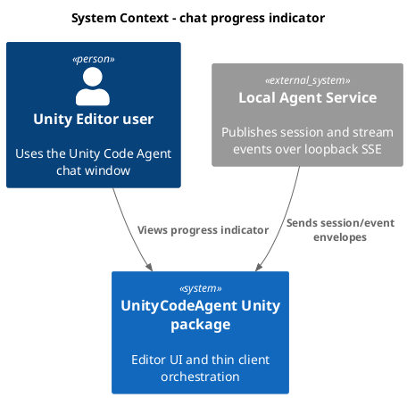
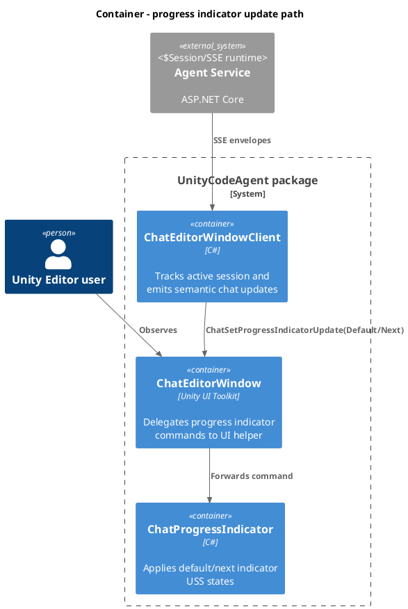
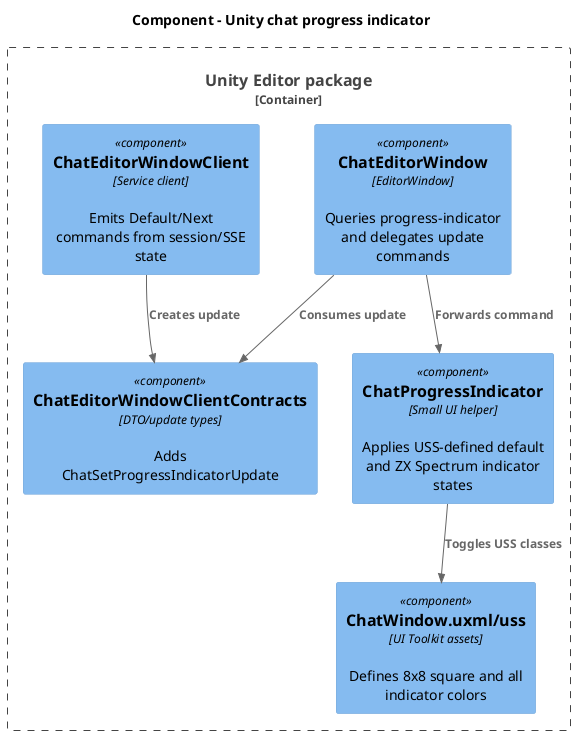
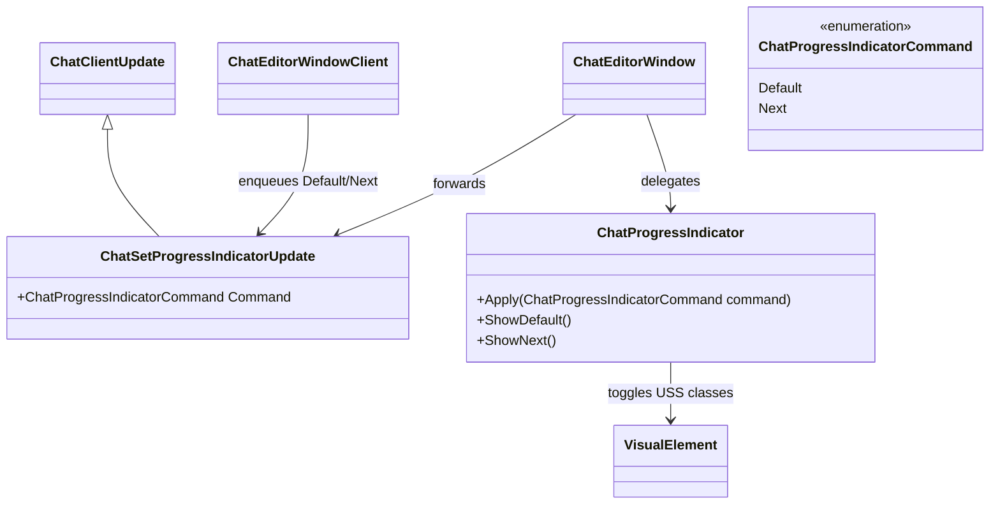
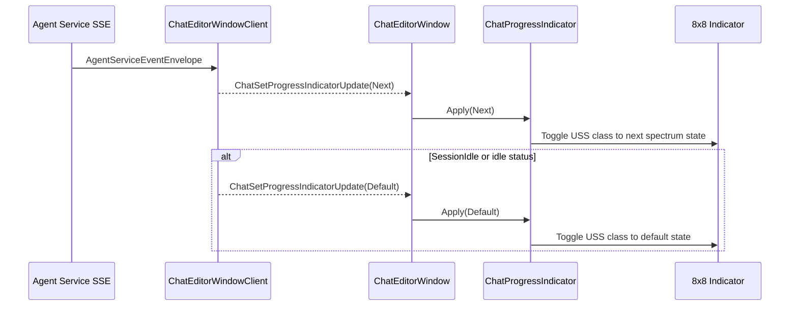

# Add chat progress indicator

- goal: Implement an always-visible 8x8 chat progress indicator beside the progress text field, driven through a semantic `ChatClientUpdate` command and a separate indicator logic class, with default grey shown for idle/session-list states and ZX Spectrum palette indicators shown for busy or newly received stream events.
- updated: 2026-07-08
- steps:
    - [x] Add progress indicator UI element and USS beside `progress-message`
    - [x] Add a progress indicator logic class that handles `Default` and `Next` commands
    - [x] Add a semantic `ChatClientUpdate` command and delegate it from `ChatEditorWindow`
    - [x] Emit indicator updates from `ChatEditorWindowClient` on busy, stream event, idle, errors, and sessions view transitions
    - [x] Add focused client/UI tests and verify Unity reload/test discovery

Original task:
~~~
Add progress indicator.

Progress indicator should be 8x8 pixels square, located in chat porgress textfield area, on the left side of the textfield, that changes color.
Should be always visible, with default color grey.
Default color should be shown on sessions screen and when active session is not busy.
When Packages\com.signal-loop.unitycodeagent\Editor\Service\ChatEditorWindowClient.cs _service.StreamEventsAsync receives event envelope or session becomes busy square should chang color to random color from ZX Spectrum palette.
When session becomes or is idle or sessions are shown, it shouod  show default color.
Create separate class for this logic, expose small surface to be used.
Use new ChatUpdate type to send color update command to ChatEditorWindow.
~~~

Research:
- `ChatWindow.uxml` currently exposes only a standalone `TextField` named `progress-message`; the indicator needs a new wrapper/child element beside that field, not inline styles.
- `ChatWindow.uss` already keeps the progress field visible and transparent. Add USS for a horizontal progress row plus a named 8x8 indicator, keeping layout space reserved when the text is empty.
- `ChatEditorWindowClientContracts.cs` is the existing UI update contract surface. Add a new semantic `ChatSetProgressIndicatorUpdate` carrying a command such as `Default` or `Next`; do not pass colors through the update contract.
- `ChatEditorWindow.cs` queries required UI elements in `BuildUi` and applies updates in `ApplyUpdate`. It should not own trigger rules or indicator command logic; it should delegate `ChatSetProgressIndicatorUpdate` to a separate indicator helper.
- `ChatEditorWindowClient.cs` owns active session state and already emits `ChatSetBusyStateUpdate` from initialization, prompt submission, stream failure, active service events, and session reopen flows. Indicator update emission should be colocated with those state transitions plus stream event acceptance.
- `ApplyServiceEvent` handles `SessionIdle`, `SessionStatusChanged`, and `Error` for the active session. These are the important paths for busy/default transitions after SSE delivery.
- `DrainServiceEvents` receives every stream envelope before deciding active/background handling. This is the right point to emit a `Next` indicator command on any received envelope, while later active-session idle/default logic can override it as needed.
- Existing focused tests cover busy/idle snapshots and session-list UI behavior in `Assets/Tests/Editor/Service/ChatEditorWindowClientE2eTests.cs` and `Assets/Tests/Editor/Service/ChatEditorWindowUiE2eTests.cs`.

Plan:
- Add `Packages/com.signal-loop.unitycodeagent/Editor/UI/ChatProgressIndicator.cs`.
  - Expose a small surface such as `Apply(ChatProgressIndicatorCommand command)` or explicit `ShowDefault()` and `ShowNext()`.
  - Own the indicator display logic: default state, bounded random next ZX Spectrum swatch, class cleanup, and class application.
  - Do not expose or return colors. The helper chooses which USS-defined indicator class is active.
  - Keep `ChatEditorWindow` as a thin delegate: it constructs the helper with the indicator root and forwards update commands to it.
- Add a new `ChatSetProgressIndicatorUpdate : ChatClientUpdate`.
  - Carry a semantic command only, for example `ChatProgressIndicatorCommand.Default` or `ChatProgressIndicatorCommand.Next`.
  - Do not include color strings, `Color`, `StyleColor`, palette indexes, or other visual implementation details in the update.
- Update `ChatWindow.uxml`:
  - Replace the standalone progress `TextField` with a row `VisualElement` around a named `VisualElement` indicator and the existing `TextField`.
  - Prefer a stable indicator root with child square elements or class-addressable square states so USS owns all visible colors.
  - Preserve the `progress-message` name so existing code/tests that query the field keep working.
- Update `ChatWindow.uss`:
  - Add a progress row class with row direction and center alignment.
  - Add the indicator square styling with `width: 8px`, `height: 8px`, `flex-shrink: 0`, default grey background, and small spacing before the progress text field.
  - Define the default grey and ZX Spectrum palette states entirely as USS classes, such as `chat-progress-indicator--default` and `chat-progress-indicator--spectrum-*`.
  - Keep all styling in USS, not inline.
- Update `ChatEditorWindow.cs`:
  - Query the new `progress-indicator` element in `BuildUi`.
  - Construct `ChatProgressIndicator` and initialize it to default through that helper.
  - Add an `ApplyUpdate` case for `ChatSetProgressIndicatorUpdate` that only forwards the command to `ChatProgressIndicator`.
  - Do not default the indicator in `ShowSessions` or other window methods; all triggers must come from `ChatEditorWindowClient`.
  - Leave `ChatProgressMessages` responsible only for text.
- Update `ChatEditorWindowClient.cs`:
  - Own all trigger decisions and emit only `ChatSetProgressIndicatorUpdate(Default)` or `ChatSetProgressIndicatorUpdate(Next)`.
  - Include `Default` in initialization failure/no-session/idle results, ready session initialization, stream failure, and `ShowSessionsAsync`.
  - Emit `Next` when submitting a prompt, restoring a busy session, receiving any event envelope, or any path sets the active session busy.
  - In `DrainServiceEvents`, enqueue `Next` when an envelope is received, before applying the envelope.
  - In active `SessionIdle`, `Error`, and non-busy `SessionStatusChanged`, enqueue `Default` after any `Next` update so idle/default wins over the stream-envelope flash.
- Add tests:
  - Client-level tests asserting busy initialization/submission and stream events produce `ChatSetProgressIndicatorUpdate(Next)`, while ready initialization, `SessionIdle`, and `ShowSessionsAsync` produce `Default`.
  - UI E2E test asserting the `progress-indicator` is present, remains visible at 8x8, has the default USS state on startup/sessions list, changes to a ZX Spectrum USS state on busy/session event, and returns to default on idle.
  - Keep tests narrow and reuse existing mock event helpers.

C4 Change Diagrams:
- System Context:

- Container:

- Component:

- Code:

- Flowchart/Sequence:

Verification:
- Run targeted Unity EditMode tests for chat client/UI behavior, including newly added tests.
- Check Unity console logs after compile/reload and confirm new tests are discovered by name.
- If Unity does not reload automatically after code/UI asset changes, trigger a domain reload with a targeted Unity editor script per repository instructions.

Completion notes:
- Added `ChatSetProgressIndicatorUpdate` with `ChatProgressIndicatorCommand.Default/Next`, keeping visual color choices out of the client update contract.
- Added `ChatProgressIndicator` to own class cleanup and random ZX Spectrum USS state selection.
- Added a persistent `progress-indicator` VisualElement beside the existing `progress-message` field, with 8x8 sizing and default/palette colors defined in USS.
- `ChatEditorWindowClient` now emits `Default` for idle/error/sessions-list/no-session states and `Next` for busy state, prompt submission, and received stream events while chat is visible.
- Verified Unity discovered/reloaded the changed C# and UI assets through console logs and targeted EditMode test execution.
- Targeted Unity EditMode run passed: 9 executed, 0 failed for initialization, prompt stream, sessions-list, and UI indicator coverage.
- Final Unity console check after tests showed no compile errors or test failures in recent logs.
