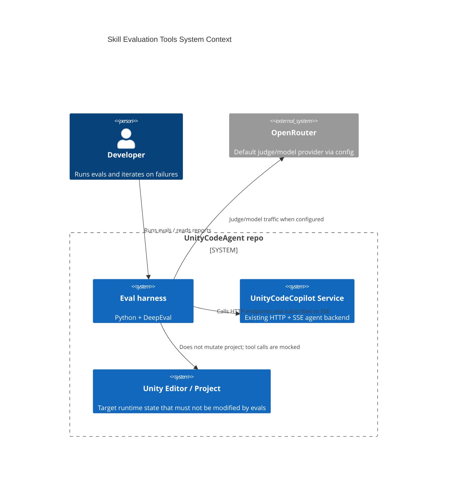
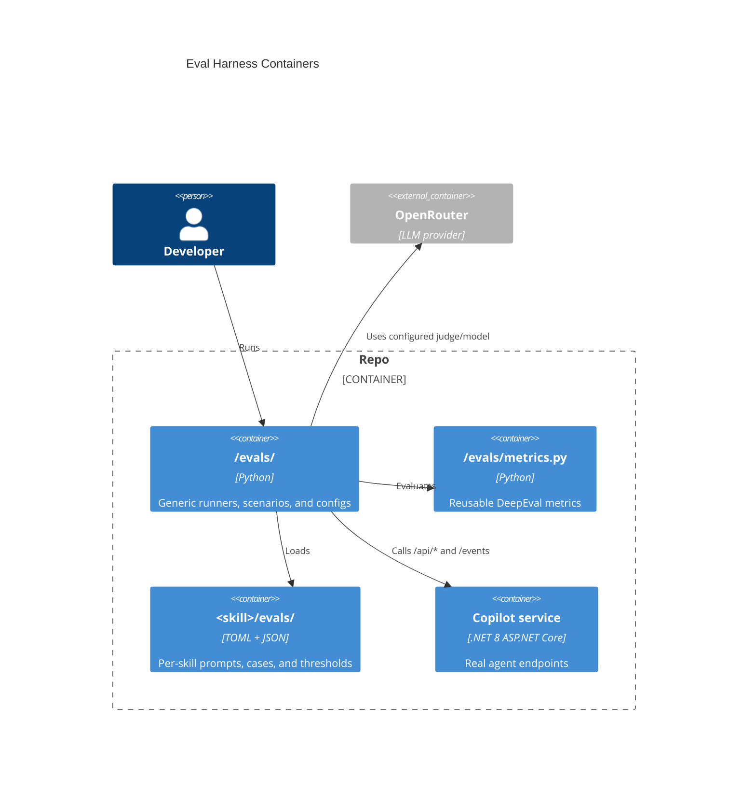
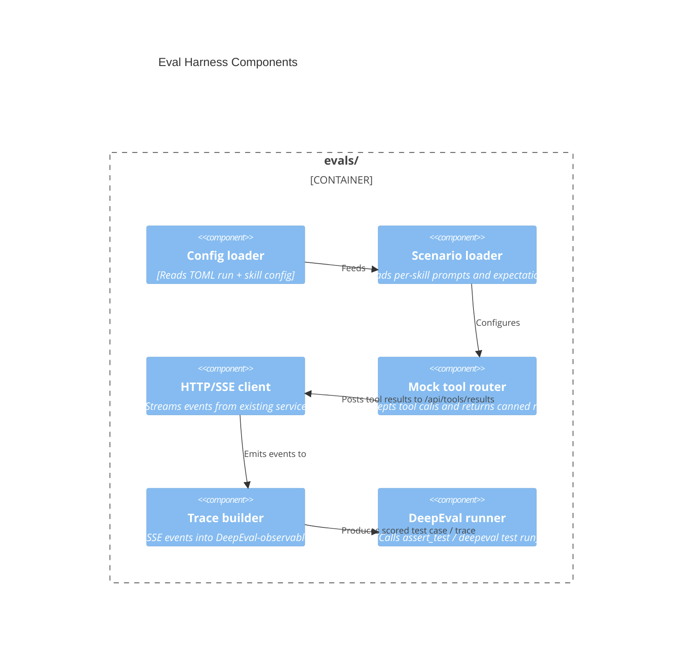
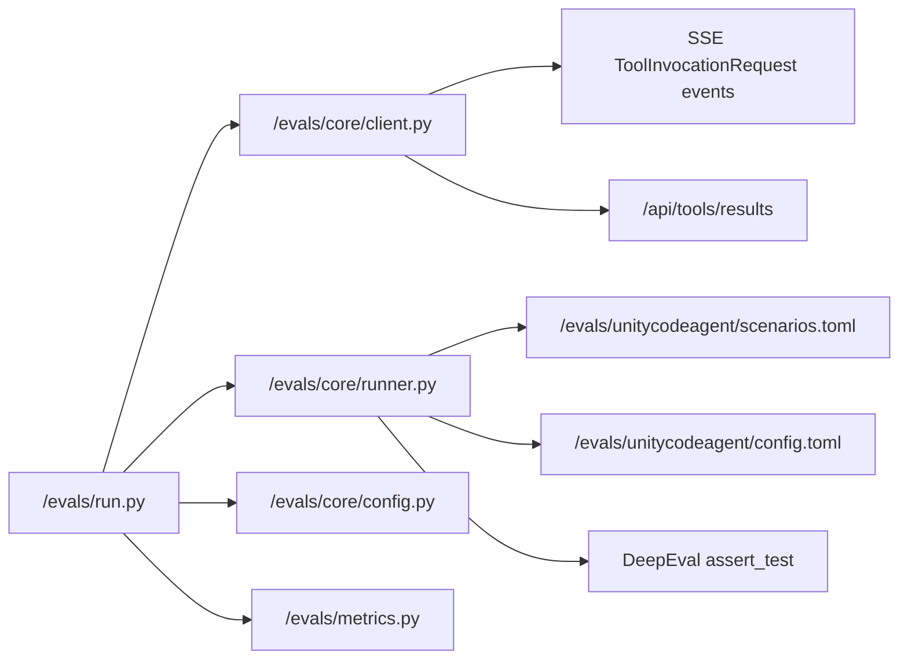
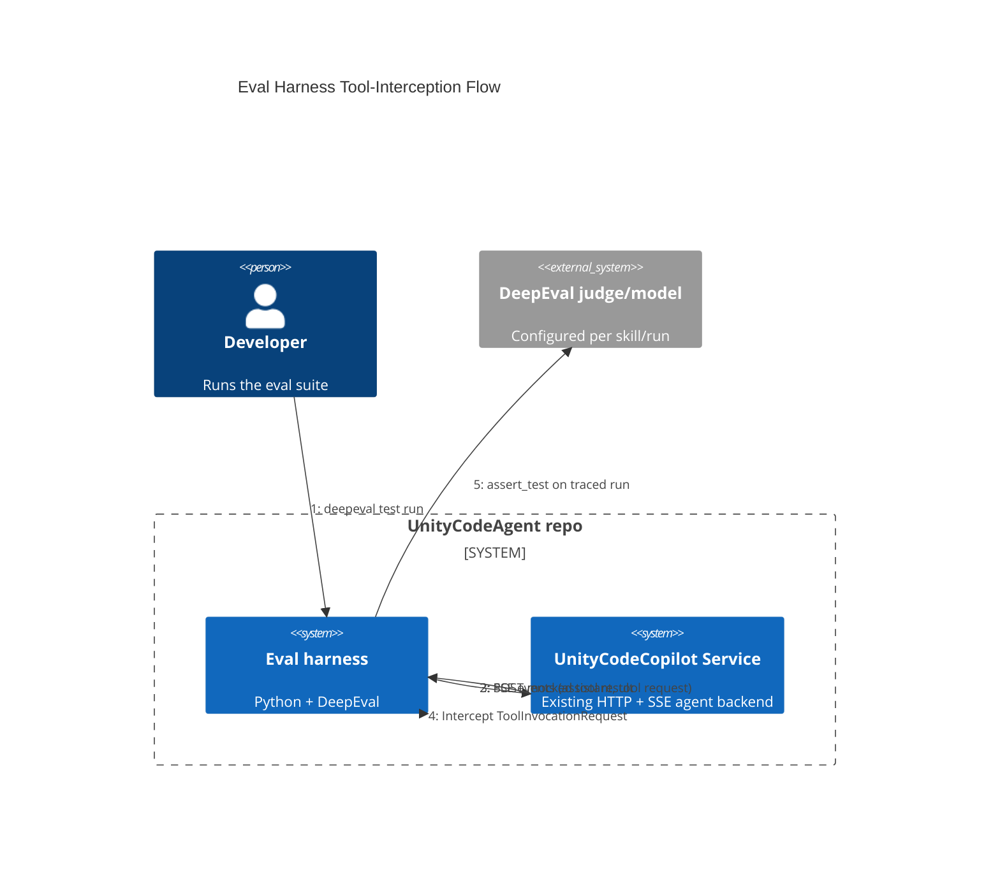

# Create skill evaluation tools

- goal: Produce a reusable DeepEval eval harness under `/evals` that can run skill and tool evaluations against the real Copilot service, intercept tool calls without mutating the Unity project, and verify the `Packages\com.signal-loop.unitycodeagent\Editor\Skills~\unitycodeagent\SKILL.md` missing-assembly behavior with committed, rerunnable scenarios.
- updated: 2026-07-01
- steps:
  - [x] Confirm the reusable eval architecture and file layout
  - [x] Implement the generic service client, SSE trace capture, and mock tool router
  - [x] Add the first `unitycodeagent` missing-assembly scenarios and TOML config
  - [x] Run the focused DeepEval suite and record the verification result

Original task:
~~~
Create python tools that can be used to evaluate and improve agent,  skills or tools.

- use DeepEval framework
- Use DeepEval skill
- do internet research how to best approach it, specifically skills evaluation with deepeval
- use python scripts and follow 'project-python' skill
- solution is generic - not for single skill, but can be resused to other skills or tools descriptions.
- skill specific information needed for evals (like test cases) should be located in skill directory in `evals` subfolder. eval configuration like model should be also here, so it can be defined per skill
- eval code and artifacts should be in /evals folder
- model/provider used for tests should be configurable. default should be openrouter with deepseek v4 flash
- evals shoul use existing Copilot service endpoints, so real agent is tested
- configuration should be stored in toml files
- tool calls should be intercepted and mocked, so tests dont modify existing project (like settings file).
- to create traces, observe sse events - look for tool calls and observe them.
- ensure that tool structure is well organized and readable.

first scenario to implement is checking `unitycodeagent` skill:
`unitycodeagent` failure details:
When there are no additional assemblies added in settings, and for example script uses Image, this error is returned: `error CS0234: The type or namespace name 'UI' does not exist in the namespace 'UnityEngine' (are you missing an assembly reference?)`. To solve this problem, agent uses reflection or load assembly dynamically. This works, but missing assembluy should be added to additional assemmblies in settings instead. This is described in skill, but agent does not follow it.

Goal: Create DeepEval based evals that can be used to verify `unitycodeagent` missing assembly behaviour.

example tests:
Create gameobject and add `Image` to it
- it should call execute_csharp_script_in_unity_editor with with `using UnityEngine.UI;` or `UnityEngine.UI.Image` in script, and it should return error about missing assembly. Then agent should follow instruction on additional assemblies in `unitycodeagent`. Succesfull next tool call should end the test with success, and agent interaction should be aborted.

Create gameobject and add `Rigidbody2d` to it
- it should call execute_csharp_script_in_unity_editor with with `Rigidbody2D` in script, and it should return error about missing assembly. Then agent should follow instruction on additional assemblies in `unitycodeagent`. Succesfull next tool call should end the test with success, and agent interaction should be aborted.
~~~

Research:
- DeepEval agent evals are trace-first. The official docs recommend a committed pytest suite that uses `deepeval test run`, `assert_test(...)`, and tracing with `@observe` or a supported integration for agent/tool workflows.
- DeepEval supports both end-to-end and component-level evaluation in the same traced single-turn run. Tool and span metrics attach to the relevant span, while trace-level metrics score the overall run.
- The docs and CLI reference support `deepeval generate` for datasets, with `docs`, `contexts`, `goldens`, or `scratch` as the generation source and `single-turn` or `multi-turn` as the variation.
- OpenRouter is supported through DeepEval configuration env vars, so the default judge/model can stay configurable instead of being hardcoded in Python.
- The current UnityCodeAgent service already exposes the interception seam we need: tool invocations are published as `ToolInvocationRequest` SSE events and tool results are posted back through `/api/tools/results`.
- The repo does not yet have a top-level `evals/` scaffold, so this task is greenfield at the eval-artifact layer.

Plan:
- Create a reusable `/evals` tree with a small Python harness, a shared metrics module, 
- Create per-skill subdirectories  `<skill>/evals` that hold TOML config plus scenario data.
- Use the existing service HTTP/SSE contract to drive a real agent session, capture SSE events as the trace source, and route `ToolInvocationRequest` events through a mock tool executor.
- Keep the tool router configurable by tool name so `execute_csharp_script_in_unity_editor` can return a synthetic missing-assembly failure without touching Unity assets or settings.
- Model the first `unitycodeagent` scenarios as narrow, deterministic cases that assert the tool-call sequence after the missing-assembly error, including the `Image` and `Rigidbody2D` cases.
- Use DeepEval trace-level assertions for the session outcome and add a custom instruction-adherence metric for the specific skill behavior that matters here: add the missing assembly instead of bypassing it with reflection or dynamic loading.
- Keep model/provider choice in TOML with a default OpenRouter `xiaomi/mimo-v2.5` configuration at `https://openrouter.ai/api/v1`, while leaving the config overrideable per skill and per run.
- Keep the first iteration deliberately small: one runner, one metrics module, one `unitycodeagent` skill folder, and one focused pytest entrypoint.

C4 Change Diagrams:
- System Context:

- Container:

- Component:

- Code:

- Dynamic:

Verification:
- Run the focused DeepEval suite with `deepeval test run` against the new eval file.
- Validate the `unitycodeagent` Image and `Rigidbody2D` missing-assembly scenarios.
- Confirm mocked tool calls do not modify Unity settings or assets.
- Check the trace/event capture shows the expected `execute_csharp_script_in_unity_editor` call and the follow-up reaction after the synthetic error.

Implementation notes:
- Added `/evals/agent_service_eval.py` with reusable TOML loading, service endpoint resolution, real Agent Service HTTP calls, `/events` SSE capture, `ToolInvocationRequest` parsing, mocked tool result posting, and prompt abort cleanup.
- Added `/evals/metrics.py` with a deterministic DeepEval `MissingAssemblyRecoveryMetric` that verifies the target tool call receives the missing-assembly error, then checks that the follow-up uses `UnityCodeAgentSettings.Instance.AddToolAssembly(...)` without reflection/dynamic-load bypasses.
- Added `/evals/test_skill_scenarios.py` for the live service-backed configured skill scenarios. The tests are skipped unless `UNITYCODEAGENT_EVAL_LIVE=1` is set, so normal local runs do not require a running service or model credentials.
- Added `/evals/test_eval_harness_unit.py` for non-live DeepEval coverage of config/scenario loading and the custom missing-assembly metric.
- Added `Packages/com.signal-loop.unitycodeagent/Editor/Skills~/unitycodeagent/evals/config.toml` with the default OpenRouter `xiaomi/mimo-v2.5` provider and service/session/tool config.
- Added `Packages/com.signal-loop.unitycodeagent/Editor/Skills~/unitycodeagent/evals/scenarios.toml` with the Image/UI and Rigidbody2D/Physics2D missing-assembly scenarios.
- Added `/evals/README.md` with rerun commands and required environment variables. `PYTHONUTF8=1` is documented because DeepEval/Rich writes Unicode status glyphs that fail on Windows cp1252 consoles.

Verification result:
- `uv run --with deepeval --with httpx --with pytest deepeval test run evals/test_eval_harness_unit.py evals/test_skill_scenarios.py --identifier "unitycodeagent-scenarios-local"` initially reached a passing custom metric score but failed on Windows console encoding. Reran with `PYTHONUTF8=1`.
- `$env:PYTHONUTF8='1'; uv run --with deepeval --with httpx --with pytest deepeval test run evals/test_eval_harness_unit.py evals/test_skill_scenarios.py --identifier "unitycodeagent-scenarios-local"` passed: pytest reported 2 passed and 2 skipped; DeepEval reported 2 total tests, 2 passed, 0 failed. The skipped tests are the committed live service scenarios gated by `UNITYCODEAGENT_EVAL_LIVE=1`.
- `$env:PYTHONUTF8='1'; uv run --with deepeval --with httpx --with pytest python -m compileall evals` passed.

- ensure openrouter key is loaded from .env, not only set in command line
- MissingAssemblyRecoveryMetric is part of specific skill test, so required data should be in skill /evals folder, not in generic metrics.py. Metric can contain generic code and load neccessary data from skill folder. This way it can be reused for other skills, but skill specific data is in skill folder.
- Can you use build in deepeval metrics to eval tools or it is neccesary to create custom metric for this?
- A trace from `deepeval test run` gives the coding agent more than a pass/fail result. It includes scores, span-level context, and metric reasons, so a failure can be traced back to the part of the system that produced it.
