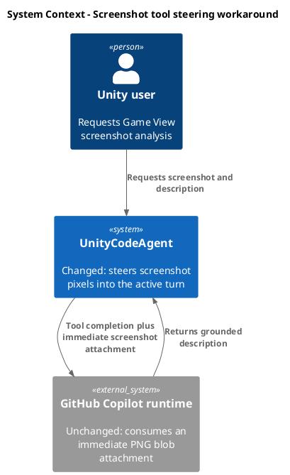
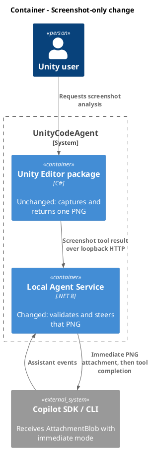
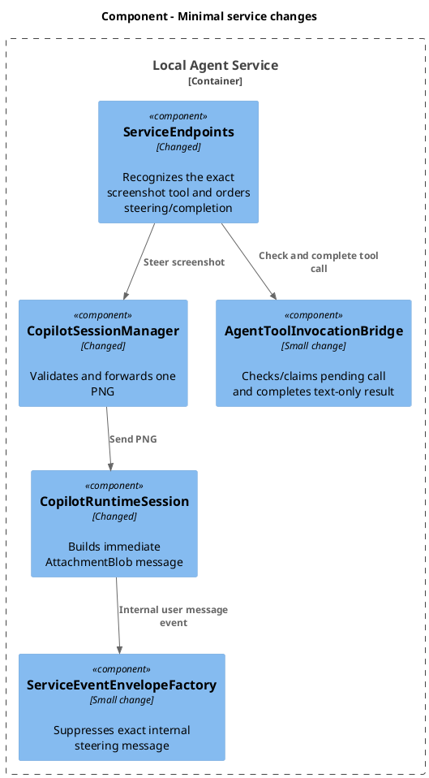
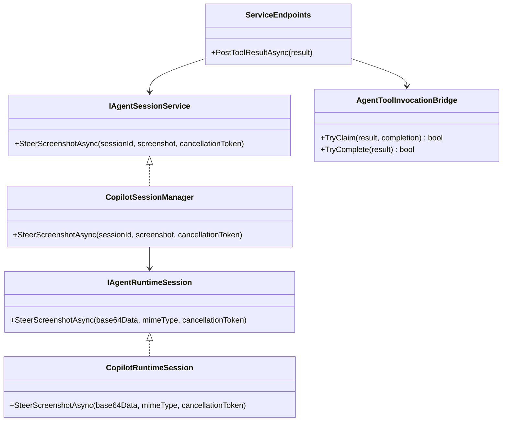
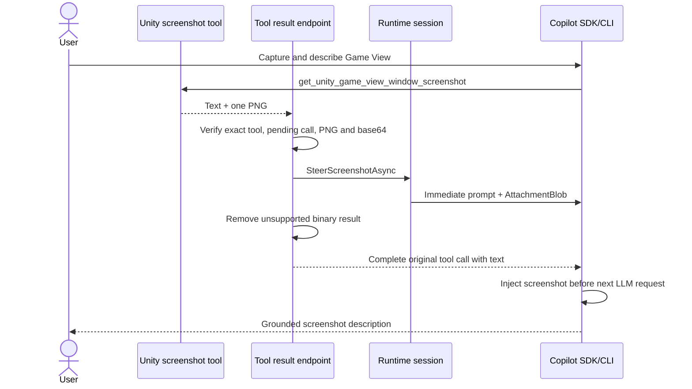

# Fix screenshot tool image analysis

- goal: Make `get_unity_game_view_window_screenshot` produce descriptions grounded in the captured pixels by steering its PNG into the active Copilot turn as a blob attachment, verified with focused service tests and a live Game View check while leaving every other tool unchanged.
- updated: 2026-07-09
- steps:
    - [x] Add screenshot-only steering support to the runtime session boundary.
    - [x] Route the screenshot tool's successful PNG result through that steering path.
    - [x] Complete malformed or unforwardable screenshot results with an explicit tool error.
    - [x] Preserve all non-screenshot tool behavior.
    - [x] Add focused service regression tests.
    - [x] Run targeted Unity screenshot tests and confirm Unity reload/test discovery.
    - [x] Verify a live screenshot description with a vision-capable model.

Original task, narrowed to the screenshot tool:

~~~
Ask UnityCodeAgent, by opening chat and inserting a prompt, to take a screenshot and describe it.

Expected output:
The image shows a minimalist Unity scene with:

• Sky: A smooth gradient from a deeper blue at the top to a lighter, paler blue near the horizon
• Ground/Plane: A large, flat grayish-brown surface occupying roughly the bottom two-thirds of the frame
• Horizon: A clean, straight horizon line dividing the sky and ground, with a slight hazy white/light band where they meet

Current output: a hallucinated Unity interface or Game View.

Goal: confirm, debug, and fix image analysis for the Game View screenshot tool.
~~~

## Scope

- Included only: `get_unity_game_view_window_screenshot`.
- Unchanged: all other Unity tools, ordinary prompts, chat UI, and public loopback contracts.
- No SDK upgrade: releases 1.0.5 and 1.0.6 do not fix custom-tool binary image consumption.
- No Copilot CLI fork: use the SDK's supported blob-attachment and immediate-steering APIs.

## Research

- `GetUnityGameViewWindowScreenshotTool` already captures, scales, persists, and returns a valid PNG image content item.
- `ScreenshotToolArtifactTests` verifies the returned base64 data and `image/png` MIME type.
- Visual inspection confirmed the latest persisted capture contains the expected sky gradient, horizon, and gray-brown ground.
- `UnityAgentToolRegistry`, `AgentToolInvocationResultDto`, OpenAPI, and `AgentToolInvocationBridge` preserve the PNG through `ToolResultAIContent`.
- Service logs prove the complete PNG reaches `tool.execution_complete.result.binaryResultsForLlm`, but the subsequent assistant description is incorrect. Capture and transport to the SDK are working; the runtime does not expose the binary tool result to the model.
- The project uses `GitHub.Copilot.SDK` 1.0.4 and Copilot CLI 1.0.69.
- SDK 1.0.5, SDK 1.0.6, and current `main` all retain the skipped `.NET` `Can_Return_Binary_Result` E2E test with the reason that the model behaves as if no binary content was returned. Neither later release documents a fix.
- The SDK supports `AttachmentBlob` for an in-memory PNG.
- `MessageOptions.Mode = "immediate"` injects a steering message before the next LLM request in the active turn. When a tool call is already committed, the runtime applies the steering message after that tool call completes but still within the same turn.
- Therefore the minimal workaround is: submit the screenshot attachment while the turn is waiting for the Unity tool result, then complete the tool call.

Official sources:

- SDK 1.0.5 release: https://github.com/github/copilot-sdk/releases/tag/v1.0.5
- SDK 1.0.6 release: https://github.com/github/copilot-sdk/releases/tag/v1.0.6
- SDK 1.0.5 binary-result test: https://github.com/github/copilot-sdk/blob/v1.0.5/dotnet/test/E2E/ToolsE2ETests.cs
- SDK 1.0.6 binary-result test: https://github.com/github/copilot-sdk/blob/v1.0.6/dotnet/test/E2E/ToolsE2ETests.cs
- Current binary-result test: https://github.com/github/copilot-sdk/blob/main/dotnet/test/E2E/ToolsE2ETests.cs
- Image input: https://docs.github.com/en/copilot/how-tos/copilot-sdk/features/image-input
- Steering and queueing: https://docs.github.com/en/copilot/how-tos/copilot-sdk/features/steering-and-queueing

## Detailed implementation plan

### 1. Add one narrow runtime-session operation

Extend `IAgentRuntimeSession` with:

```csharp
Task SteerScreenshotAsync(
    string base64Data,
    string mimeType,
    CancellationToken cancellationToken);
```

Do not introduce a generic attachment DTO, collection abstraction, or public API change. The screenshot tool returns exactly one PNG, so two strings are sufficient.

Implement the method in `CopilotClientHost.CopilotRuntimeSession` by calling the existing SDK session:

```csharp
await _session.SendAsync(new MessageOptions
{
    Prompt = "The Game View screenshot returned by the current Unity tool call is attached. Analyze it to answer the user's current request.",
    Mode = "immediate",
    Attachments =
    [
        new AttachmentBlob
        {
            Data = base64Data,
            MimeType = mimeType,
            DisplayName = "unity-game-view.png",
        },
    ],
}, cancellationToken);
```

Keep the steering prompt constant and concise. It must not ask a new question or start unrelated work.

### 2. Add one screenshot-forwarding operation to the session manager

Add a narrow method to `IAgentSessionService`/`CopilotSessionManager`:

```csharp
Task SteerScreenshotAsync(
    string sessionId,
    AgentToolBinaryResultDto screenshot,
    CancellationToken cancellationToken);
```

The method:

1. Resolves the already-attached runtime session with the existing `GetRequiredSession`.
2. Validates that `Data` is non-empty.
3. Validates that `MimeType` equals `image/png`, ignoring case.
4. Validates base64 with `Convert.TryFromBase64String` or an equivalent allocation-conscious check.
5. Calls `attached.Session.SteerScreenshotAsync(...)` exactly once.
6. Logs session ID, MIME type, and encoded length only; it must not log the base64 data.

Validation belongs here because the session manager owns runtime orchestration. Do not duplicate PNG decoding or image resizing; the Unity tool already performs those operations.

### 3. Special-case only the screenshot tool result endpoint

Change `/api/tools/results` to an async handler and add `IAgentSessionService` plus `CancellationToken`.

Use one exact ordinal tool-name comparison:

```csharp
request.ToolName == "get_unity_game_view_window_screenshot"
```

Behavior:

- If the tool name differs, execute the current `tools.TryComplete(request)` path without any change.
- If the screenshot tool already returned `IsError = true`, execute the current completion path without steering.
- For a successful screenshot result, require exactly one binary result with:
  - `Type == "image"`;
  - `MimeType == "image/png"`;
  - valid, non-empty base64 data.
- Ignore no additional tools and support no additional image formats in this task.

### 4. Preserve reliable ordering and completion

Before any screenshot steering side effect, atomically claim the pending tool call in `AgentToolInvocationBridge`. Add a minimal internal completion handle:

```csharp
bool TryClaim(
    AgentToolInvocationResultDto result,
    out AgentToolInvocationCompletion completion);
```

The claim removes the call from the pending dictionary so a duplicate HTTP result cannot steer the screenshot twice. The returned handle owns the original `TaskCompletionSource` and can complete it exactly once with either success or failure. Existing non-screenshot results may continue through `TryComplete`.

For a valid claimed screenshot:

1. Await `sessions.SteerScreenshotAsync(...)` while the Copilot turn is still waiting for the Unity tool result.
2. After steering is accepted by the SDK, create a copy of the result with `BinaryResults = null`.
3. Complete the claimed pending tool call through the completion handle.

Removing the binary from the final `ToolResultAIContent` avoids sending the same image through both the unsupported tool-binary path and the steering path. Preserve `TextResult`, `IsError`, and `Error`.

For invalid image data or a steering exception:

1. Create a failure `AgentToolInvocationResultDto` for the same call/session/tool.
2. Set a concise error such as `Game View screenshot could not be attached for visual analysis.`
3. Complete the claimed pending tool call with that failure before returning from the endpoint.
4. Log the technical exception without image data.

This guarantees the pending tool call does not wait for its two-minute timeout and prevents the model from treating screenshot capture as successful when it received no pixels.

If `TryClaim(...)` reports that the call is no longer pending, retain the existing `404` response and do not steer an attachment.

### 5. Keep the internally generated steering message out of the chat transcript

The SDK emits the steering prompt as a `user.message`. Add one exact internal prompt constant shared by the sender and service-event conversion. Suppress only that exact message from Unity-facing event publication.

Do not filter by prefix, attachment presence, or general message content. User messages that happen to discuss screenshots must remain visible.

If sharing the constant would create an undesirable dependency, use an internal event marker carried in `DisplayPrompt` and suppress that exact marker. Choose one mechanism and cover it with a focused test.

### 6. Add focused tests

Service tests:

- `CopilotSessionManagerTests`
  - valid PNG is forwarded once to the requested attached session;
  - malformed base64 is rejected before runtime send;
  - non-PNG MIME type is rejected;
  - a different session is not used.
- `AgentServiceEndpointContractTests`
  - non-screenshot tool results follow the existing path and never steer;
  - screenshot tool errors complete normally and never steer;
  - valid screenshot steering occurs before tool completion and completion contains no binary result;
  - steering failure completes the tool with an explicit error;
  - stale/duplicate result does not steer a second time.
- Runtime adapter test/seam
  - `AttachmentBlob` contains the original data, `image/png`, and `unity-game-view.png`;
  - `Mode` is `immediate`;
  - the steering prompt is the expected internal constant.
- `ServiceEventEnvelopeFactory` test
  - the exact internal steering message is suppressed;
  - normal user messages remain visible.

Unity tests:

- Keep `ScreenshotToolArtifactTests.CaptureResult_IncludesSavedPathTextAndImageContent` as the capture-side proof.
- Run the targeted tool registry/transport test that proves the PNG and MIME type reach `AgentToolInvocationResultDto`.
- Do not add UI, file-selection, or generic attachment tests.

### 7. Verification sequence

1. Copy OpenAPI/AsyncAPI files under `.artifacts/contracts/...` as required by the repository test setup.
2. Run focused service tests using:

   ```powershell
   dotnet test CopilotService.Tests\UnityCodeCopilot.Service.Tests.csproj --artifacts-path .artifacts\copilot-service-tests -p:UseAppHost=false
   ```

   Apply a test filter if the existing project supports the relevant NUnit names cleanly.
3. Wait for Unity compilation/domain reload.
4. Confirm the targeted screenshot and tool transport tests are discovered by name.
5. Run those Unity EditMode tests and inspect Unity console logs.
6. Run a live check with a vision-capable model:
   - ask UnityCodeAgent to capture and describe the current Game View;
   - compare the response with the persisted PNG;
   - confirm the response describes the visible sky, horizon, and ground;
   - confirm the internal steering prompt is absent from the chat transcript;
   - confirm no base64 image data appears in new service log entries.

If the selected model does not advertise vision support, record that as a failed precondition and repeat with a vision-capable model. Do not accept a plausible-sounding description as evidence; compare it with the saved screenshot.

## C4 Change Diagrams

### System Context



### Container



### Component



### Code



### Runtime Flow



## Verification

- Planning evidence:
  - Correct persisted screenshot visually inspected.
  - PNG traced from Unity capture through the service and SDK tool-completion event.
  - SDK 1.0.5, SDK 1.0.6, and current `main` checked; binary tool-result E2E remains skipped.
  - Blob attachment and immediate steering are documented supported SDK paths.
- No implementation tests were run during planning.
- Acceptance requires passing focused service and Unity tests, mandatory Unity reload/test discovery, no visible internal steering message, no new base64 log payload, and a live response matching the persisted screenshot.

## Completion

- Added screenshot-only immediate `AttachmentBlob` steering, atomic tool-result claiming, explicit failure completion, binary removal from the original tool completion, exact transcript suppression, and redacted runtime-event logging.
- Focused service verification passed: 34 tests covering the session manager, endpoint behavior, invocation bridge, and event conversion.
- Unity discovered and passed `SignalLoop.UnityCodeAgent.Service.ScreenshotToolArtifactResultTests.CaptureResult_IncludesSavedPathTextAndImageContent`.
- No separate Unity registry/transport test matching the planning note exists in the current test tree; service endpoint coverage verifies the DTO-to-runtime boundary.
- Restarted the local service from Unity and ran two live screenshot turns with `claude-haiku-4.5`. Both descriptions matched the persisted pixels: blue sky, horizon, and gray-brown ground with no visible objects.
- The final live run recorded one steering operation and one redacted internal event, with zero PNG base64 prefixes and zero internal steering prompts in new service log entries.
