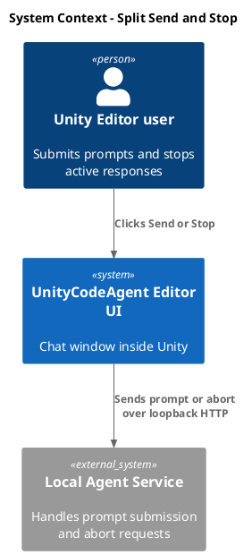
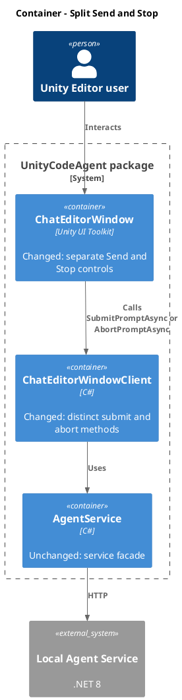
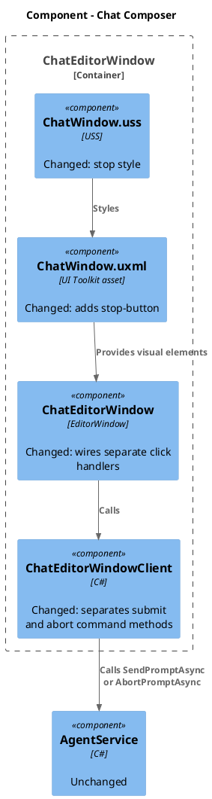
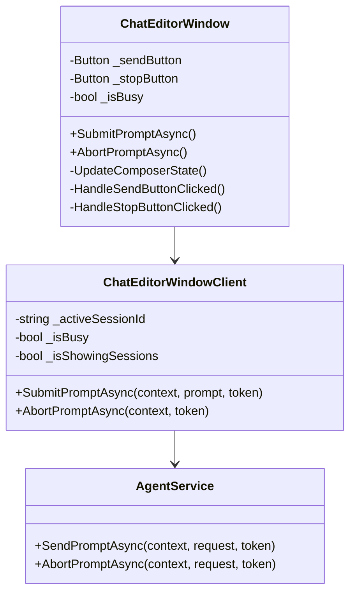
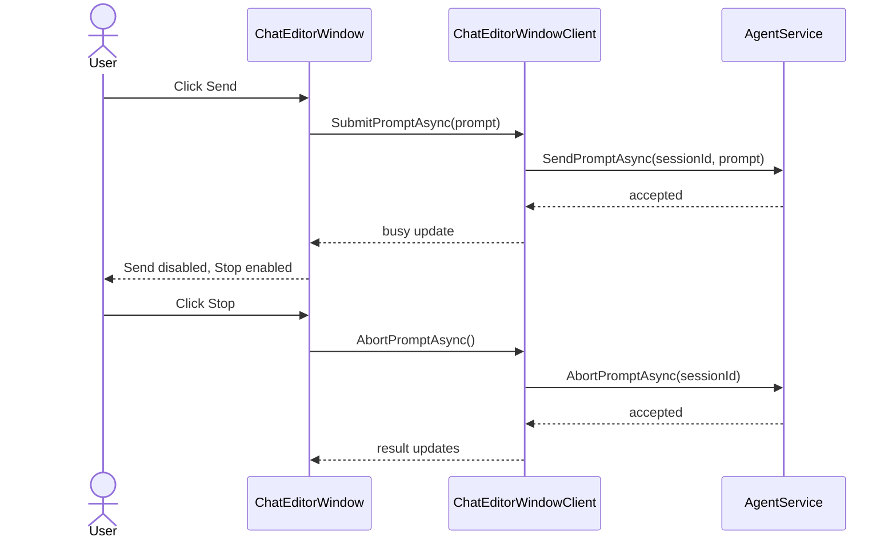

# Split Send and Stop button

- goal: Separate Send and Stop controls so prompt submission and response abort use distinct UI and client paths, verified by focused UI E2E coverage while preserving existing session-list behavior.
- updated: 2026-07-07
- steps:
    - [x] Add a dedicated `stop-button` to the chat composer UXML and USS.
    - [x] Wire Send to prompt submission only and Stop to aborting the active busy session.
    - [x] Keep Send and Stop always visible, enabling each only when its action is valid.
    - [x] Add UI E2E coverage for busy Stop visibility and abort dispatch.
    - [x] Run the focused Unity UI E2E test.

Current UI has one `send-button` that changes text to `Stop` while busy, but click still calls `SubmitPromptAsync`.

Add a separate `stop-button` in UXML/USS and wire it to `AbortPromptAsync` for the active session.
Keep Send and Stop visible at all times; disable Send while busy or otherwise invalid, and disable Stop unless the current session is busy.
Cover with UI E2E: submit prompt, busy state shows Stop, Stop sends abort instead of another prompt.

Research:
- `Packages/com.signal-loop.unitycodeagent/Editor/UI/ChatWindow.uxml` currently defines only `send-button` in the composer actions.
- `Packages/com.signal-loop.unitycodeagent/Editor/UI/ChatEditorWindow.cs` requires `send-button`, registers it to `HandleSendButtonClicked`, and changes its text to `Stop` in `UpdateComposerState()` when `_isBusy` and not showing sessions.
- `Packages/com.signal-loop.unitycodeagent/Editor/Service/ChatEditorWindowClient.cs` currently overloads `SubmitPromptAsync`: while busy and not showing sessions it calls `AgentService.AbortPromptAsync`, otherwise it sends a prompt.
- `Assets/Tests/Editor/Service/ChatEditorWindowUiE2eTests.cs` already drives the window through real UI Toolkit events and has mock-service helpers for busy session events.

Plan:
- Add a `stop-button` next to Send in `ChatWindow.uxml`; keep both controls present in the normal composer layout.
- Add `_stopButton` lookup, validation, click registration, and cleanup/reset handling in `ChatEditorWindow`.
- Add a window-level `AbortPromptAsync()` path that calls a new client method, then applies returned updates, mirroring the current submit method shape.
- Refactor `ChatEditorWindowClient` so `SubmitPromptAsync` returns failure while busy instead of aborting, and add `AbortPromptAsync(UnityContext, CancellationToken)` for the existing abort logic.
- Update `UpdateComposerState()` so Send remains text `Send`, Send is disabled during active busy response or loading, and Stop remains visible but is enabled only when `_isBusy && !IsShowingSessions && !isLoading`.
- Keep sessions-list behavior: when sessions are shown during a busy background response, Send should remain visible for starting a new prompt when valid, and Stop should remain visible but disabled.
- Add or adjust UI E2E coverage to assert `stop-button` exists on startup, is disabled while idle, becomes enabled while busy, sends abort through the mock service, and does not submit another prompt.

C4 Change Diagrams:

System Context:

Container:

Component:

Code:

Sequence:

Verification:
- Run focused Unity EditMode/UI E2E coverage for `ChatEditorWindowUiE2eTests`, ideally the new Stop test and nearby composer/session-list tests.
- If Unity test execution is unavailable, record that blocker and at minimum run a compile-oriented check through Unity console logs after recompile.

Completion:
- Added `stop-button` to the chat composer and kept Send text stable.
- Split `ChatEditorWindowClient` command routing so busy Submit fails without aborting, while `AbortPromptAsync` calls the abort endpoint for the active busy session.
- Added UI E2E coverage for Stop dispatch and client E2E coverage for separated submit/abort routing.
- Verification passed: Unity EditMode fixture run for `SignalLoop.UnityCodeAgent.UI.ChatEditorWindowUiE2eTests` and `SignalLoop.UnityCodeAgent.Service.ChatEditorWindowClientE2eTests` passed, 37 passed, 0 failed.
