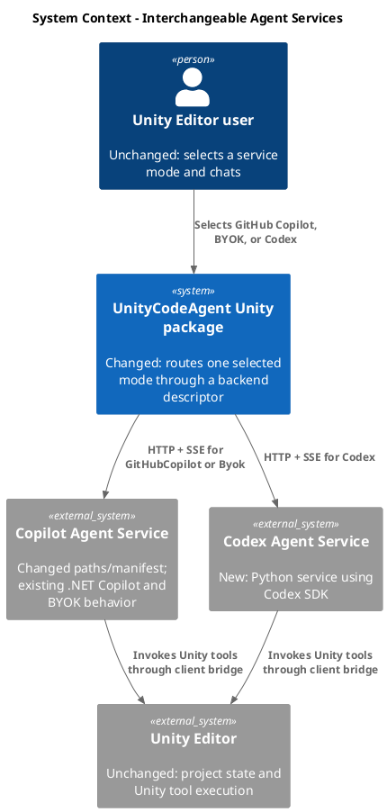
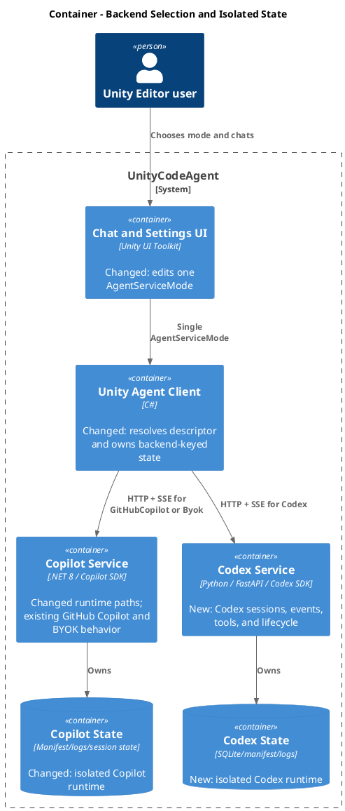
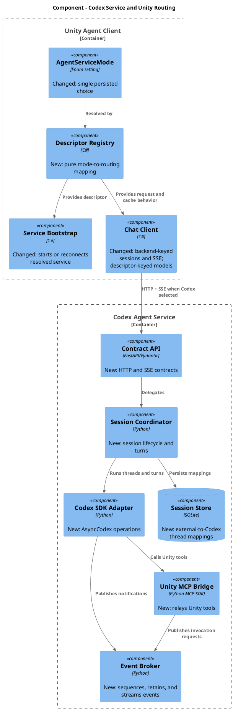
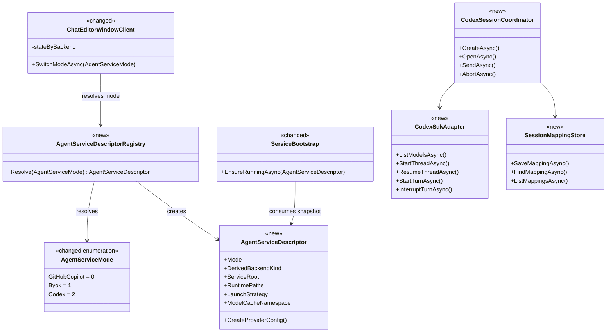
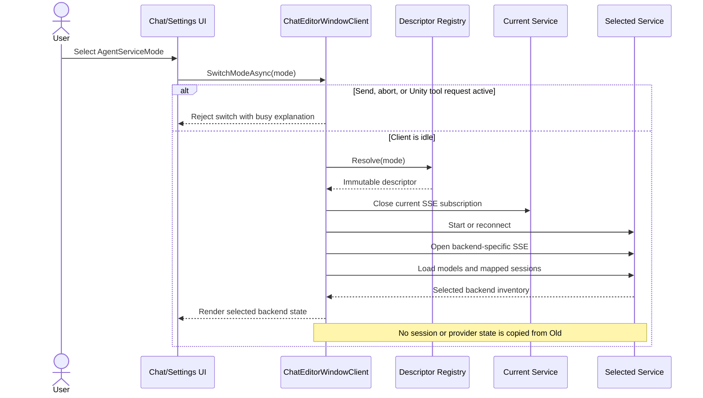

# Add interchangeable Codex agent service

- status: ToDo
- order: 100
- goal: Add a maintainable Python Codex service that implements the existing agent-service contracts and can be selected from Unity through one authoritative service mode, while keeping Copilot and Codex sessions and runtime state isolated and preserving existing GitHub Copilot and BYOK behavior.
- updated: 2026-07-20
- steps:
    - [ ] Add the locked uv Python service and Codex SDK adapter
    - [ ] Implement the existing HTTP, SSE, session, model, tool, skill, MCP, lifecycle, and telemetry contracts
    - [ ] Replace the persisted provider choice with one authoritative AgentServiceMode
    - [ ] Add backend-isolated bootstrap, manifests, clients, models, event cursors, and session state
    - [ ] Add the Unity toolbar and settings selector with safe switching behavior
    - [ ] Add Python, service-contract, Unity EditMode, and UI E2E coverage
    - [ ] Verify both services, Unity reload and test discovery, and session isolation end to end

## Original request

Create a service exchangeable with `Packages/com.signal-loop.unitycodeagent/Editor/CopilotService~` that implements the service contracts under `contracts/`.

- Use the Codex SDK and Python.
- Run with uv and follow uv best practices.
- Keep the service maintainable, reliable, and testable.
- Allow the Unity UI to select GitHub Copilot, BYOK, or Codex.
- Keep each service's sessions separate.
- Avoid complexity and invalid states caused by independently persisted backend and provider variables.

## Research

- The existing persisted selector is `UnityCodeAgentSettings.ProviderType`, backed by `UnityCodeAgentProviderType { Copilot = 0, Byok = 1 }`. Model selection is currently cached only by normalized BYOK base URL, so Codex would otherwise collide with Copilot state.
- `UnityContext` carries provider and one `UnityCodeAgentPaths`; `ServiceBootstrap`, `AgentService`, `ChatEditorWindowClient`, `EventStreamCursorStore`, and `ActiveSessionState` each assume one backend. The current runtime path is `.unityCodeAgent/service/`, the endpoint manifest is version 1 with no service identity, and the event cursor is global.
- The chat surface is UI Toolkit (`ChatWindow.uxml`/`ChatWindow.uss`), while the settings inspector currently uses IMGUI. The new toolbar selector must be a UXML/USS control; the settings selector must still write the same serialized mode and notify an open chat window so both surfaces cannot drift.
- The current contracts expose health, model listing, mapped session list/create/open/send/abort, tool-result completion, no-Unity stop, and one global SSE stream. JSON DTOs use PascalCase, send/abort/tool results return 202, stale tool results return 404, and SSE replay uses `Last-Event-ID` plus a manifest stream-generation ID.
- The official [Codex Python SDK](https://github.com/openai/codex/tree/main/sdk/python) now supports Python 3.10+, reuses existing Codex authentication, and installs a matching pinned `openai-codex-cli-bin` runtime. Its async API exposes model listing, thread start/list/resume/read, streamed typed/unknown notifications, turn interruption, compaction, workspace-write sandboxing, and automatic approval review. The implementation must pin a published SDK release in `uv.lock`, not depend on the moving `main` branch.
- `AsyncCodex.thread_start` and `thread_resume` accept a thread-scoped raw `config` object. Use that seam for MCP and skill overrides, with an integration test against the locked SDK proving that the process-private MCP server is visible only to the intended thread. Do not write Unity-generated MCP configuration to the user's global Codex config.
- The official SDK routes turn notifications by turn ID and documents concurrent active turns on one client. That supports one lifespan-owned client, per-session operation serialization, and cross-session concurrency without one Codex process per Unity session.
- `uv run --project` would otherwise place `.venv` beside the packaged service. Bootstrap must set `UV_PROJECT_ENVIRONMENT` and `UV_CACHE_DIR` to Codex-owned project runtime paths before invoking the locked console entry point.

## Plan

### Single authoritative service mode

- Add one persisted selector: `AgentServiceMode { GitHubCopilot = 0, Byok = 1, Codex = 2 }`.
- Replace the existing persisted Copilot/BYOK provider choice with `ServiceMode`, using `FormerlySerializedAs("ProviderType")` and preserving numeric values 0 and 1; append Codex as value 2 so existing settings assets migrate without a prompt.
- Do not persist or independently mutate an AgentServiceBackend value.
- If routing needs a backend kind, expose it only as a pure derived value: Codex maps to the Codex service; GitHubCopilot and Byok map to the existing Copilot service.
- Resolve the selected mode through one immutable AgentServiceDescriptor containing service root, launch strategy, runtime paths, model-cache namespace, applicable settings, and provider-request factory.
- Pass a selected mode or resolved descriptor through an operation, never an independently supplied backend/provider pair.
- Bind the chat toolbar and settings controls directly to the same mode field and one mode-changed notification path. Show and use BYOK inputs only for Byok.
- Add exhaustive invariant tests proving unsupported combinations such as Codex with BYOK credentials cannot be represented.

### Python Codex service

- Create `Packages/com.signal-loop.unitycodeagent/Editor/CodexService~` as a Python 3.12 packaged project with `pyproject.toml`, checked-in `uv.lock`, `src/`, `tests/`, and a console entry point.
- Use FastAPI, Uvicorn, Pydantic, SQLite, the official Python MCP SDK, and the asynchronous `openai-codex` SDK.
- Launch with `uv run --locked --no-dev --project <CodexService~> unity-code-agent-codex-service`.
- Set `UV_PROJECT_ENVIRONMENT` and `UV_CACHE_DIR` so the virtual environment and cache live under `.unityCodeAgent/services/codex/`, never under the installed package. Require uv on PATH and report an actionable error instead of installing it silently.
- Run one long-lived AsyncCodex client from the application lifespan and use the SDK-bundled Codex runtime by default.
- Isolate SDK-specific types behind a small adapter so orchestration and endpoint tests use a deterministic fake and SDK upgrades remain localized.
- Reuse existing Codex/ChatGPT authentication. Use project-root workspace-write sandboxing and automatic review. Fail an unsupported interactive approval with an actionable turn error rather than hanging.
- Separate contract/API, Codex adapter, session coordination, SSE broker, Unity MCP bridge, persistence, and lifecycle/telemetry responsibilities.

### Contract behavior

- Implement all existing OpenAPI and AsyncAPI operations without changing JSON casing or DTO shapes: health, models, session list/create/open/send/abort, tool results, service stop, and global SSE.
- Keep OpenAPI, AsyncAPI, shared DTO behavior, and examples aligned.
- Return 202 from send after safely scheduling the turn. Translate Codex thread, turn, message, reasoning, tool, completion, and error notifications into existing AgentEventDto types.
- Preserve stable stream keys between deltas and completed messages. Put sanitized original Codex notifications in SourceJson and map unsupported notifications to Unknown.
- Implement SSE heartbeats, monotonic sequence IDs, bounded replay, Last-Event-ID, bounded subscriber queues, and slow-client disconnection.
- Make abort idempotent for an attached idle session; interrupt the active Codex turn when present and publish normal status/idle events.
- Return Codex SDK models from the models endpoint. Reject Copilot-specific BYOK base URL or API-key configuration on Codex with a clear 400 response.
- Treat InfiniteSessions.Enabled as enabling Codex-native compaction. Accept existing fractional threshold fields for compatibility without translating them into undocumented token limits; log one compatibility warning.
- Translate configured skill directories, disabled skills, and supported stdio or Streamable HTTP MCP configuration into per-thread Codex configuration without modifying global Codex settings.

### Session and Unity-tool isolation

- Keep the Unity session ID separate from the Codex thread ID. Persist mappings and request configuration signatures in a Codex-owned, schema-versioned SQLite database using WAL mode.
- List only mapped sessions and never expose unrelated threads from the user's general Codex history.
- Persist creation atomically, recover mappings after restart, and resume the mapped thread when opening a session.
- Rebuild the existing contract history on open from `thread_read(include_turns=True)`, translating only the mapped thread and normalizing any turn left busy by a service crash to an interrupted/idle state.
- Serialize operations within one session while allowing different sessions to execute concurrently.
- Host a process-private Streamable HTTP MCP endpoint for Unity tools supplied through the service contract.
- Protect it with an unguessable per-process token and scope its tool registry to the external session.
- Publish ToolInvocationRequest over SSE, await the tools-results endpoint, and convert text, image, resource, and error results into native MCP content.
- Apply timeouts and cancellation and reject stale, mismatched, or completed results with 404. Return images as MCP image content without a steering workaround.

### Runtime isolation and Unity switching

- Store state separately under `.unityCodeAgent/services/copilot/` and `.unityCodeAgent/services/codex/`.
- Version the endpoint manifest and add serviceKind. Accept the legacy manifest path only as a Copilot fallback; Codex must never read it.
- Refactor bootstrap around the descriptor registry: Copilot retains executable/dotnet startup and Codex uses the locked uv command.
- Resolve one immutable descriptor snapshot at the start of bootstrap, request construction, or event connection so settings changes cannot create mixed-backend operations.
- Key runtime clients, manifests, SSE cursors, and remembered active sessions by derived backend kind. Key selected models and available-model inventories by the descriptor's mode/provider cache namespace so GitHub Copilot, each BYOK base URL, and Codex cannot reuse one another's model catalog.
- Block mode changes while sending, aborting, or waiting for a Unity tool result and show an explanatory progress message.
- When switching while idle, close the old SSE subscription, start or reconnect the selected service, and load only that service's models and sessions.
- Remember the active session independently per derived backend and never submit one backend's session ID to another.
- Permit both processes to remain running for fast switching.
- Implement both selectors with UI Toolkit controls and USS, with no inline styles. Migrate the provider/model portion of the existing custom settings inspector to `CreateInspectorGUI`; legacy custom sections may remain inside contained adapters during this task, but both selectors must mutate only `ServiceMode` and use the same switching coordinator.

### Reliability and operations

- Let the FastAPI lifespan own the Codex client, database, event broker, turns, and pending tool calls.
- Publish manifests atomically and delete one only while it remains owned by the stopping process.
- Monitor the parent Unity process unless no-Unity mode is enabled. Gracefully interrupt turns, fail tool futures, close resources, and remove only owned runtime state.
- Report healthy only after database and Codex adapter initialization. Return sanitized degraded details for dependency, runtime, or authentication failures.
- Use structured rotating logs and never log credentials, MCP authorization headers, binary bodies, or base64 data.
- Preserve telemetry switches with backend-neutral agent names and a Codex service identity. Capture prompt/response content only when explicitly enabled.
- Bound queues and timeouts. Retry overloads only for idempotent operations; never blindly retry thread creation or turn submission.

### Public interfaces and compatibility

- Make `AgentServiceMode { GitHubCopilot = 0, Byok = 1, Codex = 2 }` the only configurable service/provider selector.
- Do not add an independently configurable AgentServiceBackend setting; internal backend kind is derived and read-only.
- Preserve existing OpenAPI, AsyncAPI, and shared DTO wire shapes.
- Keep Copilot as the default and preserve existing GitHub Copilot and BYOK behavior.
- Do not import, migrate, share, merge, or deduplicate sessions between services.
- Pin the Codex SDK and all dependencies through uv.lock.

## Verification

### Python and contract tests

- Test every contract route, documented status, PascalCase payload, validation error, and AsyncAPI event example with a fake Codex adapter.
- Cover session mappings, persistence, restart recovery, missing threads, reattachment, same-session serialization, cross-session concurrency, and isolation.
- Cover deltas, stable keys, ordering, replay, heartbeat, unknown events, backpressure, abort races, and SDK failures.
- Cover MCP tool discovery and text, image, resource, and error results, including timeout, cancellation, mismatch, and late results.
- Cover authentication/model failures, lifecycle startup, manifest ownership, parent exit, no-Unity stop, and shutdown.
- Run `uv sync --locked`, formatting/type checks, and `uv run --locked pytest`; fail CI when pyproject.toml and uv.lock diverge.

### Unity and existing-service tests

- Verify serialized values 0 and 1 remain GitHub Copilot and BYOK, while 2 maps to Codex.
- Test exhaustive descriptor resolution and prove no mutable backend/provider pair exists.
- Test conditional settings, launch commands/environment, manifests, provider requests, model caches, session inventories, and the legacy Copilot fallback.
- Add UI E2E coverage using real UI Toolkit events for idle switching, busy rejection, SSE reconnection, isolated session lists, and restoration when switching back.
- Run the existing focused Copilot service tests.
- Wait for Unity domain reload, confirm new tests are discovered by name, run targeted EditMode/UI E2E tests, inspect the Console, and verify the UI visually.

### End-to-end acceptance

- Create a Copilot session, switch to Codex, confirm it is absent, create a Codex session, switch back, and confirm both inventories remain isolated after restarts.
- Stream a Codex response and complete a Unity tool invocation, including an image result.
- Resume a mapped Codex session after restarting only Codex.
- Confirm active work blocks switching.
- Confirm missing uv or Codex authentication produces actionable errors.
- Confirm existing GitHub Copilot and BYOK workflows continue without migration prompts.
- Confirm no code path can represent or execute Codex with BYOK configuration.

## C4 Change Diagrams

### System Context

### Container

### Component

### Code

### Switching Flow

## Assumptions and defaults

- Reuse existing Codex/ChatGPT authentication; do not add another API-key field initially.
- Copilot remains the default mode.
- The toolbar and settings selectors edit one shared mode setting.
- Block switching during active work instead of implicitly aborting it.
- uv must already be on PATH; first launch may download locked Python or dependencies.
- Keep the contracts backend-neutral and do not add a second service/provider selector.
