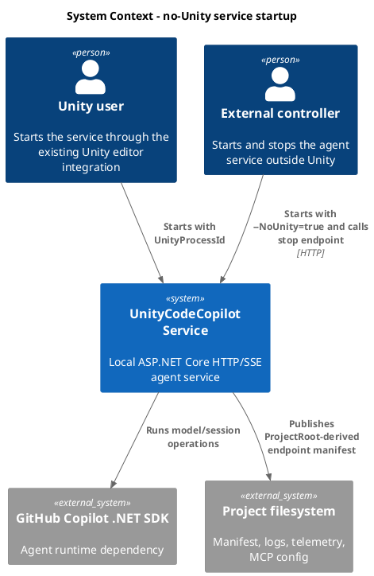
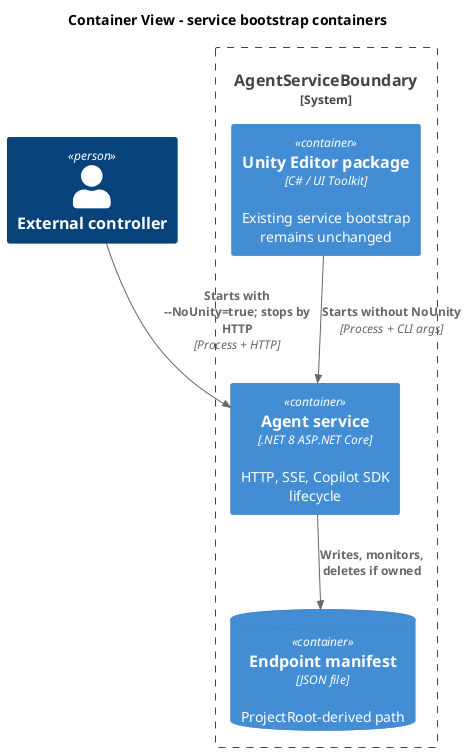
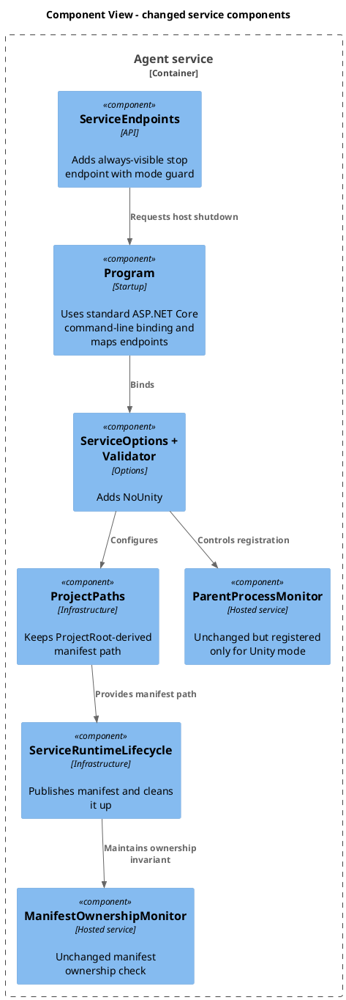
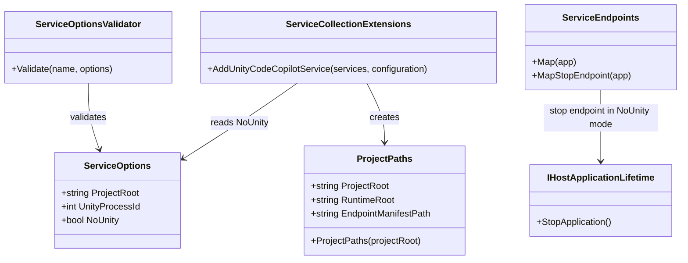
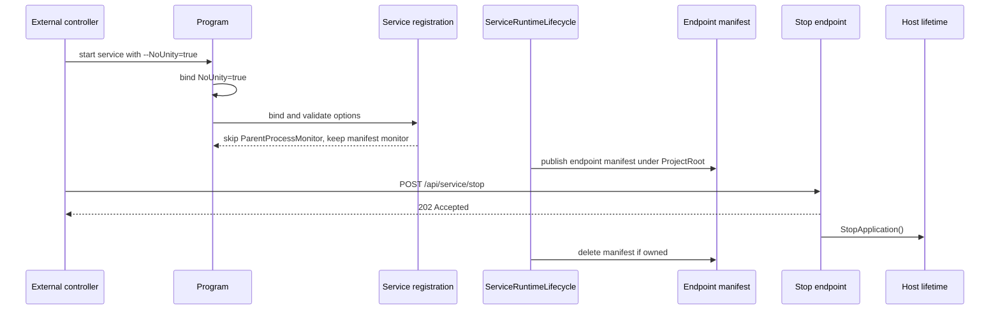
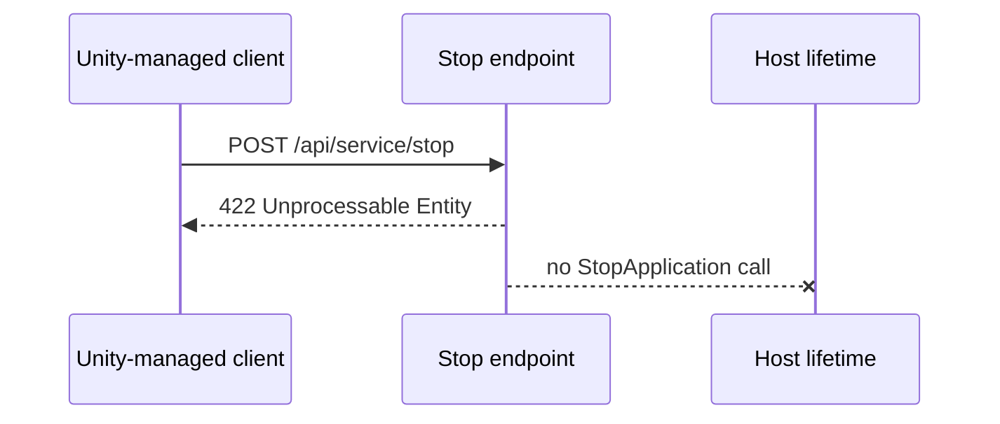

# Agent service can run without Unity
- status: Completed
- order: 300
- goal: Add a `nounity` service startup mode that runs without Unity process liveness checks, keeps normal manifest publication and ownership checks derived from `ProjectRoot`, exposes a visible stop endpoint that only stops the service in no-Unity mode, and is verified by focused service tests plus OpenAPI alignment while preserving Unity-managed startup behavior.
- updated: 2026-07-02
- steps:
    - [x] Add and validate service options for no-Unity startup mode.
    - [x] Keep Unity-managed startup behavior unchanged when no-Unity mode is disabled.
    - [x] Expose a stop endpoint that requests service shutdown only in no-Unity mode and returns `422 Unprocessable Entity` otherwise.
    - [x] Update focused tests and OpenAPI documentation for the new mode and endpoint.
    - [x] Run focused service tests.

Original task:
~~~
Add call parameter 'nounity' to agent service startup. When set, agent do not test for unity presence, otherwise works same, incl manifest checks.
Goal of this task is to enable  agent to run  independently and conterolled from outside.

- when completed:
- has 'nounity' parameter
- when nounity parameter is set, it esposes 'stop' endpint, which when called, kills service.
- ensure that manifest path is configurable
~~~

Research:
- `Program.cs` uses `WebApplication.CreateBuilder(args)`, then registers all service dependencies through `AddUnityCodeCopilotService(builder.Configuration)`.
- Service startup options live in `ServiceOptions`; validation currently requires `ProjectRoot` to exist and `UnityProcessId > 0`.
- Unity-managed startup passes CLI settings in `ServiceBootstrap.BuildServiceArguments`: `--ProjectRoot`, `--UnityProcessId`, `--OrphanTimeoutSeconds`, logging, telemetry, and `--urls`.
- Unity liveness checking is implemented by `ParentProcessMonitor`, registered unconditionally from `ServiceCollectionExtensions`.
- Manifest publication and cleanup are in `ServiceRuntimeLifecycle`; manifest ownership monitoring is handled by `ManifestOwnershipMonitor`. These should remain active in no-Unity mode because the task says the mode otherwise works the same, including manifest checks.
- `ProjectPaths.EndpointManifestPath` is currently always `<ProjectRoot>/.unityCodeAgent/service/runtime/endpoint.json`; `EndpointManifestStore` reads, writes, and deletes only that path. The reviewed plan should keep this `ProjectRoot`-derived behavior rather than adding a configurable manifest path.
- HTTP endpoints are centralized in `ServiceEndpoints.Map(app)`. There is no current stop/shutdown endpoint.
- Endpoint contract tests host the real `Program` pipeline via `WebApplicationFactory<Program>` and remove hosted services for in-process endpoint tests. This is the right place for endpoint behavior coverage; lifecycle and ProjectRoot-derived manifest behavior should use narrower unit tests.

Plan:
- Add a `NoUnity` option to `ServiceOptions`.
- Bind `NoUnity` through the existing ASP.NET Core command-line configuration pipeline, the same way other service options are bound. Use the canonical `--NoUnity=true` option name.
- Update `ServiceOptionsValidator` so `UnityProcessId > 0` is required only when `NoUnity` is false. Keep `ProjectRoot` validation because the service still needs a working directory, logs, telemetry defaults, MCP config lookup, and project identity.
- Leave `ProjectPaths` manifest behavior unchanged. `ProjectRoot` remains the only required root setting, and runtime files stay under project-relative `.unityCodeAgent/...` paths.
- Keep `ServiceRuntimeLifecycle` publishing a manifest in no-Unity mode, with `unityProcessId` set to `0`, and keep `ManifestOwnershipMonitor` registered. Register `ParentProcessMonitor` only when `NoUnity` is false.
- Add a stop endpoint, preferably `POST /api/service/stop`, that is always mapped. It should return `202 Accepted` and trigger `IHostApplicationLifetime.StopApplication()` after the response has been accepted when `NoUnity` is true. In normal Unity-managed mode, it should return `422 Unprocessable Entity` with an `AgentServiceErrorResponse` explaining that service self-stop is available only in no-Unity mode.
- Update `contracts/openapi/agent-service.openapi.yaml` with the stop endpoint, including `202` and `422` responses.
- Add tests:
  - `ServiceOptionsValidator` accepts `NoUnity=true` with `UnityProcessId=0` and rejects `UnityProcessId=0` when `NoUnity=false`.
  - Startup/configuration binds `--NoUnity=true` through the standard command-line provider.
  - Service registration omits `ParentProcessMonitor` in no-Unity mode while keeping `ManifestOwnershipMonitor`.
  - The stop endpoint returns `202` and calls `StopApplication` when `NoUnity=true`; the same endpoint returns `422 Unprocessable Entity` and does not stop the host when `NoUnity=false`.
  - Contract example/catalog tests include the new OpenAPI path.

C4 Change Diagrams:

System Context:

Container:

Component:

Code:

Dynamic Behavior:

Verification:
- Run focused tests first: `dotnet test CopilotService.Tests\UnityCodeCopilot.Service.Tests.csproj --filter "ServiceOptionsValidator|ProjectPaths|ManifestOwnershipMonitor|AgentServiceEndpointContractTests" --artifacts-path .artifacts\copilot-service-tests -p:UseAppHost=false`.
- If contract-spec tests fail under custom artifact path because the contract files are not copied under `.artifacts\contracts\...`, either copy `contracts/openapi/agent-service.openapi.yaml` and `contracts/asyncapi/agent-service-events.asyncapi.yaml` into the artifact root as documented, or rerun without `--artifacts-path` if no live service process is locking the apphost.
- For a final confidence pass, run `dotnet test CopilotService.Tests\UnityCodeCopilot.Service.Tests.csproj --artifacts-path .artifacts\copilot-service-tests -p:UseAppHost=false` with the contract files available under `.artifacts\contracts\...`.

Completion:
- Implemented `ServiceOptions.NoUnity`, standard command-line binding through the existing ASP.NET Core configuration pipeline, conditional Unity process validation, and conditional `ParentProcessMonitor` registration.
- Added `POST /api/service/stop`, returning `202 Accepted` and stopping the host only in no-Unity mode, and returning `422 Unprocessable Entity` with `AgentServiceErrorResponse` in Unity-managed mode.
- Left `ProjectRoot`-derived endpoint manifest publication and ownership monitoring active in no-Unity mode.
- Updated OpenAPI with the stop endpoint and added focused service tests for validation, command-line binding, hosted-service registration, and stop endpoint behavior.
- Verification passed:
  - `dotnet test CopilotService.Tests\UnityCodeCopilot.Service.Tests.csproj --filter "ServiceNoUnityModeTests|AgentServiceEndpointContractTests" --artifacts-path .artifacts\copilot-service-tests -p:UseAppHost=false` passed 18/18.
  - `dotnet test CopilotService.Tests\UnityCodeCopilot.Service.Tests.csproj --artifacts-path .artifacts\copilot-service-tests -p:UseAppHost=false` passed 46/46.
