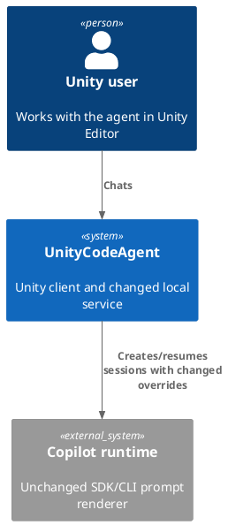
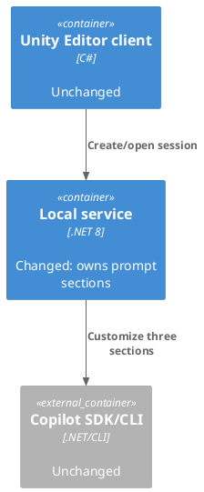
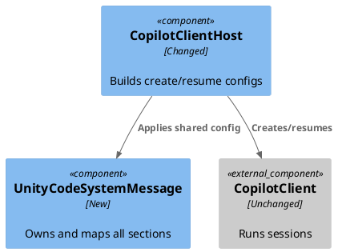
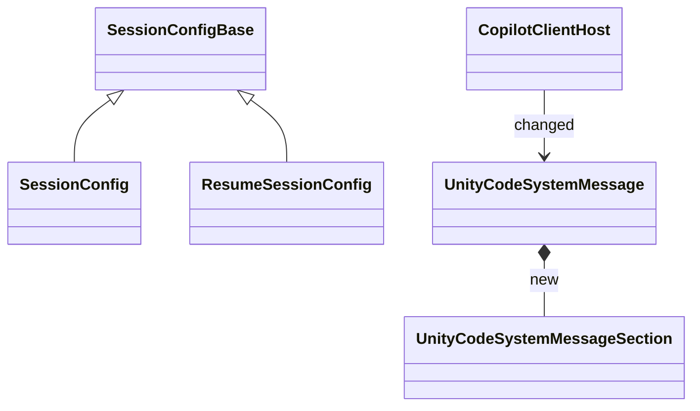

# Customize Copilot system message from C# sections

- status: Completed
- order: 100
- goal: Customize the Copilot SDK system message for both created and resumed sessions from one service-owned C# dictionary containing every supported `SystemMessageSection` and an immutable value struct with SDK action plus content, initially replacing the preamble and appending critical Unity tool and safety instructions while preserving all other generated CLI sections, verified by focused mapping/session tests and a captured or live prompt check without changing user-configured skills, tools, providers, or unrelated session behavior.
- updated: 2026-07-21
- steps:
    - [x] Confirm SDK customize-mode behavior against `dev/systemprompt/v0.md` and the create/resume paths
    - [x] Add the immutable section value struct and authoritative C# system-message dictionary
    - [x] Map non-empty dictionary entries to SDK section overrides
    - [x] Apply the same generated `SystemMessageConfig` to created and resumed sessions
    - [x] Remove only AGENTS.md instructions now owned by the system prompt
    - [x] Add focused dictionary, prompt-content, and create/resume parity tests
    - [x] Verify the rendered prompt, service tests, Unity reload, and test discovery

Customize the GitHub Copilot CLI system message with a concise Unity-specific identity and baseline operating rules. Use `dev/systemprompt/v0.md` as the reference snapshot of the currently rendered prompt and preserve its useful SDK-managed sections unless this task explicitly overrides them.

Use these skills as source material for the Unity-specific content:

- `.agents/skills/unitycodeagent/SKILL.md`
- `.agents/skills/executing-csharp-scripts-in-unity-editor/SKILL.md`

## C# storage design

- Store the authoritative prompt content in one service-owned C# file under `Packages/com.signal-loop.unitycodeagent/Editor/CopilotService~/Copilot`, next to the SDK integration that consumes it. A suitable name is `UnityCodeSystemMessage.cs`.
- Define a small immutable value struct, for example `UnityCodeSystemMessageSection`, containing `string Content` and the existing Copilot SDK `SectionOverrideAction Action`. Add a static `Empty` value that centralizes the inactive representation as `SectionOverrideAction.Preserve` plus `string.Empty`. Do not introduce a duplicate local action enum.
- Represent the prompt as an `IReadOnlyDictionary<SystemMessageSection, UnityCodeSystemMessageSection>` keyed directly by the SDK `SystemMessageSection` values.
- Include every known key exactly once: `Preamble`, `Identity`, `Tone`, `ToolEfficiency`, `EnvironmentContext`, `CodeChangeRules`, `Guidelines`, `Safety`, `ToolInstructions`, `CustomInstructions`, `RuntimeInstructions`, and `LastInstructions`.
- Give every unused section the canonical `UnityCodeSystemMessageSection.Empty` value. Ignore empty or whitespace-only content when constructing SDK overrides, so inactive entries do not emit `Preserve` overrides.
- Store each active section's action beside its content: `Preamble` uses `SectionOverrideAction.Replace`; `ToolInstructions` and `Safety` use `SectionOverrideAction.Append`. Map those values directly into SDK `SectionOverride` objects without a separate action dictionary or switch.
- Keep prompt construction in one small service-owned component and reuse it from both create and resume paths. Do not make Unity read, transport, or own the prompt.
- Do not add TOML, JSON, YAML, embedded resources, output-copy rules, runtime file loading, or a configuration parser for this feature.

Illustrative shape:

```csharp
private readonly record struct UnityCodeSystemMessageSection(
    SectionOverrideAction Action,
    string Content)
{
    public static UnityCodeSystemMessageSection Empty { get; } =
        new(SectionOverrideAction.Preserve, string.Empty);
}

private static readonly IReadOnlyDictionary<SystemMessageSection, UnityCodeSystemMessageSection> Sections =
    new Dictionary<SystemMessageSection, UnityCodeSystemMessageSection>
    {
        [SystemMessageSection.Preamble] = new(SectionOverrideAction.Replace, """..."""),
        [SystemMessageSection.Identity] = UnityCodeSystemMessageSection.Empty,
        // Every remaining SystemMessageSection key is listed explicitly.
    };
```

Tests must enumerate the public SDK section properties and prove the dictionary contains exactly the same keys, so an SDK upgrade cannot add or rename a section without an intentional prompt update.

## Initial active sections

Only these dictionary entries contain text initially:

- `Preamble` / `Replace`: identify the agent as **Unity Code Copilot**, working with the user in the live Unity Editor and shared project workspace.
- `ToolInstructions` / `Append`: add only the critical routing and execution rules:
  - use `execute_csharp_script_in_unity_editor` for live Unity state and Editor automation, but use file tools for C# source and plain project files;
  - check `read_unity_console_logs` before Editor scripts or Unity tests that depend on compiled code;
  - use `run_unity_tests` for EditMode/PlayMode tests, not the script execution tool;
  - Editor scripts are synchronous top-level statements, safe to rerun, use Unity-safe `== null` checks, and report real results.
- `Safety` / `Append`: add only the most important prohibited actions:
  - never fabricate, simulate, or claim an Editor change or test result that did not occur;
  - never use `async`/`await`, `Task`, or background threads in executed Unity Editor scripts;
  - never use the Editor script tool to edit source/plain files or run Unity tests;
  - never modify a prefab asset through an in-scene instance; use the load, modify, save, and unload lifecycle.

Leave every other dictionary value empty. Do not replace the full prompt: preserve the CLI tone, code-change rules, environment context, runtime instructions, custom instructions, and final completion behavior visible in `dev/systemprompt/v0.md`.

## AGENTS.md cleanup

After the final C# wording is established, remove from `AGENTS.md` only instructions materially duplicated by the active Unity Code system-message sections. Keep repository-maintainer information that the runtime prompt does not replace, including architecture/layout, naming conventions, package distribution, exact test commands and artifact-path guidance, contract alignment, UI Toolkit conventions, E2E mechanics, git policy, and external source references. Record the exact removed paragraphs so useful repository guidance is not lost accidentally.

## Boundaries and acceptance criteria

- Build `SystemMessageMode.Customize` from non-empty dictionary entries and reuse the result for both `SessionConfig` and `ResumeSessionConfig`; do not use full `Replace` mode in this first version.
- Keep the dictionary authoritative. Do not duplicate its prompt text in other C# constants, `AGENTS.md`, tests, external files, or dynamically read the skill files at runtime.
- Preserve content exactly apart from clearly defined newline normalization; do not interpolate project paths, credentials, tool definitions, or other runtime data.
- Preserve existing working directory, tools, MCP servers, skill directories, disabled skills, provider/BYOK configuration, streaming, infinite-session settings, permission handling, and session IDs.
- Add tests for complete key coverage, the canonical `Empty` value, struct content/action values, empty-entry filtering, direct SDK action mapping, active prompt wording, and create/resume parity.
- Capture effective sections through SDK transform callbacks in a focused test or use an equivalent live check to prove that only the preamble is replaced and tool/safety content is appended relative to `dev/systemprompt/v0.md`.
- Confirm customize mode works with the installed Copilot SDK version and document any provider-specific difference discovered during implementation.
- Complete repository-mandated Unity verification: ensure changes are reloaded, confirm focused tests are discovered by name, inspect console errors, and perform a targeted live-session check where practical.

Research:

- `CopilotClientHost` builds both SDK config types; `SessionConfig` and `ResumeSessionConfig` inherit `SessionConfigBase` and share `SystemMessage`.
- Pinned Copilot SDK 1.0.4 supports customize mode and all twelve named sections, forwarding normal-mode overrides unchanged. Its E2E tests verify preamble replacement.
- The prompt snapshot contains useful CLI-owned sections, so only the requested preamble, tool, and safety overrides should be active.

Plan:

- Add one service-owned prompt component with a complete read-only dictionary, immutable values, filtered mapping, and a shared apply method.
- Route create and resume through that component without changing other session options.
- Remove only the duplicated Unity tool/test preference sentence from `AGENTS.md` and add focused NUnit coverage.

C4 Change Diagrams:

- System Context:



- Container:



- Component:



- Code:



- Runtime sequence:

```mermaid
sequenceDiagram
    participant U as Unity client
    participant H as CopilotClientHost
    participant M as UnityCodeSystemMessage
    participant C as Copilot SDK/CLI
    U->>H: Create or open
    H->>M: ApplyTo(config)
    M-->>H: Customize config
    H->>C: Create or resume
    C->>C: Replace preamble; append tools/safety; preserve others
```

Completion:

- Added `UnityCodeSystemMessage` with all twelve SDK keys, canonical inactive values, exact action/content pairs, whitespace filtering, and LF newline normalization. Both create and resume apply a fresh equivalent customize config through `SessionConfigBase`.
- Removed exactly this duplicated AGENTS.md paragraph (all repository-specific verification guidance remains):

  > - For Unity/editor changes, prefer Unity EditMode tests, Unity console logs, and targeted `execute_csharp_script_in_unity_editor` checks.
- Added six focused tests covering SDK-key drift, `Empty`, active wording/actions, filtering, direct action mapping, newline normalization, create/resume parity, and the three emitted overrides. The names were confirmed through `dotnet test --list-tests`.
- Verification passed: focused tests 6/6; complete service suite 63/63; `git diff --check`; kanban validation for 40 tasks; Unity service restart/reload with no compilation errors; final Unity console with no errors.
- Live session `UnityCodeSystemMessageVerification-20260721` captured the effective `system.message`: Unity identity starts the prompt, the CLI preamble is absent, CLI tone remains, and Unity tool/safety sections are appended. The session returned to ready.
- No provider-specific customize-mode difference was observed. The mapper is provider-independent; the live check used the authenticated GitHub Copilot provider while existing BYOK/session settings were left unchanged.
