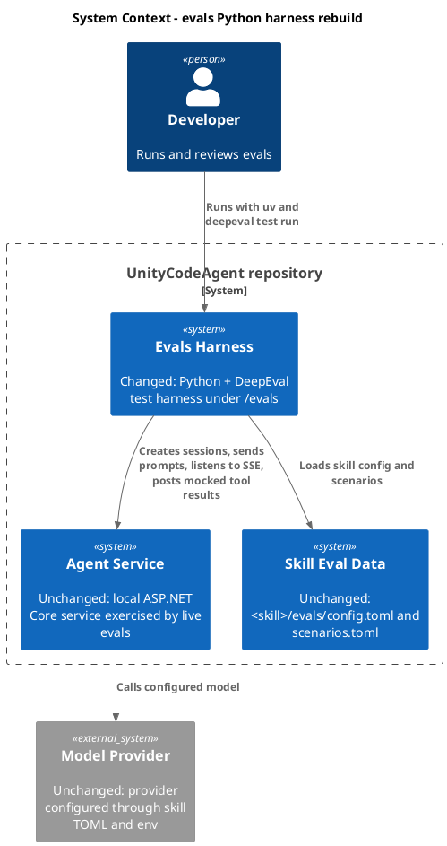
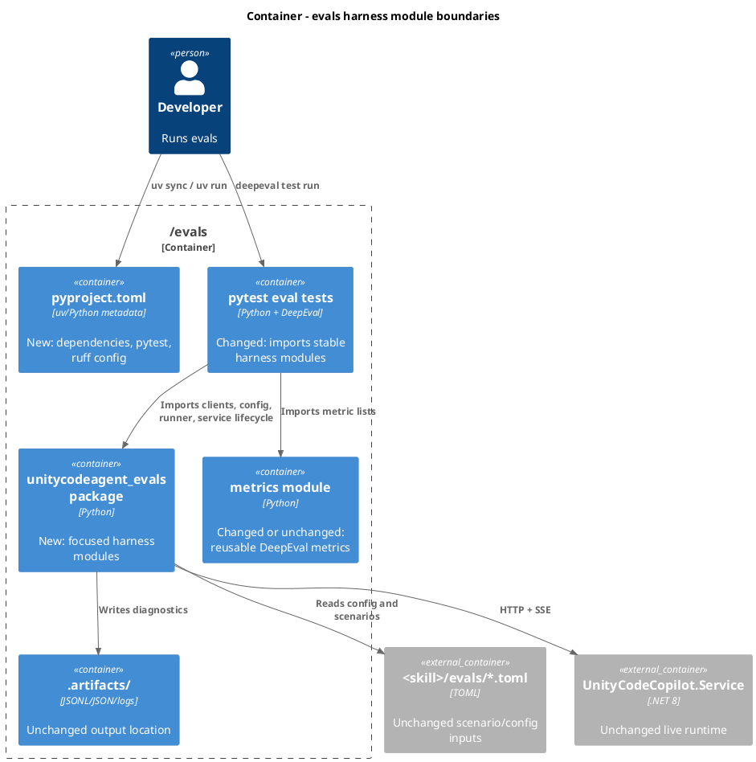
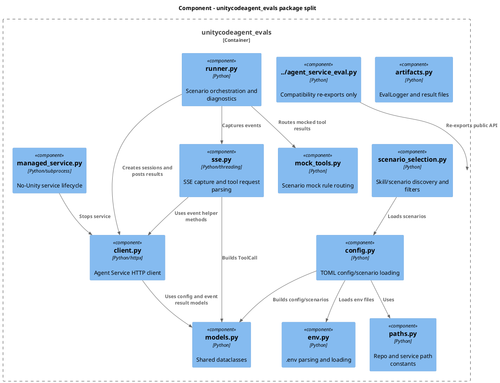
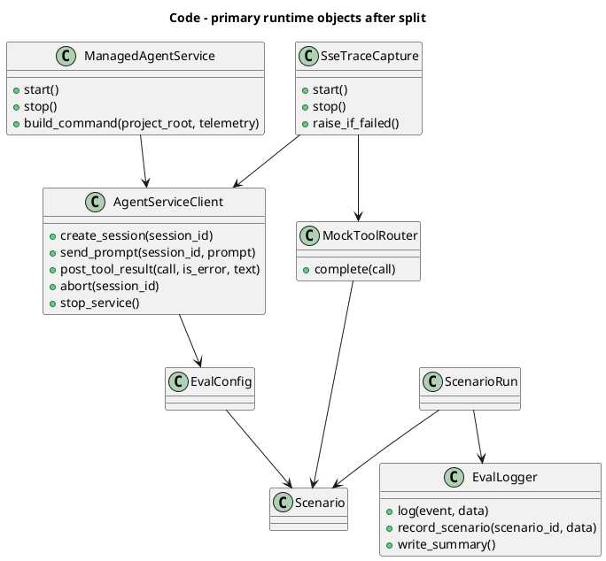
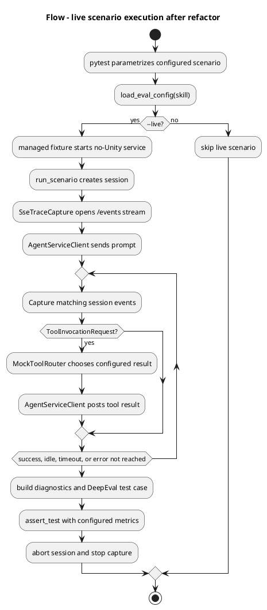

# Rebuild evals Python harness
- status: Completed
- order: 900
- goal: Rebuild `/evals` into a readable, single-responsibility Python eval harness with `uv`/`pyproject.toml` project metadata, preserving the current DeepEval behavior and verifying the split with focused non-live checks.
- updated: 2026-07-03
- steps:
    - [x] Add `pyproject.toml`/uv project metadata for the eval harness.
    - [x] Split `evals/agent_service_eval.py` into focused modules.
    - [x] Preserve or intentionally migrate existing public imports used by tests.
    - [x] Update eval tests and docs for the new module layout.
    - [x] Run focused compile and DeepEval checks.

Original task:
~~~
Act as python architect and code reviewer.

REbuiild /evals  to follow best python and uv practices
You can ignore 'project-python' rules
You can add pyproject.toml
Keep SOLID and YAGNI and KISS principles in mind
Follow single responsibility - split evals\agent_service_eval.py to be single responsibility
Make it more readable
~~~

Research:
- `/evals` currently contains `agent_service_eval.py`, `metrics.py`, `conftest.py`, `test_eval_harness_unit.py`, `test_live_preflight.py`, `test_skill_scenarios.py`, and `README.md`.
- There is no repo-level `pyproject.toml`, `uv.lock`, or Python dependency configuration for the eval suite. Each eval test currently repeats PEP 723 script metadata comments for `deepeval`, `httpx`, and `pytest`.
- `agent_service_eval.py` is the main readability and responsibility issue. It mixes path constants, `.env` parsing, TOML loading, scenario discovery/filtering, dataclasses, artifact logging, HTTP client behavior, SSE capture, mock tool routing, scenario orchestration, diagnostics, and managed service lifecycle.
- Existing tests import many symbols directly from `agent_service_eval`, including `AgentServiceClient`, `EvalLogger`, `ManagedAgentService`, `MockRule`, `Scenario`, `ScenarioCase`, `TelemetryConfig`, `build_diagnostics`, `filter_scenario_cases`, `load_eval_config`, `load_scenarios`, `parse_scenario_filter_tokens`, `parse_telemetry_config`, and `run_scenario`.
- DeepEval guidance for this repo favors committed pytest eval suites run through `deepeval test run`, metric lists in a separate `metrics.py`, small rerunnable datasets/configs, and preserving existing metrics/thresholds unless the task explicitly changes them.
- The current use case is an agent/tool-use eval harness, not a generic Python library. The rebuild should improve structure without changing the service endpoint contract, skill TOML shape, or default non-live skip behavior.

Plan:
- Add a repo-root `pyproject.toml` scoped to the eval harness:
  - Set `requires-python = ">=3.12"`.
  - Declare runtime dependencies `deepeval` and `httpx`, and dev/test dependency group with `pytest`, `ruff`, and optionally `mypy` if the first pass keeps typing strict enough to be useful.
  - Configure `uv` as a non-package or workspace-style project if packaging is unnecessary; keep command usage simple with `uv run ...`.
  - Configure pytest test discovery for `evals` and Python import path for the harness package.
  - Configure Ruff for readable defaults, import sorting, and line length consistent with the repo's Python style.
- Create a focused package under `evals/unitycodeagent_evals/`:
  - `paths.py`: repository paths and managed-service project path.
  - `models.py`: dataclasses such as `ProviderConfig`, `TelemetryConfig`, `MockRule`, `Scenario`, `ScenarioCase`, `EvalConfig`, `ToolCall`, `SessionEventWaitResult`, and `ScenarioRun`.
  - `env.py`: `.env` parsing and loading.
  - `config.py`: TOML loading, service URL resolution, working directory resolution, config/scenario loading, and telemetry parsing.
  - `scenario_selection.py`: configured-skill discovery, scenario case discovery, filter token parsing, filtering, and public selection.
  - `artifacts.py`: `EvalLogger` and JSONL/summary artifact writing.
  - `client.py`: `AgentServiceClient`, service HTTP requests, assistant-output event helpers, and session wait behavior.
  - `sse.py`: `SseTraceCapture` and tool invocation event parsing.
  - `mock_tools.py`: `MockToolRouter`.
  - `runner.py`: `run_scenario` and diagnostics construction.
  - `managed_service.py`: `ManagedAgentService` lifecycle, isolated project-root preparation, command building, health wait, and stop behavior.
- Keep `evals/agent_service_eval.py` as a thin compatibility facade during the first implementation:
  - Re-export the public symbols the current tests import.
  - Avoid keeping logic in the facade so the single-responsibility split is real.
  - After tests are updated, decide whether to keep the facade for backwards compatibility or remove it in a second, explicit cleanup.
- Keep metric behavior stable:
  - Either leave `evals/metrics.py` as the canonical metric module or move implementations to `evals/unitycodeagent_evals/metrics.py` and keep `evals/metrics.py` as a re-export facade.
  - Preserve `HARNESS_CONFIG_METRICS` and `TOOL_SEQUENCE_POLICY_METRICS` names for current tests and docs.
- Update tests incrementally:
  - Prefer importing from `unitycodeagent_evals` modules or package exports for new tests.
  - Keep compatibility assertions for the facade if it remains.
  - Preserve non-live behavior: live tests should still skip unless `--live` is passed.
  - Keep managed-service artifact isolation and `UseAppHost=false` behavior unchanged.
- Update `evals/README.md`:
  - Replace repeated `--with deepeval --with httpx --with pytest` commands with `uv run ...` commands that use `pyproject.toml`.
  - Document `uv sync`, `uv lock`, the existing `.env` `PYTHONUTF8=1` setting, and DeepEval command examples using `uv run --env-file .env ...`.
  - Document the new module layout and where to add future service clients, scenarios, metrics, or managed-service behavior.
- Avoid broader refactors:
  - Do not change OpenAPI/AsyncAPI contracts.
  - Do not change skill `config.toml` or `scenarios.toml` semantics unless tests prove an existing bug.
  - Do not add abstractions beyond the module split and small helper functions needed for clear ownership.

C4 Change Diagrams:

- System Context:

- Container:

- Component:

- Code:

- Flow:

Verification:
- `uv sync` to resolve the new project metadata and write/update the lock file if implementation chooses to commit one.
- `uv run --env-file .env python -m compileall evals`
- `uv run --env-file .env deepeval test run evals/test_eval_harness_unit.py --identifier "eval-harness-refactor-unit"`
- `uv run --env-file .env deepeval test run evals/test_skill_scenarios.py --identifier "eval-harness-refactor-collect"` to confirm configured scenarios still collect and skip without `--live`.
- Optional live check when provider credentials are available: `uv run --env-file .env deepeval test run evals/test_live_preflight.py --identifier "eval-harness-refactor-live-preflight" -- --live`
- Run `uv run ruff check evals` if Ruff is added to the project metadata.

Open questions for implementation:
- Keep `evals/agent_service_eval.py` as a compatibility facade indefinitely, or remove it after updating all local imports? Recommended first pass: keep it to reduce migration risk.
- Commit `uv.lock` for reproducible eval runs? Recommended first pass: commit it if `pyproject.toml` is added and `uv sync` is part of the workflow.
- Add strict type checking now or defer it until after the module split? Recommended first pass: configure Ruff immediately; defer strict mypy unless the split leaves types clean enough without extra churn.

Completion notes:
- Moved Python project metadata to `evals/pyproject.toml` and `evals/uv.lock`; `uv sync` from `evals/` creates `evals/.venv` without repeated `--with` flags.
- Split `evals/agent_service_eval.py` into `evals/unitycodeagent_evals/` modules for paths, env, artifacts, models, config, scenario selection, client, SSE capture, mock tools, runner, and managed service lifecycle.
- Kept `evals/agent_service_eval.py` as a thin compatibility facade and preserved public symbols, including `SseTraceCapture`, for existing monkeypatch-based tests.
- Updated eval tests to import the package API for normal usage and updated `evals/README.md` with `evals/`-root project setup, module layout, and `uv run --env-file ..\.env` commands.
- Verification passed:
  - From `evals/`: `uv sync`
  - From `evals/`: `uv run ruff check .`
  - From `evals/`: `uv run --env-file ..\.env python -m compileall -q agent_service_eval.py conftest.py metrics.py test_eval_harness_unit.py test_live_preflight.py test_skill_scenarios.py unitycodeagent_evals`
  - From `evals/`: `uv run --env-file ..\.env deepeval test run test_eval_harness_unit.py --identifier "eval-harness-evals-root-unit"`: 19 passed
  - From `evals/`: `uv run --env-file ..\.env deepeval test run test_skill_scenarios.py --identifier "eval-harness-evals-root-collect"`: 2 skipped as expected without `--live`
