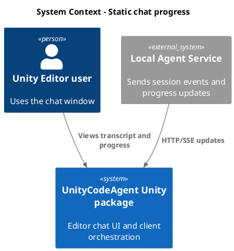
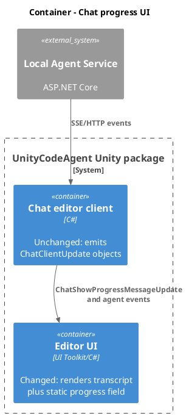
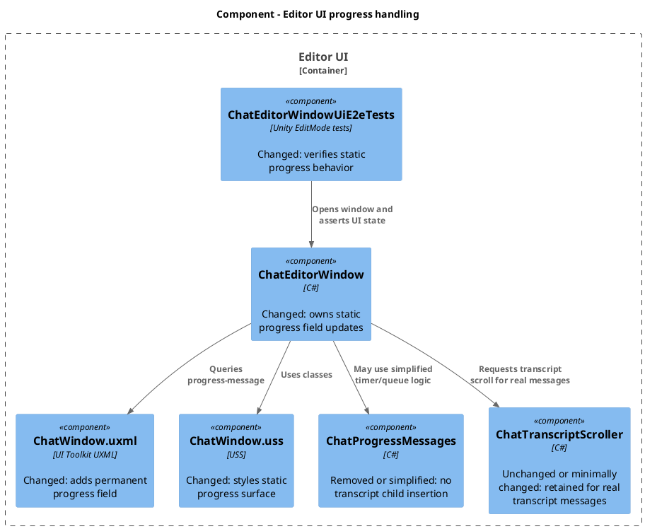
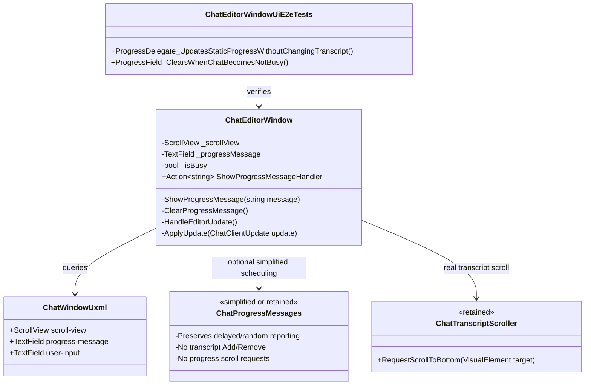
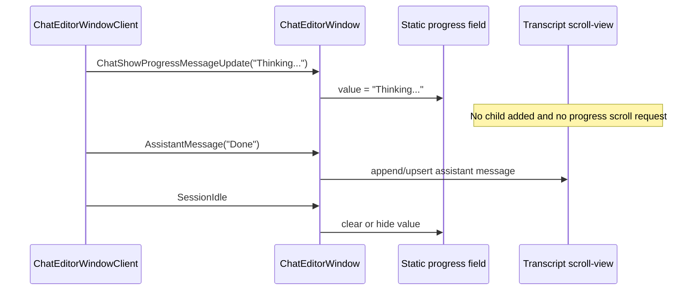

# Move progress messages to static position
- status: Completed
- order: 1600
- goal: Move chat progress text out of the transcript scroll view into a permanent static UI field, verified by focused Unity UI E2E tests, while preserving normal transcript rendering and busy/loading progress updates.
- updated: 2026-07-08
- steps:
    - [x] Add a permanent progress `TextField` or equivalent read-only field to `ChatWindow.uxml` near the bottom of the transcript area.
    - [x] Route progress updates to the static field instead of adding/removing progress messages in `scroll-view`.
    - [x] Preserve existing delayed/random progress reporting cadence and message selection.
    - [x] Remove transcript progress cleanup and scroll-to-bottom calls that only existed for progress messages.
    - [x] Prune `ChatProgressMessages` if the remaining behavior no longer justifies a separate class.
    - [x] Update UI E2E tests to assert progress text is static and transcript message counts are unchanged by progress.
    - [x] Verify Unity discovers the changed tests/UI and run focused EditMode checks.

Original task:
~~~
Move progressmesages to static position.

Currently progress messages are displayed by adding message to scrollview. Simplify it:
- add permanent TextField to bottom of scrollview
- update text of TextField instead of adding new message to scrollview
- remove scrolling logic - it is not neccessary
- remove ChatProgressMessages if code is significanltly simplified
- prune everythong not needed
~~~

Research:
- `Packages/com.signal-loop.unitycodeagent/Editor/UI/ChatWindow.uxml` currently contains `scroll-view`, `sessions-scroll-view`, and the composer. There is no static progress field.
- `ChatEditorWindow.cs` owns `_scrollView`, `_transcriptScroller`, and `_progressMessages`. Transcript messages call `PrepareForVisibleTranscriptMessage()` before rendering, and progress updates use `_progressMessages.ShowProgressMessage(...)`.
- `ChatProgressMessages.cs` currently appends a `chat-message--progress` `TextField` into the transcript scroll view, replaces that trailing progress field, removes it before visible messages, removes it when not busy, and requests transcript scrolling.
- `ChatTranscriptScroller.cs` is only used by `ChatEditorWindow` and `ChatProgressMessages` for auto-scroll behavior. Keep `ChatTranscriptScroller`; only remove progress-specific calls into it so real transcript message scrolling behavior remains preserved.
- `Assets/Tests/Editor/Service/ChatEditorWindowUiE2eTests.cs` has progress tests around lines 600-730 that currently expect progress to appear as the last transcript message and disappear before assistant/tool/delta/idle events. These tests should be rewritten for the static progress surface.
- Startup test `OpenWindow_ShowsStartupProgressWithoutDisablingFullWindow` currently looks for startup progress inside transcript messages; it should query the new static progress field instead, while still tolerating fast startup completion if needed.

Plan:
- Add a named progress field to `ChatWindow.uxml`, for example `name="progress-message"` with `readonly="true"`, `multiline="true"`, and classes like `chat-progress-message chat-message--progress`, placed after the transcript/session scroll views and before the composer so it stays at the bottom of the chat content area.
- Add USS rules in `ChatWindow.uss` for the static progress field: fixed/flex-shrink layout, subdued italic text, transparent input chrome consistent with existing message fields, and hidden/empty state if no progress is active. Keep UI Toolkit styles in USS, not inline.
- In `ChatEditorWindow.cs`, query the progress field during `BuildUi`, include it in the required-elements check, reset it during rebuild/disable, and replace `_progressMessages` with direct state/methods or a simplified helper that updates the static field text.
- Preserve existing delayed/random progress reporting behavior: keep the `InitialDelay`, `RefreshDelay`, pending queue, and random message list semantics for busy-state auto progress. Remove only methods whose sole job is transcript cleanup, such as `PrepareForVisibleMessage`, `RemoveTrailingProgress`, and progress-specific scroll calls.
- Change `ShowProgressMessageHandler` and `ChatShowProgressMessageUpdate` handling so they update `progress-message.value` instead of adding a transcript child.
- On loading/busy false, clear or hide the static progress field. On visible transcript messages, do not clear progress solely to protect transcript ordering; the static field is independent. Clear progress on idle/not busy so stale status does not remain after completion.
- Remove `ChatMessageTemplateProgress.uxml` and `ChatProgressMessages.cs` if they have no remaining references after simplification. Do not create Unity `.meta` files; let Unity regenerate/remove metadata as appropriate.
- Keep `ChatTranscriptScroller` and normal transcript message rendering unchanged except for removing unnecessary progress cleanup calls. Continue using `ChatTranscriptScroller` on append/upsert/delta paths for real transcript messages.
- Update `ChatEditorWindowUiE2eTests` helper coverage:
    - Add a helper that reads `root.Q<TextField>("progress-message")?.value`.
    - Update startup progress test to inspect the static progress field instead of `GetMessageContents`.
    - Rewrite progress delegate tests so calling `ShowProgressMessageHandler` changes only the progress field and does not increase transcript message count.
    - Add or update a focused test for busy-state delayed/random progress so automatic progress still appears only after the initial delay and refresh cadence.
    - Verify assistant/tool/delta events still append/update transcript messages while the progress field is cleared on idle or replaced by later progress text according to final behavior.
- Run focused Unity EditMode tests for `ChatEditorWindowUiE2eTests` after Unity reloads/discovers the changed tests. Also check Unity console logs for compile or UI asset errors.

C4 Change Diagrams:

System Context:

Container:

Component:

Code:

Flow:

Verification:
- Unity domain reload/discovery: after code changes, confirm Unity has reloaded and the updated `ChatEditorWindowUiE2eTests` methods are discoverable. If not, trigger a domain reload using a targeted editor script.
- Focused EditMode run: run `ChatEditorWindowUiE2eTests` or the narrowed progress-related methods after implementation.
- Console/log check: inspect Unity console or `.unityCodeAgent/client/logs/unity.log` for UI asset load failures, compile errors, and test failures.
- Manual UI sanity if needed: open the chat window, confirm transcript history remains in the scroll view and progress text stays in the static field near the bottom instead of becoming a transcript message.

Completion:
- Implemented a permanent `progress-message` field in `ChatWindow.uxml` and USS hidden/visible styling for the static progress surface.
- Reworked `ChatProgressMessages` to preserve delayed/random progress scheduling while updating the static `TextField` instead of adding/removing transcript children or requesting progress-specific scrolling.
- Updated `ChatEditorWindow` to require/query the static field, clear it on idle/loading completion, and leave visible transcript message rendering independent from progress display.
- Removed the obsolete `ChatMessageTemplateProgress.uxml` asset and metadata after code no longer referenced it.
- Updated `ChatEditorWindowUiE2eTests` progress coverage to assert static progress text, unchanged transcript counts for progress updates, idle clearing, and delayed busy-state automatic progress.
- Unity verification: triggered `AssetDatabase.Refresh`, observed assembly reload at 2026-07-08 10:22:22, removed the obsolete template asset, refreshed Unity again, then ran six focused EditMode tests:
  `OpenWindow_ShowsStartupProgressWithoutDisablingFullWindow`,
  `ProgressDelegate_ReplacesStaticProgressWithoutChangingTranscriptCount`,
  `ProgressDelegate_StaticProgressDoesNotAffectAppendedMessage`,
  `ProgressDelegate_StaticProgressDoesNotAffectStreamedDelta`,
  `ProgressDelegate_IsClearedWhenChatBecomesNotBusy`,
  `BusyState_ShowsStaticProgressAfterDelayWithoutChangingTranscriptCount`.
  Result: Passed 6, Failed 0.
- Final Unity console check showed no compile errors or UI asset load errors after the focused test run.

Follow-up:
- Updated the static progress field so it always remains in the layout with a fixed 20px height. Empty progress now clears only the text value instead of applying `display: none`, preventing the transcript scroll view from moving or being overlaid when progress appears/disappears.
- Added UI E2E assertions that the progress field keeps `DisplayStyle.Flex` before progress, while progress is visible, and after idle clearing.
- Unity verification after follow-up: triggered `AssetDatabase.Refresh`, observed assembly reload at 2026-07-08 10:32:00, reran the six focused EditMode progress tests. Result: Passed 6, Failed 0.

