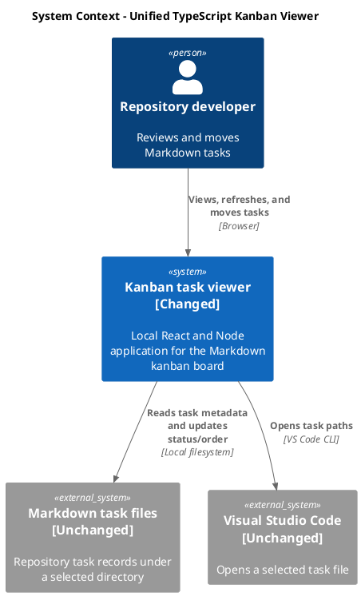
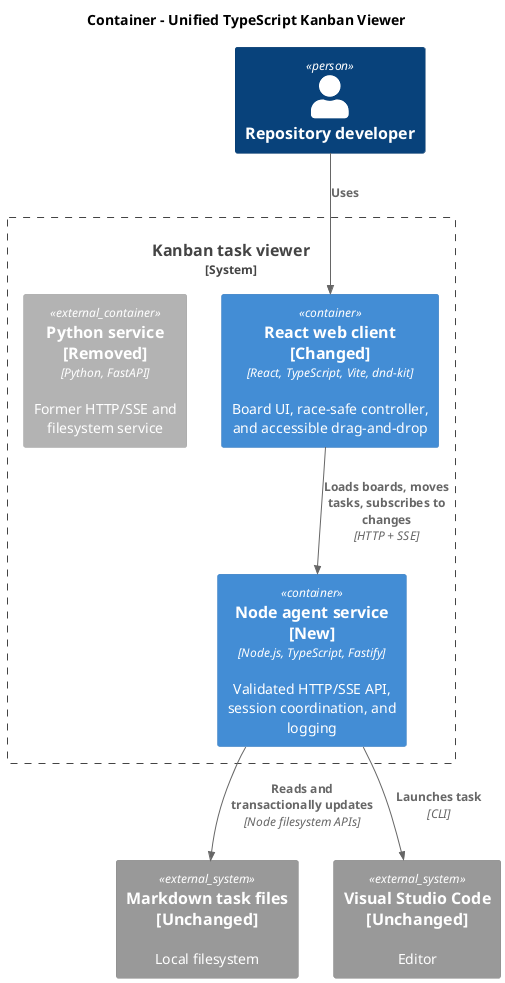
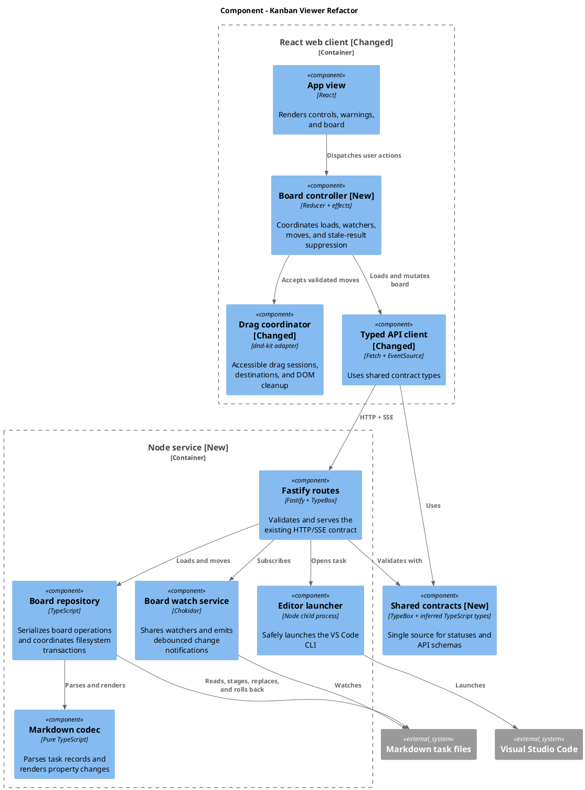
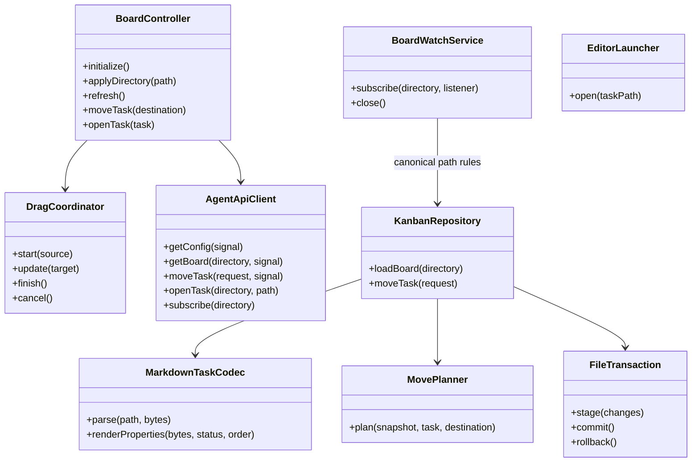
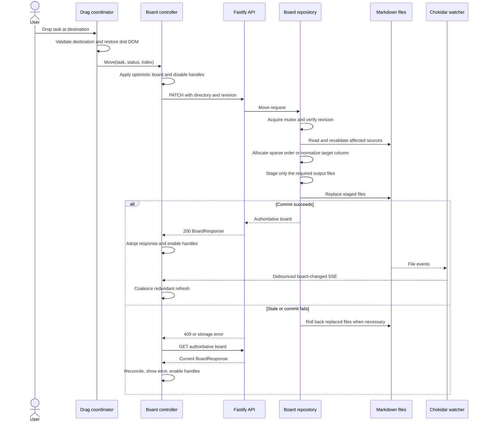

# Refactor kanban viewer to a unified TypeScript stack

- status: Backlog
- order: 90
- goal: Replace the Python/FastAPI kanban-viewer backend with a maintainable TypeScript/Node service, preserve sparse task ordering, harden filesystem and drag-and-drop reliability, and verify the preserved feature set through deterministic unit, integration, and browser tests without changing the existing HTTP or Markdown contracts.
- updated: 2026-07-20
- steps:
    - [ ] Lock the existing HTTP, Markdown, board, watcher, and drag-and-drop behavior with characterization tests
    - [ ] Replace the Python/FastAPI backend with a schema-driven Fastify service
    - [ ] Preserve sparse task ordering and minimize order-property rewrites
    - [ ] Make Markdown moves serialized, staged, recoverable, and safe against external edits
    - [ ] Refactor frontend orchestration to prevent stale asynchronous state updates
    - [ ] Add accessible and reliable pointer, touch, and keyboard drag-and-drop
    - [ ] Add unified Vitest coverage and Playwright end-to-end tests
    - [ ] Remove the Python toolchain and document the Node-only workflow
    - [ ] Run the complete local quality gate and verify the preserved feature set

Original request:
~~~
Make `dev/kanban_viewer` maintainable, reliable, and testable while preserving its current feature set, with particular attention to drag-and-drop UI/UX. Architecture and code may change, but the technology stack should remain coherent. Replace the Python backend with Node so the viewer uses one TypeScript/JavaScript stack.
~~~

## Research

- The viewer currently uses React 19, Vite, TypeScript, Tailwind, and dnd-kit in the browser, with a Python 3.11 FastAPI service for filesystem access, SSE watching, task moves, and VS Code launching.
- The current public behavior consists of recursive Markdown discovery, seven workflow states, warning-tolerant parsing, deterministic ordering, configurable task directories, browser-local directory persistence, manual and SSE refresh, task counts, VS Code opening, optimistic same/cross-column moves, stale-board detection, and atomic single-file property updates.
- Frontend loads, watcher refreshes, folder changes, and move responses are not coordinated by request generation, so an older asynchronous response can overwrite a newer board.
- The drag implementation depends on dnd-kit's optimistic DOM movement and manual DOM restoration. Cancellation and invalid-target paths do not consistently restore the original DOM, target highlighting depends on `document.elementFromPoint`, and the UI promises a drag handle that does not exist.
- Current drag tests verify helper calculations and hook registration but never perform a real pointer, touch, or keyboard drag.
- Repository moves are not serialized. Two concurrent requests can both accept the same revision, and a normalization that writes multiple files can leave a partially updated column when a later write fails.
- The current repository intentionally uses sparse positive integer order values: a move normally changes only the selected task by choosing a value in the available gap, and it renumbers the target column to `100`, `200`, `300`, and so on only when no integer gap remains.
- Board loading can read a symlink that resolves outside the selected root even though mutation and editor-open paths reject such an escape.
- `npm run check` can fail before linting source because ESLint traverses local cache and verification directories. Frontend tests and the production build pass independently; the existing Python test runner is also an unnecessary second toolchain.
- The repository has no competing Node server convention. Use Fastify with TypeBox schemas, Chokidar, and Vitest so runtime contracts, server code, client code, and tests share TypeScript and npm.
- Use Node `^20.19.0 || >=22.12.0`, which satisfies the existing Vite 8 runtime requirements and Fastify 5's Node 20+ requirement.
- Keep the full quality gate local; do not add a repository CI workflow.

## Preserved feature set

- Recursively load `.md` task files while excluding `README.md` case-insensitively.
- Parse the first H1 title, exactly one supported `status`, exactly one positive integer `order`, and an optional `goal`.
- Preserve the status order: `Backlog`, `Started`, `Planning`, `Ready`, `ToDo`, `InProgress`, `Completed`.
- Sort tasks by status, order, then case-insensitive relative path; keep duplicate-order and malformed-file warnings visible without failing the whole board.
- Preserve sparse positive integer task orders. Do not densify a column or rewrite unaffected task files after every move.
- Accept workspace-relative and absolute task directories, resolve the canonical directory, and remember the last successfully selected directory in browser storage.
- Preserve folder apply, manual refresh, live SSE refresh, watcher connection status, per-column counts, warnings, task goals, horizontal columns, and title-click opening in VS Code.
- Preserve reordering within a column and moving across columns, including dropping into an empty column or appending to a column.
- Preserve optimistic feedback, board-revision conflict detection, authoritative refresh after conflicts, and rollback when both mutation and refresh fail.
- Edit only `status` and `order`; preserve UTF-8 BOM, newline style, permissions, and all unrelated Markdown content.
- Keep the current route names and JSON field names compatible.

## Plan

### 1. Establish unified contracts and service boundaries

- Add one shared TypeScript contract module containing `KANBAN_STATUSES`, TypeBox request/response schemas, and inferred DTO types used by both the client and server.
- Keep `GET /api/config`, `GET /api/board`, `PATCH /api/board/tasks`, `POST /api/editor/open`, and `GET /api/events` wire-compatible.
- Build a Fastify application factory separately from the executable entry point. Bind the executable only to `127.0.0.1:8765`; use Fastify injection for endpoint tests.
- Preserve existing `400`, `409`, `422`, and `503` mappings. Convert unexpected storage failures into logged server errors without returning task content.
- Use Fastify structured logging for board loads, successful moves, conflicts, rollback failures, watcher lifecycle, and editor launches.
- Keep a small injectable process-launch seam for the VS Code CLI and handle Windows command shims without shell-constructed user input.

### 2. Make Markdown storage deterministic and recoverable

- Separate pure Markdown parsing/rendering and move planning from filesystem orchestration.
- Use a process-wide asynchronous mutex around load/check/write/reload operations so a reader cannot observe an in-process partial normalization and simultaneous moves yield one winner plus one stale conflict.
- Calculate all affected output bytes first, revalidate source hashes, create temporary files beside their targets, write and flush every temporary file, and only then begin replacement.
- Retry replacement for a bounded set of transient Windows `EPERM`/`EBUSY` failures. If any replacement ultimately fails, restore already-replaced files from captured bytes and remove all temporary files.
- Revalidate each affected source immediately before commit so an external edit made after the board revision check is never silently overwritten.
- Retain sparse integer order allocation with an explicit deterministic policy:
  - Use `100` when the destination column has no other tasks.
  - Insert before the first task using `max(1, floor(firstOrder / 2))` when that produces a distinct value.
  - Append using `previousOrder + 100`.
  - Insert between tasks using `previousOrder + floor((followingOrder - previousOrder) / 2)` when the gap is greater than one.
  - When no distinct positive integer exists, normalize only the target column to `100`, `200`, `300`, and so on in the requested final order.
- When a sparse value is available, update only the moved task's `status` and `order`; preserve every unaffected task's existing order value and file bytes.
- Keep deterministic path ordering for duplicate order values. A move that cannot obtain a unique sparse value may resolve duplicates by applying the target-column normalization policy above.
- Resolve scanned files before reading them. Warn and skip unreadable, disappearing, non-file, and outside-root symlink targets.
- Preserve BOM, line endings, file mode, untouched properties, and body bytes exactly.

### 3. Replace filesystem watching with a shared Node watcher

- Maintain one reference-counted Chokidar watcher per canonical directory instead of one watcher per browser connection.
- Watch recursively without following symlinks; filter to Markdown task files and exclude `README.md`.
- Normalize editor-style atomic writes, wait briefly for chunked writes to stabilize, and debounce event bursts into one `board-changed` event.
- Preserve the SSE retry directive and event name, add heartbeat comments, close subscriptions promptly, release the watcher after its final subscriber disconnects, and log watcher errors.

### 4. Make frontend orchestration race-safe

- Move application orchestration from `App` into a reducer-backed board controller with injectable API, EventSource, and storage seams.
- Associate every load and move with the active directory generation and a request identity. Abort supported requests and ignore all stale completions.
- Coalesce watcher notifications while a refresh or move is active, then issue at most one authoritative follow-up refresh.
- Serialize moves, keep the board visible during background work, disable drag handles while saving, and expose `aria-busy` plus concise pending feedback.
- Optimistically reorder on a valid drop. On failure, load the authoritative board; restore the captured snapshot only if that refresh also fails and the same directory is still active.
- Do not let an old initialization, watcher, refresh, or mutation response replace a newly selected directory.

### 5. Harden drag-and-drop behavior and accessibility

- Add a visible, focusable drag-handle button connected through dnd-kit's `handleRef`; keep the task title as a separate open-file button.
- Support mouse, pen, touch, and keyboard movement with screen-reader instructions and announcements.
- Replace `document.elementFromPoint` highlighting with typed dnd-kit target data.
- Centralize destination calculation as a pure typed function covering card targets, column targets, index clamping, empty columns, appends, cross-column moves, and same-position no-ops.
- Encapsulate dnd-kit's optimistic DOM movement in one drag-session adapter. Record the initial DOM location and restore it on every terminal path—success, cancellation, invalid target, Escape, or unmount—before React applies controlled state.
- Preserve live insertion feedback, source-card styling, target-column highlighting, horizontal scrolling, empty-column messaging, and edge auto-scroll.

### 6. Unify build, test, and development tooling

- Remove the tracked Python backend, Python tests, `.python-version`, `pyproject.toml`, and `uv.lock` only after equivalent Node tests pass.
- Add Fastify, TypeBox, Chokidar, and the safe process-launch helper as runtime dependencies; add `tsx`, Playwright, and coverage support as development dependencies.
- Add separate browser and server TypeScript configurations referenced by the root build.
- Make `npm run dev` start `tsx watch` and Vite; keep `npm run test:backend` as a compatibility script targeting the server Vitest project.
- Make `npm test` run browser and server Vitest projects, `npm run build` type-check both sides and build both outputs, and `npm run check` run lint, coverage, build, and Playwright.
- Scope ESLint to tracked source and configuration files and ignore virtual environments, pytest caches, dependencies, builds, verification directories, and E2E artifacts.
- Update the README to require only Node/npm and the VS Code `code` command, explain the architecture, and document focused and complete verification commands.

## Public APIs and types

- HTTP paths, methods, status meanings, and JSON field names remain unchanged.
- `TaskDto`, `BoardWarning`, `BoardResponse`, `ConfigResponse`, and `MoveTaskRequest` become types inferred from the shared TypeBox schemas.
- `KanbanStatus` is inferred from the single shared `KANBAN_STATUSES` constant instead of being duplicated between the frontend and backend.
- `order` remains a positive integer on disk and over HTTP; sparse values and gaps have no additional wire representation.
- Internal test seams are limited to the API client, EventSource factory, browser storage, watcher factory, filesystem replacement operation, and editor process launcher.

## Verification

- Port every Python repository and API test to the Node Vitest project before removing Python.
- Repository tests cover valid and malformed Markdown, recursive sorting, warnings, duplicate orders, BOM/CRLF preservation, every sparse order-allocation branch, minimal single-file rewrites when a gap exists, target-only `100`-step normalization when no gap exists, no-op moves, stale hashes, traversal, symlink containment, simultaneous moves, replacement retries, injected partial failures, rollback, and temporary-file cleanup.
- Fastify tests cover shared schema validation, status mappings, every endpoint, error mappings, editor-launch failures, SSE filtering, heartbeats, watcher reuse, watcher errors, and disconnect cleanup.
- Frontend tests cover initialization, saved-folder fallback, folder switching, stale-response suppression, watcher reconnect/coalescing, refresh, warnings, open errors, optimistic success, conflict refresh, rollback, failed refresh, and directory changes during an in-flight move.
- Drag tests cover top/middle/end placement, cross-column movement, empty columns, no-ops, invalid targets, cancellation, DOM restoration, highlighting, pending-state disabling, handles, and accessibility announcements.
- Playwright runs the real Node service and Vite application against temporary Markdown boards and verifies pointer, touch, and keyboard dragging; persistence; cancellation; stale external-edit recovery; folder persistence; responsive horizontal layout; and visible pending/error feedback.
- Enforce at least 90% statements, lines, and functions and 85% branches across frontend and server TypeScript.
- Final acceptance requires repeated clean `npm ci && npm run check` success, no Python runtime requirement, no test-created tracked changes, no partial Markdown after failed moves, and full preservation of the documented feature set.

## Assumptions and boundaries

- The viewer runs as one local Node service process. Coordination between separately started service processes is outside scope.
- Fastify with TypeBox is the selected Node server architecture because the repository has no competing Node backend convention.
- Accessible drag hardening and Playwright are approved additions.
- Repository CI is intentionally excluded; the complete quality gate remains local.
- Existing untracked virtual environments may remain ignored locally, but no Python configuration or runtime dependency remains in the viewer.

## C4 Change Diagrams

### System Context

### Container

### Component

### Code

### Move Flow

