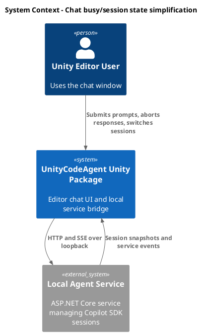
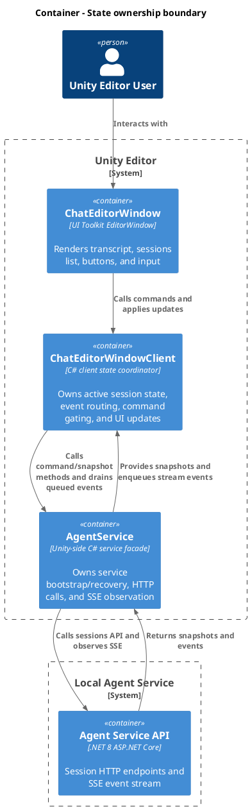
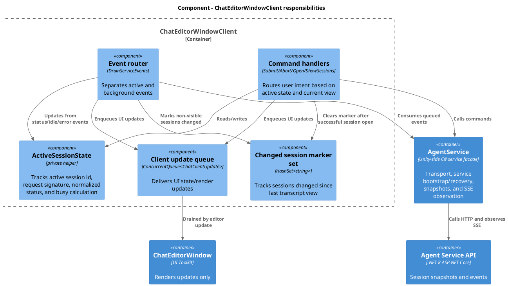
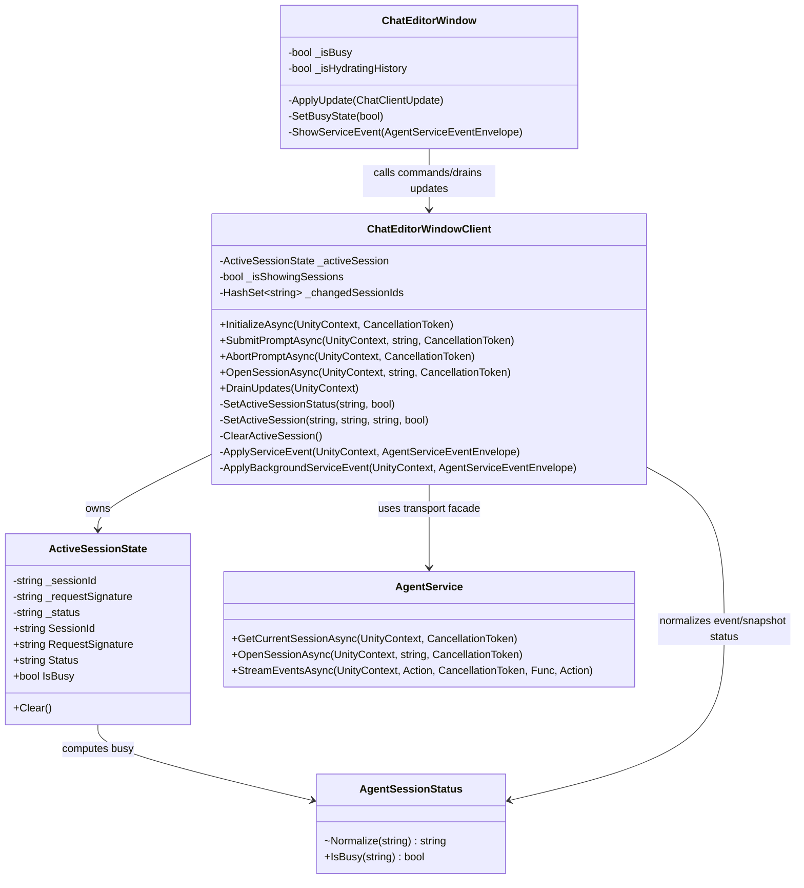
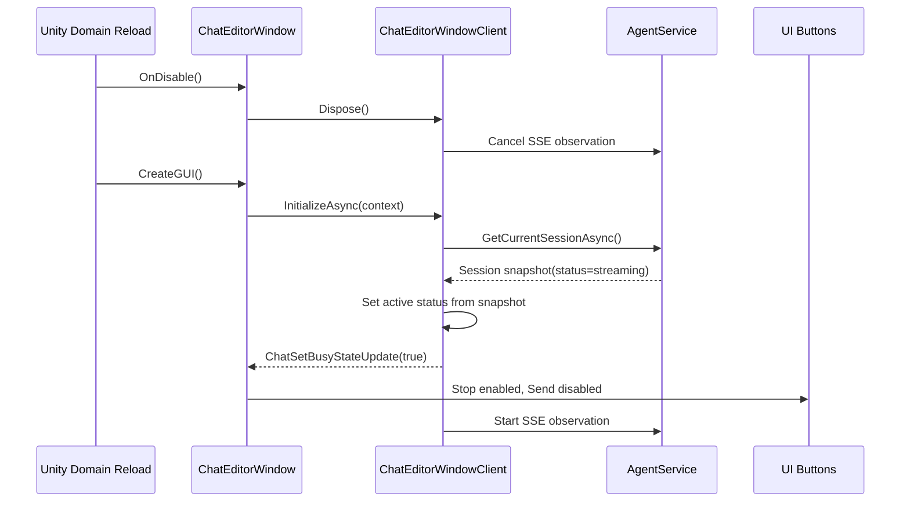
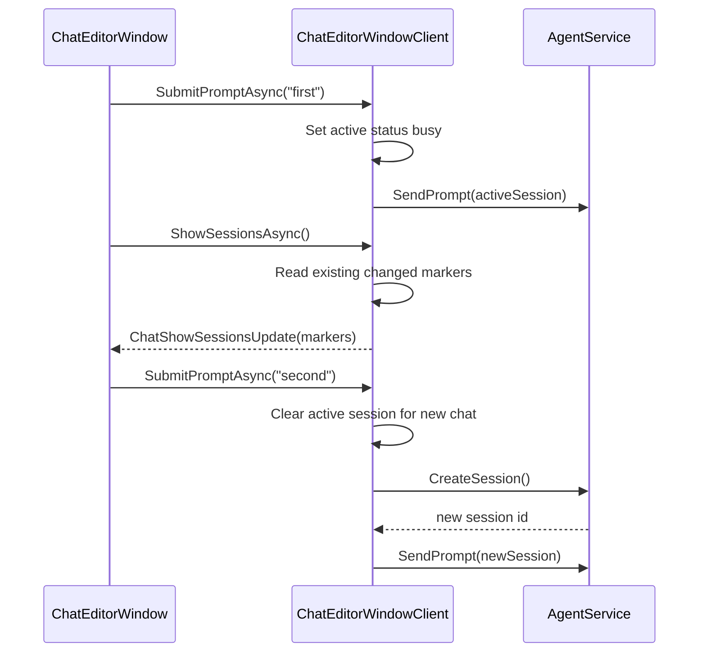

# Simplify chat client busy and session state ownership
- status: Completed
- order: 2300
- goal: Simplify `ChatEditorWindowClient` busy/session-state handling so active response state survives Unity domain reload, session switching, sessions-list navigation, and service stream recovery, verified by focused client and UI tests while leaving UI XML/USS and Copilot service code unchanged.
- updated: 2026-07-07
- steps:
    - [x] Research current busy/session state ownership and tests
    - [x] Implement a minimal client-side active-session state model
    - [x] Move busy derivation out of UI rendering paths
    - [x] Normalize sessions-list changed-since-view marker lifecycle
    - [x] Verify reload, session switching, sessions-list, abort, and stream recovery scenarios

## Original task

~~~
Analyze ChatEditorWindowClient.cs _isBusy usage, how it affects and is affected by buttons and session state and session management. Additionally analyze how are they affected by unity domain reload. Propose ways to simplify it and/or improve it.

Create task based on this plan and move it to Planning. Improve plan by making it robust, cover different scenarios like reloading, moving between sessions/messages. Simplify as possible, separate responsibilities. Include plan for tests.

Rubber duck review constraint: keep UI XMLs and Copilot service unchanged; `ChatEditorWindow`, `ChatEditorWindowClient`, and Unity-side `AgentService` can be changed if it creates a cleaner robust solution.
~~~

## Research

- `ChatEditorWindowClient` owns `_isBusy`, `_activeSessionId`, `_isShowingSessions`, `_changedSessionIds`, `_pendingPromptEcho`, stream cursor state, and session request refresh state.
- `_isBusy` currently acts as command gate, optimistic submit marker, active-session remote status cache, UI update source, auto-reconfiguration guard, sessions-list marker heuristic, and stream-failure recovery fallback.
- `ChatEditorWindow` has a separate `_isBusy` that is updated from `ChatSetBusyStateUpdate`, but `ShowServiceEvent` also derives busy directly from `Error`, `SessionIdle`, and `SessionStatusChanged`. This duplicates responsibility between client state and rendering.
- `InitializeAsync` loads the current session but currently reports `ChatSetBusyStateUpdate(false)` instead of deriving busy from `AgentSessionResponseDto.Status`. After Unity domain reload, an active service-side response can therefore reopen as idle in the UI.
- `OpenSessionAsync` already derives busy from `session.Status`; initialization should follow the same rule.
- Sessions view intentionally changes command behavior: it displays any existing changed-since-view marker, disables Stop, and allows Send to start a new session.
- Background events are currently treated as changed-session markers. This matches the desired marker meaning, but the current implementation also marks from `ShowSessionsAsync` based on busy state, which makes viewing the sessions list mutate marker state incorrectly.
- Existing source TODO in `ChatEditorWindowClient.ShowSessionsAsync`: `//TODO: _changedSessionId should only be updated when the session is actually changed by event.`
  - This task should resolve that TODO by making marker updates event-driven/state-transition-driven instead of adding the active session from sessions-list display logic.
- `ShouldIgnoreEvent` in `ChatEditorWindowClient` is unused and can be removed.
- Existing tests in `Assets/Tests/Editor/Service/ChatEditorWindowClientE2eTests.cs` cover stream failure recovery, replayed idle reset, model-change reconfiguration, sessions-list submit behavior, abort routing, marker clearing on open, and session switching.
- `AgentSessionStatus.Normalize` is currently private. If active-session state stores normalized status, expose normalization as an internal helper instead of duplicating prefix stripping.

## Rubber Duck Review

Ask the design out loud before implementing:

- What is "busy"?
  - It is not a UI button flag. It is the active session's response lifecycle state as interpreted from snapshots, local command intent, and service events.

- Who is allowed to decide busy?
  - `ChatEditorWindowClient` decides. `ChatEditorWindow` consumes `ChatSetBusyStateUpdate` and updates buttons/progress. Transcript rendering must not reinterpret service status events.

- What is "showing sessions"?
  - It is a view mode, not a session status. It changes command routing: Stop is disabled, Send starts a new session, and any existing changed-since-view marker is displayed in the sessions list.

- What should survive Unity domain reload?
  - Local fields do not survive; service session snapshot and persisted stream cursor do. Initialization must rebuild active session id, request signature, and busy state from the snapshot before UI becomes interactive.

- What does a sessions-list marker mean?
  - It means the session changed since the user last viewed that session's transcript. Any service event for a non-visible session can mark it changed, including content, tool, status, idle, and error events. Opening/viewing the session clears it.

- Do we need a broad state machine?
  - No. A private active-session state holder plus transition helpers is enough. Avoid adding public interfaces, new service contracts, or new UI assets.

- Can `AgentService` be changed?
  - Yes, but only Unity-side `AgentService` and only if it clarifies transport/recovery behavior for the client. Do not change `Editor/CopilotService~`, OpenAPI, AsyncAPI, or SDK session manager for this task.

- What should be avoided?
  - Do not mix immediate return updates and queued updates more than already necessary. Do not move session lifecycle policy into `ChatEditorWindow`. Do not make sessions-list UI infer state by inspecting transcript events.

### Marker Rubber Duck Verification

- If the user is reading a session transcript and an event arrives for that same session, should the marker appear?
  - No. The user is already viewing the change.

- If the sessions list is open and an event arrives for the previously active session, should the marker appear?
  - Yes. No transcript is visible while the sessions list is open.

- If a session receives `SessionIdle`, is that a change?
  - Yes, if the session is not visible. The marker means "changed since viewed", not "still busy".

- What clears the marker?
  - Successfully opening/viewing that session's transcript.

- Should `ShowSessionsAsync` change marker state?
  - No. It only renders the current set.

## Target Architecture

Keep Unity thin and make responsibilities explicit:

- `ChatEditorWindowClient` owns session state, status interpretation, command routing, active/background event routing, view-mode state used for command routing, and client update generation.
- `ChatEditorWindow` owns UI rendering, input field state, button enablement from client updates, and applying requested view changes.
- `AgentSessionStatus` owns status normalization and busy classification.
- Unity-side `AgentService` owns transport, service bootstrap/recovery, snapshot loading, and SSE observation. It must not gain UI-specific button or view behavior.
- `Editor/CopilotService~` remains unchanged for this task.
- UI XML/UXML/USS assets remain unchanged for this task.

## Plan

1. Establish a minimal active-session state model in `ChatEditorWindowClient`.
   - Add a private nested `ActiveSessionState` to replace duplicated `_activeSessionId`, `_activeSessionRequestSignature`, and `_isBusy` mutation.
   - Track only `SessionId`, `RequestSignature`, and normalized `Status`.
   - Keep `IsBusy` computed from status; do not store a separate busy flag once transition helpers are in place.
   - Add helper methods such as `SetActiveSession(sessionId, requestSignature, status, notifyUi)`, `SetActiveSessionStatus(status, notifyUi)`, `ClearActiveSession()`, and `IsActiveSessionBusy`.
   - Avoid a general state machine, enum, reducer, or public interface unless tests prove the simpler helper approach is inadequate.

2. Fix domain-reload behavior first.
   - In `InitializeAsync`, after `GetCurrentSessionAsync`, set active session status from `session.Status`.
   - Return `ChatSetBusyStateUpdate(activeSession.IsBusy)` instead of hardcoded false.
   - Preserve empty/no-session initialization as idle.
   - Preserve invalid-provider initialization as idle.
   - Ensure `CreateGUI`/`InitializeWindowAsync` applies the busy update before `SetLoadingState(false)` makes actions available.

3. Centralize busy updates in `ChatEditorWindowClient`.
   - Active `Error`, `SessionIdle`, and `SessionStatusChanged` events update client status and enqueue exactly one `ChatSetBusyStateUpdate`.
   - `SubmitPromptAsync` may still optimistically set busy before the service emits status, but it must do so through the same helper.
   - `ObserveEventStreamAsync` failure may still reset busy to false for recovery, but it should also go through the same helper.
   - `EnsureSessionRequestAppliedAsync` may use temporary UI busy updates for reconfiguration progress, but it must not overwrite the active session status as idle unless the returned session snapshot says idle.
   - If status normalization is needed outside `AgentSessionStatus`, make `Normalize` an `internal static` method in that class and keep all prefix handling there.

4. Remove UI-side busy derivation from transcript rendering.
   - In `ChatEditorWindow.ShowServiceEvent`, remove direct `SetBusyState(...)` calls for `Error`, `SessionIdle`, and `SessionStatusChanged`.
   - Rendering remains responsible for showing messages/events only.
   - Button state remains driven by `ChatSetBusyStateUpdate` and `IsShowingSessions`.
   - Historical transcript events rendered by `ShowMessagesView` are render-only; state reconstruction must come from session snapshots and live client updates.
   - Keep UI display filtering in `ChatEditorWindow`, including sub-agent suppression and `ShowAllEventsInChat` behavior.
   - Keep existing UXML/USS and template assets unchanged.

5. Make sessions-list marker semantics explicit.
   - Keep or rename `_changedSessionIds` to a similarly direct name such as `_sessionsChangedSinceView`; do not use `_unfinishedSessionIds` for client state because the marker is not a busy marker.
   - The marker means "this session received at least one event since the user last viewed its transcript".
   - Remove the source TODO by ensuring `ShowSessionsAsync` only fetches sessions and returns the current marker set; it must not mutate marker state.
   - Add a marker for any service event whose session is not currently visible in the transcript, including assistant/user/tool content, status changes, idle, and errors.
   - Do not add a marker for events applied to the visible active transcript because the user is already viewing those changes.
   - While the sessions list is visible, no transcript is being viewed; events for any session, including the active session, should mark that session changed.
   - Clear the marker when `OpenSessionAsync` succeeds for that session, regardless of the returned snapshot status.
   - Clear the marker for the initialized current session after `InitializeAsync` successfully loads and displays its transcript.
   - Local submit should not create a changed marker by itself. The submitted session is visible immediately; later service events only mark it if they arrive while that session is not visible.
   - Keep the existing public UI update shape unless a narrow rename is worth the churn; the UI class name can stay `session-entry--unfinished` even if the client-side meaning is "changed since last viewed".

6. Preserve sessions-view command behavior.
   - `SubmitPromptAsync` while active session is busy and messages view is visible remains rejected.
   - `AbortPromptAsync` while active session is busy and messages view is visible calls abort.
   - `SubmitPromptAsync` while sessions view is visible starts a new session, regardless of the previous active session busy state.
   - `AbortPromptAsync` while sessions view is visible remains rejected because no active response is visible.

7. Simplify update delivery without broad behavior changes.
   - Remove the unused local `updates` list in `SubmitPromptAsync` if it remains empty, or make it the explicit return channel for updates created during that command. Do not leave both patterns ambiguous.
   - Prefer retaining the current queued-update model for event-stream and progress updates.
   - Do not do a broad rewrite of `ChatClientCallResult` unless a test exposes ordering or lost-update behavior.
   - Remove unused `ShouldIgnoreEvent`.

8. Keep session request refresh behavior safe.
   - Continue blocking auto-refresh while the active session is busy.
   - Continue allowing only model-label refresh while sessions view is visible.
   - Ensure status changes to idle allow refresh on a later editor update.

9. Keep threading risk contained.
   - State mutation currently happens from command async continuations and editor-update event draining. Centralize state writes in helpers so a future lock or main-thread marshal can be added in one place if needed.
   - Do not mutate `_changedSessionIds` or any replacement marker set from the SSE callback. The SSE callback should keep enqueue-only behavior.
   - If implementation reveals field mutation races in tests, add a private lock around active state and marker set rather than spreading locks through call sites.

## Scenarios To Cover

- Domain reload while active session is busy:
  - Window/client is recreated.
  - Current session snapshot reports `streaming`, `queued`, or `aborting`.
  - UI reopens with Stop enabled and Send disabled in messages view.

- Domain reload after active session becomes idle:
  - Snapshot reports `ready`.
  - UI reopens with Send enabled only when input has text and Stop disabled.

- Submit in active messages view:
  - Idle active session accepts submit, clears input, shows local user echo, sets busy.
  - Busy active session rejects submit and does not call send.

- Abort in active messages view:
  - Busy active session calls abort endpoint.
  - Idle active session rejects abort.

- Sessions view while active session is busy:
  - Opening sessions shows existing changed-since-view markers but does not create or clear markers.
  - If the active session receives an event while the sessions list is visible, it is marked changed because its transcript is not visible.
  - Send from sessions view creates a new session instead of sending to or aborting the previous session.
  - Stop remains disabled in sessions view.

- Session switching:
  - Opening a ready session replaces transcript and sets busy false.
  - Opening a busy session replaces transcript and sets busy true.
  - Opening any session clears its changed-since-view marker after its transcript is loaded.
  - Switching away from a session does not create a marker by itself.
  - Events for the previous session after switching away mark that previous session changed.
  - Switching back to a busy session does not lose streamed history from the snapshot and keeps Stop enabled.

- Background events:
  - Any event for a non-visible session marks it changed without rendering transcript events.
  - Idle/ready/error events for a non-visible session mark it changed; they do not clear the marker.
  - Background tool invocation continues to execute without rendering transcript events.

- Stream recovery:
  - Stream failure resets active busy state only when recovery cannot know active status.
  - Local ready status event after restart keeps UI unblocked.
  - Cursor replay still routes active idle/status events once.
  - If Unity-side `AgentService` emits a synthetic ready event with no session id, the client assigns it to the active session only when there is an active session and the event is sequence zero.

- Provider/settings changes:
  - Invalid provider clears/blocks command state and returns settings guidance.
  - Session-bound setting refresh does not run while busy.
  - Session-bound setting refresh applies after idle.
  - Sessions view model changes update label but do not reopen a session until a session is selected or a new prompt starts.

- Message rendering:
  - Transcript still renders user messages, assistant deltas/messages, reasoning, tool messages, errors, and optional status/debug events as before.
  - Removing UI-side busy parsing must not remove visible error/status messages when settings request all events.

## C4 Change Diagrams

### System Context

### Container

### Component

### Code

### Flow - Domain Reload During Busy Session

### Flow - Switch From Active Session To Sessions View And Start New Session

## Verification Plan

- `ChatEditorWindowClientE2eTests.Initialize_BusySessionSnapshot_ReturnsBusyState`
  - Harness returns current/open session status `streaming`.
  - Assert initialization returns `ChatSetBusyStateUpdate(true)`.

- `ChatEditorWindowClientE2eTests.Initialize_ReadySessionSnapshot_ReturnsIdleState`
  - Harness returns status `ready`.
  - Assert initialization returns `ChatSetBusyStateUpdate(false)`.

- `ChatEditorWindowClientE2eTests.DomainReloadEquivalent_BusySnapshotKeepsAbortAvailable`
  - Dispose first client after submit or use fresh client against harness session status `streaming`.
  - Assert fresh initialization marks busy and submit is rejected until idle/status-ready event.

- `ChatEditorWindowClientE2eTests.DomainReloadEquivalent_ReadySnapshotAllowsSubmit`
  - Fresh client initializes against a ready snapshot after previous busy state.
  - Assert busy update false and a prompt can be submitted.

- `ChatEditorWindowClientE2eTests.ActiveStatusEvents_AreOnlyBusyStateSource`
  - Publish `SessionStatusChanged` busy, ready, `SessionIdle`, and `Error`.
  - Assert client emits expected `ChatSetBusyStateUpdate` sequence.

- `ChatEditorWindowClientE2eTests.BackgroundEvent_MarksSessionChangedUntilOpened`
  - Publish any event for a non-visible session, show sessions, assert marker present.
  - Open that session successfully, show sessions again, assert marker absent.

- `ChatEditorWindowClientE2eTests.ShowSessions_DoesNotMutateChangedMarkers`
  - Put client in a known marker state.
  - Call `ShowSessionsAsync` repeatedly.
  - Assert markers are unchanged unless an event arrived for a non-visible session or a session was opened/viewed.

- `ChatEditorWindowClientE2eTests.OpenBusySession_ClearsChangedMarkerAndSetsBusy`
  - First mark the session changed through a non-visible event, then open a snapshot with busy status.
  - Assert busy update true and subsequent sessions list does not mark it changed because the session was just viewed.

- `ChatEditorWindowClientE2eTests.OpenReadySession_ClearsChangedMarkerAndSetsIdle`
  - Existing test covers part of this; update if marker semantics change.

- `ChatEditorWindowClientE2eTests.EventForPreviousSessionAfterSwitch_MarksPreviousSessionChanged`
  - Open another session, then publish an event for the previous session.
  - Assert previous session appears in changed markers when sessions are shown.

- `ChatEditorWindowClientE2eTests.EventForActiveSessionWhileSessionsListVisible_MarksActiveSessionChanged`
  - Open the sessions list, publish an event for the active session, then refresh sessions.
  - Assert the active session appears in changed markers because its transcript was not visible.

- `ChatEditorWindowUiE2eTests.SessionStatusChanged_DoesNotRequireUiSideBusyParsing`
  - Prefer verifying through applied `ChatSetBusyStateUpdate` behavior.
  - If too broad, keep UI tests focused on buttons after client updates rather than direct event rendering.

- UI coverage for busy snapshot hydration
  - Prefer client-level coverage unless mock service already supports configurable snapshot status.
  - Do not extend mock service solely for this task unless client-level tests miss a real UI integration risk.

- `AgentSessionStatusTests.Normalize_StatusPrefixAndWhitespace`
  - Verify `streaming`, `Status: streaming`, ` Status: ready `, `queued`, and unknown values classify consistently.
  - Add near existing editor/client test surface if no dedicated test class exists.

- Run focused Unity EditMode tests for changed surfaces.
  - Prefer exact test filters for `ChatEditorWindowClientE2eTests` and any touched UI E2E tests.
  - If Unity runner is unavailable, document the skipped verification and run compile/static checks available in the environment.

## Non-Goals

- Do not change UI XML/UXML/USS/template assets.
- Do not change `Packages/com.signal-loop.unitycodeagent/Editor/CopilotService~`, ASP.NET endpoints, OpenAPI, AsyncAPI, or service-side session manager.
- Do not redesign Unity-side `AgentService`; only make narrow transport/recovery clarifications if needed by the client state boundary.
- Do not change session persistence or event cursor semantics beyond what is required for busy-state correctness.
- Do not add public interfaces unless a test seam already requires it.
- Do not rewrite UI Toolkit layout.

## Completion Notes

- Added `ChatEditorWindowClient.ActiveSessionState` so the client owns active session id, session request signature, normalized status, and busy classification in one place.
- `InitializeAsync` now derives busy from the current session snapshot, preserving busy UI state after Unity domain reload.
- Removed transcript-rendering busy derivation from `ChatEditorWindow.ShowServiceEvent`; UI busy/button state now comes from `ChatSetBusyStateUpdate`.
- Removed sessions-list marker mutation from `ShowSessionsAsync`; changed markers are now driven by events for non-visible transcripts, shown on the next sessions-list refresh, and cleared when a session is opened.
- Avoided keeping a cached visible sessions list in `ChatEditorWindowClient`; live marker refresh is intentionally deferred to a future marker-only UI update task.
- Exposed `AgentSessionStatus.Normalize` internally and added focused coverage for prefixed/whitespace status strings.
- Verification: Unity EditMode `SignalLoop.UnityCodeAgent.Service.ChatEditorWindowClientE2eTests` and `SignalLoop.UnityCodeAgent.UI.ChatEditorWindowUiE2eTests` passed together, 42 tests, 0 failed. The client fixture alone passed 28 tests after the new tests were discovered.
