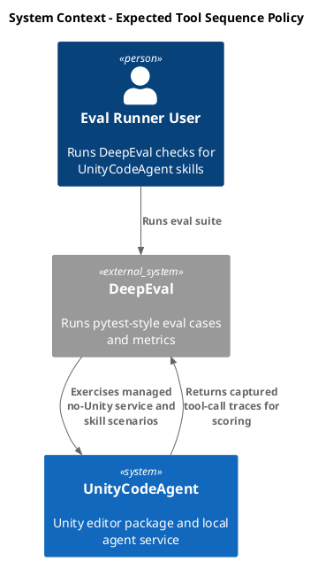
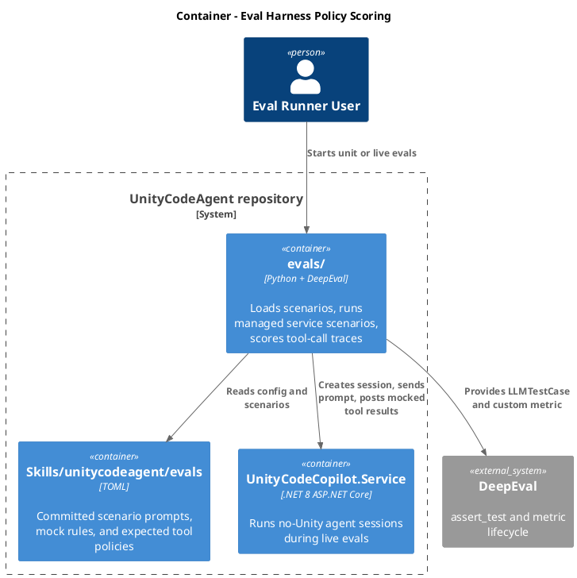
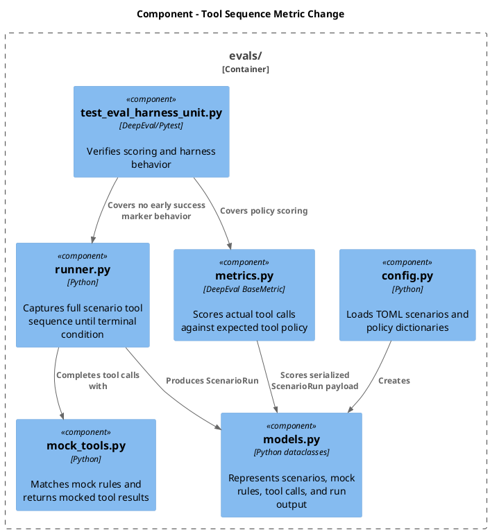
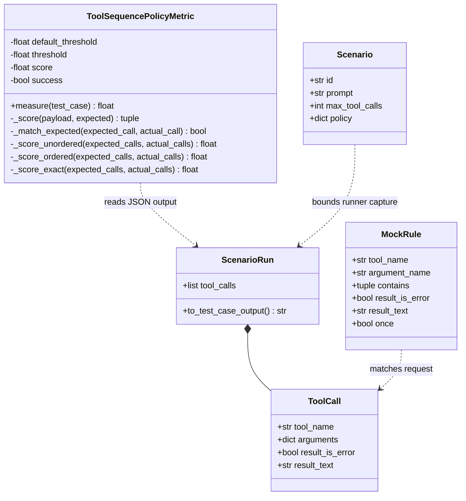
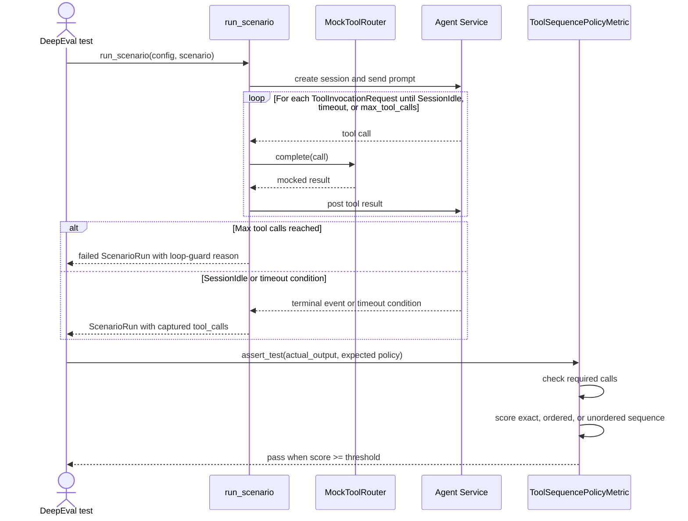

# Use expected tool sequence in ToolSequencePolicyMetric
- status: Completed
- order: 2700
- goal: Replace the first-call/follow-up-specific policy with a DeepEval-style expected tool sequence policy and a default 10-call loop guard, verified by focused eval harness unit tests and README/scenario updates, while preserving live scenario execution outside the metric contract change.
- updated: 2026-07-06
- steps:
    - [x] Add expected tool policy schema and parser behavior.
    - [x] Rework `ToolSequencePolicyMetric` scoring and success threshold behavior.
    - [x] Remove mock-rule success marking from scenario completion.
    - [x] Add per-scenario `max_tool_calls` in `scenarios.toml`, defaulting to `10`, to stop looped scenarios.
    - [x] Migrate committed scenarios and documentation.
    - [x] Add focused unit coverage for required calls, threshold scoring, ordering, exact matching, max-tool-call termination, and no-success-marker behavior.
    - [x] Run focused eval harness checks.

Original task:
~~~
instead of firstcall and followingcalls use expected tool sequence and calculate metric result score similar as deepeval buildin ToolCorrectnessMetric
Goal is to have more options when defining scenario policy
- do a research on ToolCorrectnessMetric
- remove mark_success
- add treshold
- in expected tools, any toolcall can be marked as required. if not present, test fails always. If present test passes based on score treshold
- add parameters:
should_consider_ordering: When True, the sequence in which tools were called is also checked.
should_exact_match: When True, tools_called and expected_tools must be identical (no extra or missing tools allowed).
~~~

User review updates:
- Add `max_tool_calls` as a per-scenario setting in `scenarios.toml`, not in global service config.
- Default `max_tool_calls` to `10` when a scenario omits it.
- Stop a scenario when `len(capture.tool_calls) >= scenario.max_tool_calls` and record a failed run with diagnostics so tool-call loops do not wait for the longer scenario timeout.
- Use Mermaid for the Code and Flow diagrams.

Research:
- Current repo metric: `evals/metrics.py` `ToolSequencePolicyMetric` reads `actual_output` and `expected_output` JSON, then performs binary checks against `tool_name`, `first_call_contains`, `first_call_result_is_error`, `follow_up_contains`, `follow_up_forbidden`, and `require_success_observed`.
- Current scenario policy: `Packages/com.signal-loop.unitycodeagent/Editor/Skills~/unitycodeagent/evals/scenarios.toml` stores recovery-specific `first_call_*` and `follow_up_*` keys.
- Current scenario completion: `MockRule.marks_success` is parsed in `evals/unitycodeagent_evals/config.py`, stored in `evals/unitycodeagent_evals/models.py`, toggles `MockToolRouter.success_observed` in `evals/unitycodeagent_evals/mock_tools.py`, and causes `run_scenario` to return before session idle/timeout in `evals/unitycodeagent_evals/runner.py`.
- Current loop protection relies on `scenario_timeout_seconds` and `idle_timeout_seconds`; there is no max tool-call count, so a scenario that keeps producing matched tool calls can run until the longer timeout.
- DeepEval docs for `ToolCorrectnessMetric` say it compares `tools_called` with `expected_tools`; by default it matches tool names, can require inputs/outputs, supports `threshold`, `should_consider_ordering`, and `should_exact_match`, and exact matching takes precedence over ordering.
- Installed DeepEval 4.x source confirms scoring details: non-exact matching scores matched expected calls divided by `len(expected_tools)`, ordering uses a weighted longest common subsequence, exact match is binary and requires same length/order, empty expected and empty actual scores 1, empty expected with actual calls scores 0.
- Local harness uses serialized JSON instead of DeepEval `LLMTestCase.tools_called` and `expected_tools`, so reusing DeepEval's metric directly would require larger test-case plumbing. A small local deterministic implementation matching the needed ToolCorrectness behavior is lower risk.

Plan:
- Define the new scenario policy shape under `[scenario.policy]`:
  - `threshold = 1.0` by default. Use the correct spelling `threshold` in implementation and docs; mention the old task spelling as a typo only if needed in migration notes.
  - `should_consider_ordering = false` by default.
  - `should_exact_match = false` by default and make it override ordering semantics.
  - `[[scenario.policy.expected_tool]]` entries, each with `tool_name`, optional `argument_name`, optional `arguments_contain`, optional `arguments_forbid`, optional `result_is_error`, optional `required = false`.
- Update config loading to preserve nested policy data from TOML. If the TOML library returns `expected_tool` as a list under `policy`, no special parsing is needed beyond validation/defaulting in the metric.
- Add loop-guard configuration:
  - Add `max_tool_calls: int` to `Scenario`, not `EvalConfig`, so each scenario can choose its own loop budget.
  - Load it from each `[[scenario]]` entry in `scenarios.toml`, defaulting to `10` when omitted.
  - Document it in `evals/README.md` under the `scenario` section and add `max_tool_calls = 10` to committed scenario examples for explicitness.
  - Validate it as a positive integer so `0` or negative values fail fast during scenario loading.
- Replace `_score` in `ToolSequencePolicyMetric` with general sequence scoring:
  - Convert `payload["tool_calls"]` into actual calls and `expected["expected_tool"]` into expected calls.
  - A call matches when `tool_name` matches and all configured optional checks pass.
  - If any `required = true` expected call has no matching actual call, return score `0.0` and a reason naming the missing required call, regardless of threshold.
  - If `should_exact_match` is true, require actual and expected lists to have the same length and each aligned actual call to match its expected call; score is `1.0` or `0.0`.
  - Else if `should_consider_ordering` is true, use a longest-common-subsequence style score over expected and actual calls: `matched_expected_weight / len(expected_tools)`.
  - Else score each expected call against at most one actual call in any order and divide matched expected calls by `len(expected_tools)`.
  - Preserve DeepEval-compatible empty-list behavior: no expected and no actual calls scores `1.0`; no expected with actual calls scores `0.0`.
  - Set `self.threshold` for the current measurement from `expected.get("threshold", default_threshold)` so policy-specific thresholds work with DeepEval `assert_test`.
- Remove `marks_success` as a scenario control:
  - Delete `marks_success` from `MockRule`.
  - Stop parsing and logging it.
  - Remove `MockToolRouter.success_observed`.
  - Let `run_scenario` continue until `SessionIdle`, idle timeout, or scenario timeout, then score the captured tool sequence. This avoids an early return tied to a mock rule rather than the metric.
  - Add a `max_tool_calls` terminal condition before continuing the wait loop. When `len(capture.tool_calls) >= scenario.max_tool_calls`, return a failed `ScenarioRun` with a reason such as `Stopped after reaching the scenario max tool call limit of 10.` and include the captured calls in diagnostics for metric/debug visibility.
  - Keep `ScenarioRun.success_observed` only if needed for backward-compatible artifact shape, but set it to `False`/deprecated or remove it if all tests and docs are updated cleanly.
- Migrate committed `scenarios.toml` policies:
  - Add `max_tool_calls = 10` to each committed `[[scenario]]` entry unless a scenario needs a different budget.
  - Replace first/follow-up policy fields with ordered expected tool entries for the failing component call and the recovery assembly call.
  - Mark the recovery assembly call `required = true` so missing recovery always fails even if threshold would otherwise pass.
  - Remove `marks_success = true` from mock rules.
  - Use `should_consider_ordering = true` for the existing recovery scenarios because the intended behavior is fail first, then recover.
  - Use `threshold = 1.0` for current scenarios to preserve strict pass behavior.
- Update `evals/README.md`:
  - Remove `marks_success` documentation.
  - Document `scenario.max_tool_calls`, including the default of `10` and that it fails that scenario early to protect against tool loops.
  - Replace first/follow-up policy docs with `expected_tool`, `required`, `threshold`, `should_consider_ordering`, and `should_exact_match`.
  - Add a compact TOML example.
- Update tests in `evals/test_eval_harness_unit.py`:
  - Existing recovery scenario accepts the migrated expected sequence.
  - Partial optional expected calls can pass when score meets `threshold`.
  - Missing `required = true` expected call fails regardless of threshold.
  - Ordering false allows out-of-order matched calls.
  - Ordering true penalizes out-of-order calls.
  - Exact match rejects extra, missing, or reordered calls.
  - Scenario TOML omitting `max_tool_calls` gets the default `10`, while invalid non-positive values are rejected.
  - Runner stops and returns a failed run when captured tool calls reach `max_tool_calls`, with diagnostics retaining the call tail.
  - Runner no longer returns early from a mock rule success marker and still records calls until idle.
- Keep scope out:
  - Do not introduce LLM-based available-tools optimality scoring.
  - Do not change live service endpoints, Unity code, or tool schemas.
  - Do not add a separate policy object model unless validation becomes too noisy in dict form.

C4 Change Diagrams:

System Context:

Container:

Component:

Code:

Flow:

Verification:
- `cd evals`
- `uv run --env-file .env python -m compileall conftest.py metrics.py test_eval_harness_unit.py test_live_preflight.py test_skill_scenarios.py unitycodeagent_evals`
- `uv run ruff check .`
- `uv run --env-file .env deepeval test run test_eval_harness_unit.py --identifier "tool-sequence-policy"`
- Optional collection-only scenario check: `uv run --env-file .env deepeval test run test_skill_scenarios.py --identifier "tool-sequence-policy-collection"`

Completion notes:
- Implemented `[[scenario.policy.expected_tool]]` scoring with `threshold`, `required`, `should_consider_ordering`, and `should_exact_match` support in `evals/metrics.py`.
- Removed mock-rule `marks_success`/`success_observed` scenario completion. Scenarios now finish on `SessionIdle`, idle timeout, scenario timeout, or the per-scenario `max_tool_calls` guard, and failed terminal states are emitted in `ScenarioRun` output so the metric cannot pass them accidentally.
- Added `Scenario.max_tool_calls`, defaulted omitted TOML values to `10`, and rejected non-positive values.
- Migrated committed unitycodeagent scenarios to explicit expected tool policies with ordered recovery calls and required assembly-add recovery calls.
- Updated `evals/README.md` and focused unit coverage for the new policy, max-call guard, and no-success-marker behavior.
- Verification passed on 2026-07-06:
  - `uv run --env-file .env python -m compileall conftest.py metrics.py test_eval_harness_unit.py test_live_preflight.py test_skill_scenarios.py unitycodeagent_evals`
  - `uv run ruff check .`
  - `uv run --env-file .env deepeval test run test_eval_harness_unit.py --identifier "tool-sequence-policy"` (`29 passed`, `2 skipped` local-only dotenv checks)
  - `uv run --env-file .env deepeval test run test_skill_scenarios.py --identifier "tool-sequence-policy-collection"` (exited successfully; both live scenarios skipped because `--live` was omitted)
