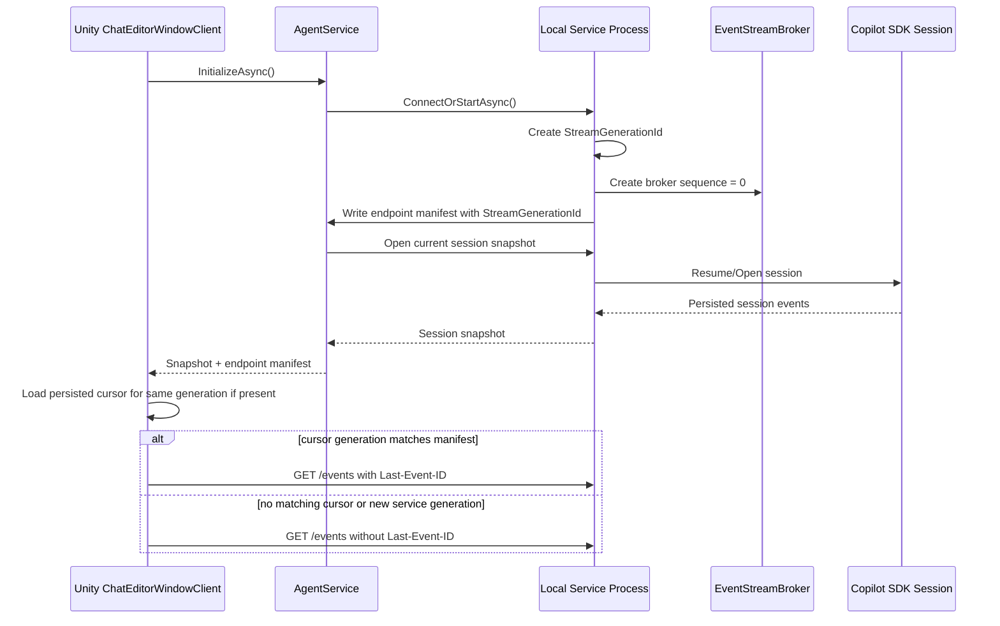
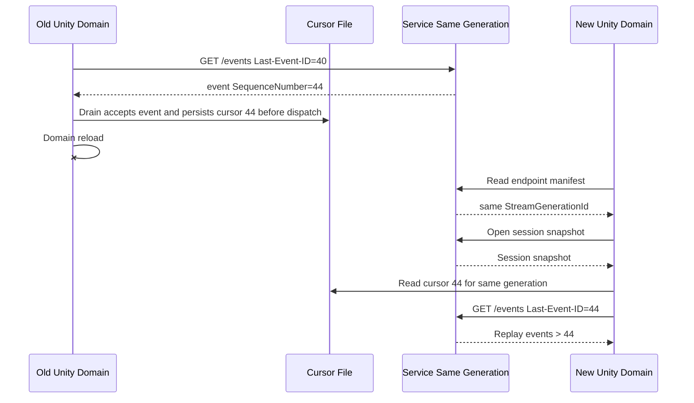
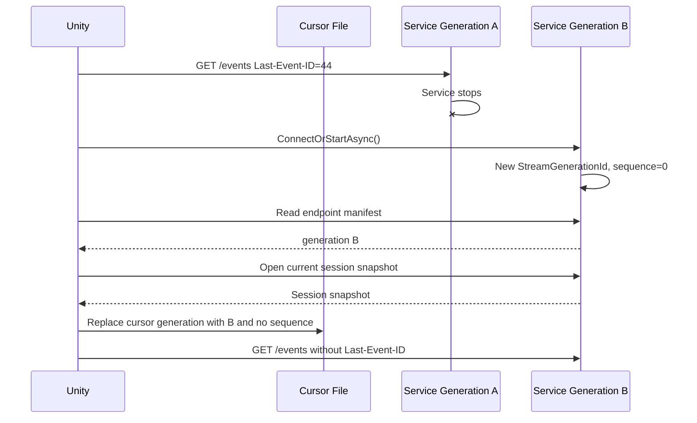
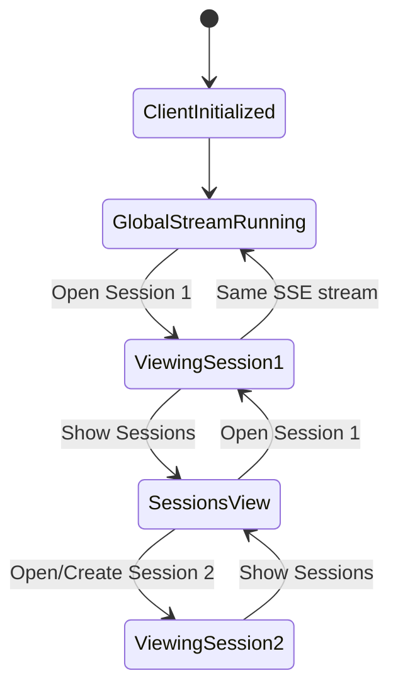

# Session Management Plan: Single Global Event Stream

## Goal

Use one service-wide SSE event stream for all attached sessions. The stream belongs to the Unity chat client lifecycle, not to the selected session. Session switching changes which events are rendered; it should not normally stop, restart, or reset event observation.

The rewrite should simplify responsibilities:

- `ChatEditorWindow` handles UI only.
- `ChatEditorWindowClient` is the controller for the window.
- `AgentService` contains agent/service operations.
- Event routing can move to a small dedicated class if that makes the controller simpler.

Prefer breaking changes over preserving accidental complexity. Keep state minimal and use cursors instead of duplicate caches wherever possible.

## Current Important Observation

Opening an existing session already loads a snapshot and renders it through the UI path. In `ChatEditorWindow`, `ShowMessagesView(...)` calls `ShowServiceEvent(...)`; it does not execute Unity tools. `ToolInvocationRequest` execution happens in `ChatEditorWindowClient` when an event arrives from the live SSE path.

That distinction should be made explicit:

- snapshot/history events are render-only;
- live stream events may trigger controller behavior;
- command events must never be executed from session history.

## Chosen Model

The service exposes one global stream:

```text
GET /events
Last-Event-ID: <global sequence number>
```

`AgentServiceEventEnvelope.SequenceNumber` is global across the service process. It is not per session.

Unity keeps one long-lived event pump while `ChatEditorWindowClient` is alive. Every accepted SSE event advances the global cursor, then the controller routes it by `SessionId` and `Type`.

## Responsibilities

### ChatEditorWindow

`ChatEditorWindow` should be a UI adapter:

- build UI Toolkit controls;
- translate button/key/UI events into controller calls;
- apply `ChatClientUpdate` values returned by the controller;
- render transcript snapshots and transcript append/upsert events;
- render session list entries and changed-session markers;
- own only UI state required for rendering, such as streamed message fields.

It should not:

- call `AgentService` directly;
- own service stream lifecycle;
- decide whether a service event is active/background/replay;
- execute tool invocation requests;
- maintain service replay cursors.

### ChatEditorWindowClient

`ChatEditorWindowClient` is the controller:

- owns active session id;
- owns sessions-view mode;
- owns one global event stream subscription;
- drains service events and emits UI updates;
- decides active vs background routing;
- coordinates prompt send, abort, create, open, and model selection;
- invokes agent tool execution only for live stream command events.

It may delegate event routing to a small class such as `AgentServiceEventRouter` if the controller becomes hard to read. Do not create an interface unless runtime substitution is actually needed.

### AgentService

`AgentService` is the Unity-side agent/service facade:

- starts/reconnects/stops the local service process;
- creates HTTP/SSE clients;
- calls service endpoints;
- executes Unity tool requests through the Unity editor thread;
- handles reconnect/reopen for service operations.

It should not know about window UI modes, visible transcript state, or session-list rendering.

### Optional AgentServiceEventRouter

Create this only if it reduces `ChatEditorWindowClient` complexity.

Suggested responsibility:

```text
AgentServiceEventRouter
  input: event, activeSessionId, isShowingSessions
  output: route decision
```

Possible decisions:

- render active event;
- update active busy state only;
- update changed-session marker;
- execute live tool command;
- ignore.

Keep it as a concrete class with direct methods. Avoid abstractions unless required.

## Cursor Model

Use one global cursor:

```csharp
private long? _lastReceivedGlobalEventId;
```

The global cursor is the delivery boundary for SSE replay. If Unity reconnects with `Last-Event-ID = 44`, the broker returns only events with `SequenceNumber > 44`.

Do not use per-session transport cursors for the global stream.

Advance the cursor when `DrainServiceEvents` accepts an event by dequeuing and validating it:

```csharp
if (envelope.SequenceNumber > 0)
{
    _lastReceivedGlobalEventId = Math.Max(_lastReceivedGlobalEventId ?? 0, envelope.SequenceNumber);
}
```

This makes reconnect deterministic without extra event-key caches.

The event stream callback should enqueue envelopes only. It should not advance the authoritative Unity cursor. Reconnect code must read the latest controller-owned cursor, either because the controller owns stream reconnection or because `AgentService.StreamEventsAsync` receives a cursor provider such as `Func<long?> getLastReceivedGlobalEventId`. Do not let `AgentService` maintain a separate hidden cursor that can drift away from `DrainServiceEvents`.

## Stream State Is Independent Of Session Open

`AgentSessionResponseDto(LastEventId = broker.CurrentSequenceNumber)` is not necessary in the clean-slate design. It mixes two different concerns:

- session snapshot: persisted conversation content for rendering;
- stream cursor: global SSE delivery position for the current service stream generation.

The event stream must be independent of session opening. Opening a session should not create, reset, or define the SSE stream cursor.

Do not add a separate `GET /api/events/state` endpoint just to expose `CurrentSequenceNumber`. It is not necessary for stream lifecycle if `/events` has clear startup semantics:

```text
GET /events without Last-Event-ID  -> subscribe forward-only from the current broker tail
GET /events with Last-Event-ID=N   -> replay retained events with SequenceNumber > N, then live events
```

`StreamGenerationId` has the same lifecycle as the endpoint manifest and should be stored in the manifest. Session open/create/current responses should return session data only:

```text
SessionId
Status
Messages
```

Do not put global stream replay state into session DTOs.

## Snapshot Rendering

Session snapshots and live stream events can overlap. Treat the session snapshot as a service-owned view of persisted conversation state. It is independent of the SSE stream cursor.

Do not add snapshot boundary metadata. The snapshot should remain a render-only response owned by the service, and the stream cursor should remain a client delivery cursor owned by Unity.

Rules:

- render snapshot messages directly through `ChatShowMessagesUpdate`;
- never execute command events from snapshot messages;
- render live active-session transcript events when they are routed from the live stream;
- never use session snapshot state as the live stream cursor;
- do not try to suppress normal live events by comparing them against the snapshot.

The worst realistic failure mode is duplicate display when a snapshot and live event overlap. That is a low-impact UI issue compared with dropping or suppressing live events incorrectly. If duplicate display becomes noisy in practice, solve it with a narrow UI-level rendering improvement, not by coupling session snapshots to stream cursor state.

Session snapshots do not need `LastEventId` or any other stream state. If implementation needs a short-lived duplicate guard for rendering polish, keep it explicitly local to UI rendering and never use it for transport replay, command execution, or stream lifecycle.

## Tool Invocation Correctness

Keep this simple. Do not add a Unity-side executed-call cache by default.

Tool command correctness should come from three rules:

1. Tool requests are dispatched only from the live SSE path.
2. The global cursor never resets to `null` during normal client lifetime.
3. Reconnect uses `Last-Event-ID`, so already accepted command events are not replayed.

With correct cursor management, `/events` is forward-only from the subscriber's cursor. A completed `ToolInvocationRequest` should not be delivered again to the same client instance, because the client must have advanced past its `SequenceNumber` before executing it.

If a duplicate tool result reaches `/api/tools/results`, treat it as a bug. The service should reject it and log enough context to diagnose the broken cursor/event lifecycle. Do not normalize duplicate tool completions into a feature.

Only add a Unity-side command cache if a concrete lower-level delivery issue is proven and cannot be fixed at the stream/cursor layer. The preferred fix is always to correct stream lifecycle, cursor lifecycle, or service event sequencing.

## Last-Event-ID And Service Lifecycle

`Last-Event-ID` is valid only for the event sequence that produced it. The plan must define the sequence lifecycle explicitly.

Use a service-instance sequence.

The event broker sequence lives for one service process instance.

Service requirements:

- endpoint manifest includes a unique service stream generation, for example `ServiceInstanceId` or `StreamGenerationId`;
- `EventStreamBroker` starts at sequence `0` for that generation;
- every event published by that broker receives a monotonic sequence number for that generation;
- `/events` without `Last-Event-ID` subscribes forward-only from the current broker tail;
- `/events` with `Last-Event-ID=N` replays retained events with `SequenceNumber > N` for that generation, then streams future events.

Unity requirements:

- track the manifest generation together with the cursor:

```csharp
private string _streamGenerationId;
private long? _lastReceivedGlobalEventId;
```

- when the service manifest generation changes, discard the old cursor and start `/events` without `Last-Event-ID`;
- never compare event sequence numbers across generations;
- if the service restarts, reload/open the relevant session snapshot for UI and start a forward-only stream for the new generation;
- keep the stream running across session switches within the same generation.

This is simple and robust. A process restart is a hard stream-generation boundary. Persisted SDK session history recovers transcript state; the new service generation handles future live events.

The global cursor has the same lifecycle as the service stream generation. It is not a cross-service persistent cursor. On service restart, Unity reads the new endpoint manifest, discards any cursor from the old generation, and subscribes to `/events` without `Last-Event-ID` so the stream starts forward-only from the new broker tail. Session snapshots are loaded separately for UI history.

This avoids stale cursor bugs such as:

- old cursor `44` from service generation A suppressing events `1..N` from generation B;
- Unity ignoring generation B events because their sequence numbers are lower than the old generation cursor;
- replaying retained commands from an unrelated old generation.

## Ownership And Lifecycle

### Owners

```text
Service process
  owns EndpointManifest
  owns StreamGenerationId
  owns EventStreamBroker
  owns global event sequence for that generation
  owns attached SDK sessions
  owns pending Unity tool calls

Unity ChatEditorWindowClient
  owns one SSE subscription
  owns active session id
  owns sessions-view mode
  owns last accepted cursor for the current stream generation
  owns cursor persistence for domain reload recovery

ChatEditorWindow
  owns UI controls and rendering state only
```

### Creation Points



The service creates a new `StreamGenerationId` when the service process starts. The broker sequence starts at `0` for that generation. Unity creates the SSE subscription when `ChatEditorWindowClient` initializes.

### Cursor Persistence

Unity should persist the last accepted cursor for the current stream generation in a small project-scoped runtime file, for example:

```text
.unityCodeAgent/service/runtime/event-cursor.json
```

Suggested fields:

```json
{
  "StreamGenerationId": "generation-guid",
  "LastAcceptedSequenceNumber": 44,
  "UpdatedAtUtc": "2026-06-18T12:00:00Z"
}
```

This file is owned by Unity, not the service. It exists only to survive Unity domain reload while the same service process keeps running.

Persist the cursor in `DrainServiceEvents` after Unity dequeues and validates an SSE event, before routing the event or dispatching side effects:

```text
receive SSE event
enqueue event
DrainServiceEvents dequeues event
validate envelope and generation
advance in-memory cursor
persist cursor for generation
route/render/execute event
```

An event is accepted only after `DrainServiceEvents` dequeues and validates it. Events that have arrived from SSE but remain queued are not yet accepted and may be replayed after a Unity domain reload. That is acceptable because their side effects have not started.

This chooses at-most-once command execution after controller acceptance. If Unity domain reloads after accepting a tool command but before returning its result, the command is not replayed and the pending tool call should time out or fail in the service. That is preferable to silently executing Unity side effects twice. It is also a visible bug to investigate, not a behavior to hide with duplicate-command caches.

If guaranteed completion across Unity domain reload is required later, cursor-only SSE is not enough. That would require a real command lease/ack protocol. Do not add that complexity unless there is a tested requirement.

### Cursor Selection On Startup

When Unity initializes:

1. Read endpoint manifest.
2. Read persisted cursor file.
3. Load current/opened session snapshot.
4. If cursor file `StreamGenerationId` matches manifest `StreamGenerationId`, use the persisted cursor for `/events`.
5. If no cursor exists for this generation, omit `Last-Event-ID` and subscribe forward-only.
6. If generation differs, discard old cursor, replace the cursor file generation, and subscribe forward-only.

Do not use omitted `Last-Event-ID` to mean "replay all retained events." Omitted `Last-Event-ID` means "start at the current broker tail."

The persisted stream cursor prevents command replay across Unity domain reload after the controller has accepted an event. Session snapshots remain render-only and independent of that cursor.

### Unity Domain Reload

Unity domain reload destroys managed objects but does not necessarily stop the local service process.



Rules:

- same service generation means the persisted cursor remains valid;
- the new Unity domain resumes `/events` from the persisted cursor, not from `null`;
- do not replace a valid persisted cursor with a broker tail value;
- snapshot messages are render-only and must not execute tools;
- live events replayed after the persisted cursor are routed normally.

If no persisted cursor exists for the same generation, Unity subscribes without `Last-Event-ID`, which starts forward-only. This can skip older retained events, but there is no evidence this Unity client previously accepted them. This is acceptable for first attach; pending tool calls older than the first attach should either still be pending and visible through a dedicated future command recovery design, or time out. Do not replay retained events just to discover old commands.

### Service Restart

Service restart creates a new stream generation. Existing sequence numbers and cursors become invalid.



Rules:

- never reuse a cursor across service generations;
- never compare sequence numbers from different generations;
- after restart, Unity reads the new manifest generation, opens a session snapshot for UI, and starts the new stream forward-only;
- session history recovery comes from the SDK persisted session snapshot, not old broker replay;
- old pending tool calls from the previous service process are gone and should fail with that process.

### Normal Session Switch

Session switching does not affect stream ownership.



Rules:

- keep the stream running;
- keep advancing the global cursor for every accepted event;
- replace only active session state and visible transcript;
- mark a session as changed when it receives an event while it is in the background;
- remove a session from the changed set when that session is opened;
- background events never render into the active transcript.

## Can A Tool Request Be Replayed?

Within one healthy service generation, a tool request should only be replayed if the client did not advance to that event before reconnecting. That is acceptable: from the client's perspective, the command was not accepted yet.

It must not be replayed after Unity has accepted it. Therefore the cursor must advance before dispatch:

```text
receive SSE event
validate envelope
advance generation cursor to SequenceNumber
route/execute event
```

If Unity accepts a tool event and then reconnects with a cursor before that tool event, the client cursor lifecycle is wrong. Fix that lifecycle; do not hide it with command idempotency caches.

## Event Routing

Use one drain path:

```text
DrainServiceEvents
  -> dequeue event
  -> validate envelope and generation
  -> advance and persist global cursor
  -> execute live ToolInvocationRequest if allowed
  -> render active transcript event
  -> update changed-session state
```

### Active Events

Active means:

```text
!isShowingSessions && envelope.SessionId == activeSessionId
```

For active events:

- `ToolInvocationRequest`: execute only if it came from the live stream.
- `SessionIdle`: set busy false and optionally render if "show all events" is enabled.
- `SessionStatusChanged`: update busy state and optionally render.
- transcript events: enqueue `ChatShowAgentEventUpdate`.

### Background Events

Background means:

```text
isShowingSessions || envelope.SessionId != activeSessionId
```

For background events:

- never render transcript messages into the visible transcript;
- add `envelope.SessionId` to `_changedSessionIds` for any background event;
- execute `ToolInvocationRequest` only from the live stream, using the global cursor rules.

Background tool execution remains required. Unity is a single editor-side tool executor for all sessions.

## Stream Lifecycle

### Initialize

1. Reset controller state.
2. Read the endpoint manifest, including `StreamGenerationId`.
3. Read Unity's persisted cursor file.
4. Load current session snapshot.
5. Set active session id.
6. Select the initial stream cursor using the cursor selection rules.
7. Return UI updates for model label, busy state, and snapshot messages.
8. Start the global stream once from the selected cursor. If no cursor exists for the manifest generation, omit `Last-Event-ID`.

### Show Sessions

1. Keep the global stream running.
2. Load session summaries.
3. Set sessions-view mode.
4. Return `ChatShowSessionsUpdate` with `_changedSessionIds` so changed sessions are featured in the list.
5. Continue draining global events in background mode.

### Open Session

1. Keep the global stream running.
2. Load session snapshot through `OpenSessionAsync`.
3. Set active session id.
4. Remove the opened session id from `_changedSessionIds`.
5. Do not modify the running global stream cursor from the snapshot.
6. Replace visible transcript with snapshot messages.
7. Set busy state from session status.

### Submit Prompt From Sessions View

1. Keep the global stream running.
2. Exit sessions-view mode.
3. Clear visible transcript via UI update.
4. Create a new session if no active session is selected.
5. Set active session id.
6. Do not modify the running global stream cursor from the create/open response.
7. Send prompt.

Do not clear the global cursor. Do not restart the stream with `Last-Event-ID = null`.

Here `null` means accidentally dropping a valid same-generation cursor. Starting `/events` without `Last-Event-ID` is valid only for first attach to a generation or after a verified service generation change.

### Reconnect

The reconnecting stream uses the latest controller-owned global cursor.

On stream failure:

1. restart/reconnect the service if necessary;
2. inspect the endpoint manifest stream generation;
3. if the generation is unchanged, reconnect `/events` with `Last-Event-ID = _lastReceivedGlobalEventId`;
4. if the generation changed, discard the old cursor, reload/open the current session snapshot for UI, persist the new generation with no accepted sequence, and start `/events` without `Last-Event-ID`;
5. continue routing returned events through the same live stream path.

If `AgentService.StreamEventsAsync` owns the reconnect loop, it should receive a cursor provider from `ChatEditorWindowClient` and read it immediately before each reconnect attempt. If the controller owns the reconnect loop, it can pass `_lastReceivedGlobalEventId` directly when it creates each stream. Either shape is acceptable; the key rule is that there is only one authoritative cursor, and it is advanced in `DrainServiceEvents`.

### Dispose

Cancel the one global stream. No per-session stream cleanup exists in Unity.

## Minimal State

Target controller state:

```csharp
private readonly ConcurrentQueue<AgentServiceEventEnvelope> _pendingServiceEvents;
private readonly ConcurrentQueue<ChatClientUpdate> _pendingClientUpdates;
private readonly HashSet<string> _changedSessionIds;
private CancellationTokenSource _eventStreamCancellation;
private string _streamGenerationId;
private string _activeSessionId;
private string _pendingPromptEcho;
private long? _lastReceivedGlobalEventId;
private bool _isBusy;
private bool _isHydratingHistory;
private bool _isEventStreamStarted;
private bool _isShowingSessions;
```

Remove if possible:

- `_visibleEventKeys`;
- per-session visible-event caches;
- per-session tool invocation caches;
- stream restart/stop logic tied to session switching.

Keep `_streamedMessageFields` in `ChatEditorWindow`; it is UI rendering state, not service state.

## Service Responsibilities

### EventStreamBroker

Keep one global retained event sequence per service stream generation.

`Subscribe(afterSequenceNumber)` returns only retained events with `SequenceNumber > afterSequenceNumber`, then live events.

`Subscribe(null)` or an omitted `Last-Event-ID` must not replay all retained events. It subscribes from the current broker tail and then streams future live events.

The broker should not require per-session replay state.

Do not compare or reuse sequence numbers across service generations.

### CopilotSessionManager

Keep attached sessions by id. Opening/creating one session must not detach unrelated sessions.

SDK session events are already per-session; the manager publishes them into the global broker with the associated session id.

### Tool Invocation Bridge

Tool requests are pending commands. A request is pending until result, cancel, or timeout.

Prefer this service behavior:

- publish pending tool command to `/events`;
- complete pending command on first valid result;
- remove pending state after completion;
- duplicate completion throws/rejects and is logged as a bug.

## Contract Notes

Keep the single stream contract:

```text
GET /events
```

Clarify in AsyncAPI:

- `/events` is global across all attached sessions.
- `Last-Event-ID` is a global sequence cursor.
- omitted `Last-Event-ID` means forward-only from the current broker tail.
- provided `Last-Event-ID` means replay retained events with `SequenceNumber > Last-Event-ID`, then live events.
- `ToolInvocationRequest` is live-command semantics, not history semantics.

Clarify in OpenAPI:

- session responses contain session data only and do not expose global stream cursor state.
- snapshot `Messages` are render-only history.
- endpoint/runtime manifest exposes `StreamGenerationId` for generation checks.
- do not add `GET /api/events/state` only to expose `CurrentSequenceNumber`; startup and reconnect are fully defined by the manifest, Unity cursor file, and `/events` header semantics.

## Migration Plan

### Phase 1: Clean-Slate Shape

Do not start implementation with tests. Tests written first would lock accidental details such as class names, signatures, or helper boundaries before the simpler design has landed.

First define the clean shape:

- `ChatEditorWindow` remains UI-only.
- `ChatEditorWindowClient` owns controller state and the single global stream.
- `AgentService` owns service calls, reconnects, and Unity tool execution.
- endpoint/runtime manifest is the source of stream generation.
- Unity's cursor file is the source of the last sequence accepted by this Unity client for the current generation.
- session response DTOs do not carry global stream cursor fields.
- `_visibleEventKeys` and command caches are removed unless implementation proves they are required.

### Phase 2: Implement Contract And Lifecycle

- Add `StreamGenerationId` to endpoint/runtime metadata.
- Make `/events` replay only events with `SequenceNumber > Last-Event-ID` for the current generation.
- Make `/events` without `Last-Event-ID` subscribe forward-only from the current broker tail.
- Ensure no normal reconnect path accidentally drops a valid cursor for the same generation.
- Persist Unity's accepted cursor by stream generation for domain reload recovery.
- Reject duplicate tool completion as a bug.
- Advance and persist the cursor in `DrainServiceEvents`, before routing or tool execution.

### Phase 3: Separate UI From Controller

- Keep `ChatEditorWindow` as a passive UI/update applier.
- Move any event routing decision out of `ChatEditorWindow`.
- Keep `ShowServiceEvent` render-only.
- Keep streamed field tracking in the UI only.

### Phase 4: Simplify Controller State

- Replace `_replayAfterSequenceNumber` with `_lastReceivedGlobalEventId`.
- Remove `_visibleEventKeys`; do not replace it with snapshot boundary state.
- Remove stream stop/restart calls from normal session switching.
- Ensure global cursor never resets during client lifetime except full controller reset.

### Phase 5: Event Routing

- Implement one routing method in `ChatEditorWindowClient`, or a small concrete `AgentServiceEventRouter` if clearer.
- Route active transcript events, background status events, and tool commands explicitly.
- Ensure tool commands only execute from live stream events, never snapshot messages.

### Phase 6: Add Tests After Shape Stabilizes

Add Unity client behavior tests:

- initializing starts one global stream;
- initializing with same generation uses persisted cursor;
- initializing with a different generation discards persisted cursor and starts `/events` without `Last-Event-ID`;
- opening another session does not stop or restart the stream;
- sessions view keeps the stream running;
- submitting prompt from sessions view does not restart the stream or clear the cursor;
- snapshot `ToolInvocationRequest` is rendered/ignored but never executed;
- active live render events are not suppressed by session snapshot state;
- live background tool invocation executes while sessions view is open;
- background events mark their session as changed;
- sessions view features sessions in `_changedSessionIds`;
- opening a changed session removes it from `_changedSessionIds`;
- old retained tool request is not replayed when a new session starts.

Add service behavior tests:

- broker replay uses only global `SequenceNumber > Last-Event-ID`;
- broker subscription without `Last-Event-ID` starts at the current tail and does not replay retained events;
- endpoint manifest includes a new `StreamGenerationId` for each service process start;
- stream generation changes reset Unity's cursor lifecycle;
- events from an old service generation are never compared against the new generation cursor;
- attached sessions remain independent;
- completed tool invocation cannot be completed twice; duplicate completion is a rejected bug.

### Phase 7: Service Cleanup

- Ensure broker replay never returns events at or before `Last-Event-ID`.
- Add a service stream generation id to the endpoint manifest.
- Reset Unity cursor state when the stream generation changes.
- Reject duplicate tool completion as a bug.

### Phase 8: Contract Docs

- Update OpenAPI and AsyncAPI after implementation choices are final.
- Keep DTOs and endpoints only when they still describe the final design clearly.

### Phase 9: Verification

Run focused service tests:

```text
dotnet test CopilotService.Tests/UnityCodeCopilot.Service.Tests.csproj
```

Run Unity EditMode tests for:

- `ChatEditorWindowClientE2eTests`
- `ChatEditorWindowUiE2eTests`
- `SseAgentServiceEventStreamClientTests`
- `AgentServiceRestartRecoveryTests`

## Acceptance Criteria

- There is one Unity SSE stream per chat client instance.
- Session switching does not restart the global stream.
- Global cursor advances monotonically and is used for reconnect.
- No old retained Unity tool invocation executes when a new session starts.
- Opening an existing session renders history but does not execute history commands.
- Background live Unity tool invocations still execute.
- Active transcript does not show other sessions' events.
- `_visibleEventKeys` and command caches are removed unless implementation proves they are necessary.

## Non-Goals

- Per-session SSE streams.
- Per-session transport cursors.
- Unity-side long-term transcript cache.
- Unity-side command execution cache unless a real delivery bug proves it is necessary.
- Moving Copilot SDK orchestration into Unity.
